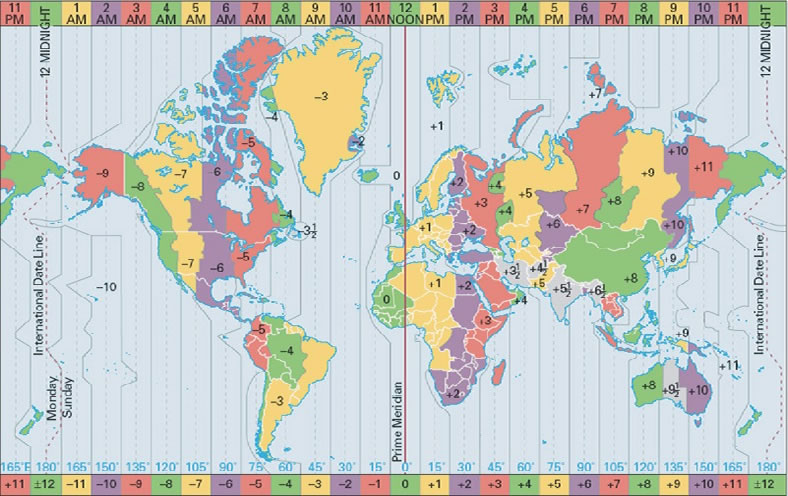
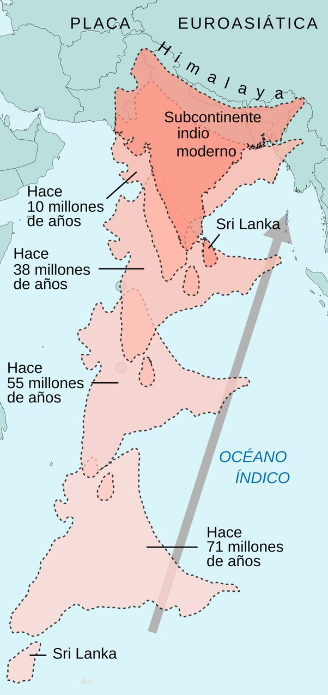
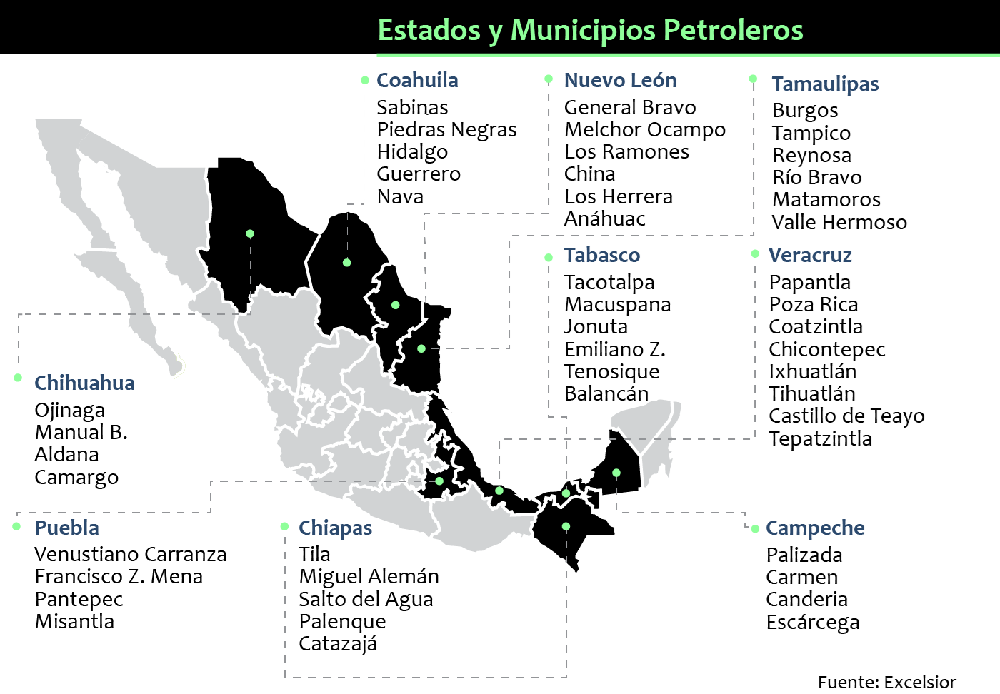
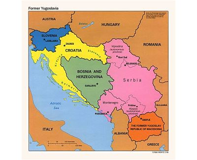

1. En Banda Aceh, Indonesia (huso horario 90 grados Este), el 26 de diciembre de 2004, a las 7:58 de la mañana, ocurrió un terremoto que generó un tsunami. ¿Qué hora y fecha tenía la CDMX cuando ocurrió este hecho?

> R: 25 de diciembre, 7:58 de la noche. 

> E: 26 de diciembre, 7:58 de la noche no podría ser ya que este horario es posterior al de Indonesia y México siempre tiene un horario menor al de Indonesia.  
> 24 de diciembre, 7:58 de la mañana no podría ser porque no podría haber dos días de diferencia en cualquiera de los usos horarios del mundo.  
> Y lo mismo aplica para 24 de diciembre, 6:58 de la noche.  
> Así que 25 de diciembre, 7:58 de la noche es la respuesta correcta porque tiene una fecha menor a la de Indonesia y si restamos las horas de diferencia al horario de Indonesia, es decir, restamos 12 horas a las 7:58 de la mañana, nos dará 7:58 de la noche.

---

2. La existencia de fósiles marinos en la cumbre de los montes Himalaya se debe a ___________ entre las placas ___________.

> R: La colisión, Euroasiática e Indo-Australiana 

> E: El Himalaya se formó por el choque de dos placas continentales, una, la enorme euroasiática y, otra, la subcontinental india que vino de su escisión con la sudafricana. Ambas eran costeras, por lo que se elevaron desde altitud cero con respecto al mar. Eso elevó fósiles miles de metros.  
> 

---

3. El desarrollo económico en México se basa en la explotación del petróleo, principalmente en las costas de:

> R: Campeche 

> 

---

4. Las corrientes marinas frente a las costas de Japón favorecen el desarrollo de:

> R: La actividad pesquera

> E: Las corrientes marinas u oceánicas se refieren a aquellos desplazamientos de masas de agua marina generadas por la acción del viento, las diferencias de temperatura, la salinidad, la densidad del agua, etc. Estas corrientes oceánicas se clasifican en cálidas o frías.  
> Las corrientes marinas frente a las costas de Japón favorecen el desarrollo de la pesca y la corriente responsable es la llamada Corriente de Japón.   

---

5. Las costas de los estados de _________  y ___________ son afectados por los ciclones tropicales que se forman en el mar de las Antillas:     

> R: Yucatán, Quintana Roo

> 

---

6. La renovación del oxígeno de la atmósfera está siendo afectada por la contaminación del mar, ya que esta provoca la mortalidad masiva de:

> R: Algas

> E: La contaminación del mar puede provocar la mortandad masiva de algas marinas. Las algas son organismos fotosintéticos que desempeñan un papel importante en la producción de oxígeno en la atmósfera. A través de la fotosíntesis, liberan oxígeno al ambiente.

---

7. El crecimiento acelerado de la población en países de África origina problemas como:

> R: Frecuentes zonas con hambruna

> 

---

8. Es el resultado de la desintegración de Yugoslavia: 

> R: Croacia 

> E: La disolución de Yugoslavia se refiere a los hechos ocurridos en la antigua Yugoslavia entre el 25 de junio de 1991 y el 27 de abril de 1992, que condujeron a esta disolución y a la formación de seis nuevas repúblicas soberanas (Eslovenia, Croacia, Bosnia-Herzegovina, Montenegro, Macedonia del Norte y Serbia).

> 

---

9. La industria más importante en la ciudad de Monterrey es la:

**R: Siderúrgica**

> Una siderúrgica es una industria dedicada a la **producción de acero** a partir de la transformación del mineral de hierro. En estas plantas, el mineral se procesa mediante altos hornos y otros equipos para obtener acero, que luego se usa en diversas aplicaciones como construcción, automóviles, maquinaria, etc. La palabra proviene del griego "sideros" (hierro), y se refiere a todo lo relacionado con la transformación de este metal.

---

10. Rama de la geografía física que estudia los cambios dinámicos que ocurren en el relieve de la tierra: 

> R: Geomorfología

> E: La geomorfología analiza las formas del relieve terrestre y los procesos que las modelan, como la erosión, la sedimentación, la actividad volcánica, los movimientos tectónicos y otros factores que influyen en la transformación del paisaje a lo largo del tiempo.
