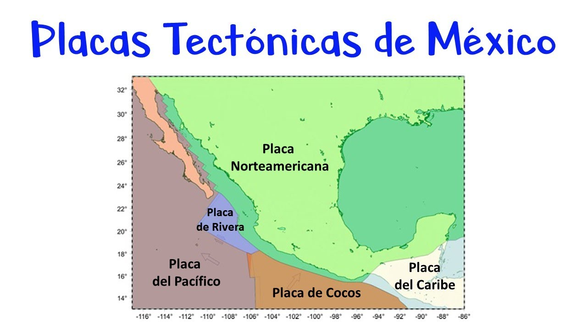
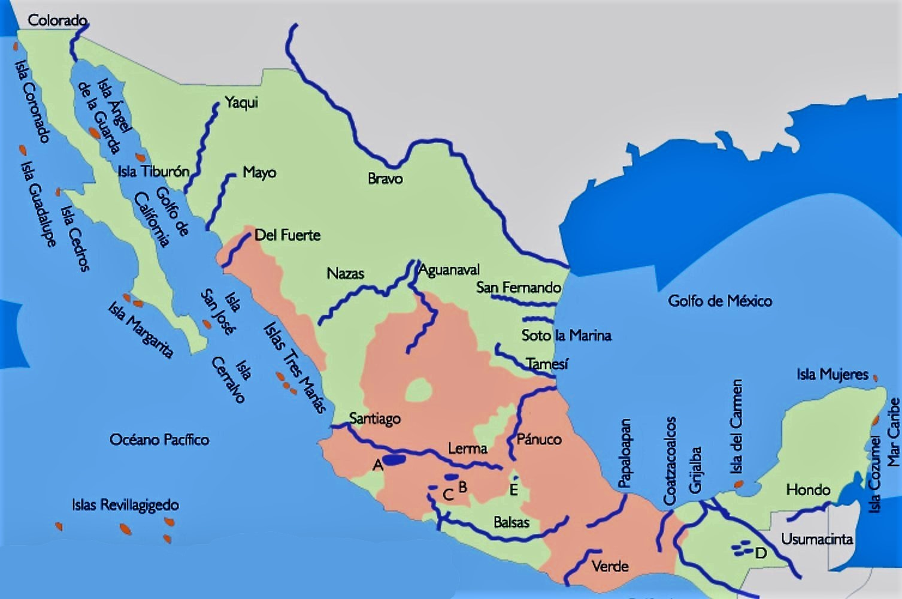

1. Las zonas de las mesetas presentan caracteristicas economicas o demograficas como:  

***R:Ganaderia extensiva y densidad media de la poblacion***

> Las mesetas son áreas planas situadas a cierta altitud sobre el nivel del mar. Las características económicas y demográficas mencionadas tienen una relación con las condiciones geográficas y climáticas de estas zonas.
> 
> 1. **Ganadería extensiva**: En las mesetas, debido a su altitud, el clima puede ser más seco y con menos vegetación densa. Esto favorece la **ganadería extensiva**, que consiste en criar animales en grandes áreas de terreno, ya que no hay suficiente vegetación para sostener una agricultura intensiva. El terreno permite que los animales pasten libremente y que los recursos naturales se utilicen de manera más dispersa.
> 
> 2. **Densidad media de la población**: Las mesetas tienden a tener una **densidad de población media** porque, si bien no son tan deshabitadas como las áreas montañosas o desérticas, tampoco tienen las condiciones ideales para una gran concentración de personas, como las zonas costeras o llanuras fértiles. Las actividades económicas, como la ganadería extensiva, requieren menos mano de obra que la agricultura intensiva o la industria, lo que también contribuye a que no haya una gran densidad de población.
> 
> En resumen, el clima y el terreno de las mesetas limitan las actividades intensivas, favoreciendo la ganadería y manteniendo una población relativamente moderada.

--- 
2. Que placas provocan sismisidad en el sur y centro de Mexico 

***R: Placa de cocos y norteamericana***

> En el sur y centro de México, la sismicidad es provocada principalmente por la interacción de varias placas tectónicas:
> 
> 1. **Placa de Cocos**: Esta placa oceánica se subduce (se desliza por debajo) de la **Placa de Norteamérica** en la costa del Pacífico, generando una intensa actividad sísmica, especialmente en los estados del sur, como Oaxaca, Guerrero y Chiapas.
> 
> 2. **Placa de Norteamérica**: Esta placa continental es la que cubre gran parte de México, y la subducción de la Placa de Cocos bajo ella es la causa de muchos de los terremotos en la región.
> 
> 3. **Placa del Caribe**: Afecta principalmente la parte sureste de México, en la península de Yucatán, aunque su influencia es menor comparada con la de la Placa de Cocos.
> 
> 
>
> La interacción entre estas placas, especialmente la subducción de la Placa de Cocos, es responsable de gran parte de la actividad sísmica en el sur y centro de México.

--- 
3. Que provoca la canicula a los ganaderos del norte del pais ?

R: Muerte del ganado por sequia 

> La **canícula** es un periodo de calor extremo que ocurre durante el verano, generalmente entre julio y agosto, y afecta gravemente a los ganaderos del norte de México. Los efectos principales son:
> 
> 1. **Estrés térmico en el ganado**: Las altas temperaturas provocan que los animales sufran estrés térmico, lo que disminuye su producción de leche, carne y su capacidad reproductiva. Esto también puede causar enfermedades y, en casos extremos, la muerte del ganado.
> 
> 2. **Escasez de agua**: Durante la canícula, la falta de lluvias disminuye la disponibilidad de agua, tanto para el consumo del ganado como para el riego de los pastos. La sequía prolongada afecta la calidad y cantidad de los recursos forrajeros.
> 
> 3. **Reducción de pastos**: El calor extremo quema o seca los pastizales, reduciendo la alimentación disponible para el ganado. Esto obliga a los ganaderos a comprar alimento adicional, aumentando los costos de producción.
> 
> En resumen, la canícula pone en riesgo la salud del ganado y aumenta los costos operativos para los ganaderos, impactando negativamente la producción.

--- 
4. La frecuente actividad sismica en el centro y sur de mexico tiene su origen en:

R: El choque de la placa de cocos contra la norteamericana

> La frecuente actividad sísmica en el centro y sur de México tiene su origen en la interacción de varias placas tectónicas. Los factores principales son:
> 
> 1. **Subducción de la Placa de Cocos**: Esta placa oceánica se desliza bajo la **Placa de Norteamérica** en la costa del Pacífico. El proceso de subducción genera tensión acumulada que se libera en forma de terremotos, afectando principalmente a los estados del sur y centro de México.
> 
> 2. **Contacto entre la Placa de Norteamérica y la Placa del Caribe**: Aunque con menor impacto que la subducción, el movimiento de estas placas también contribuye a la actividad sísmica, especialmente en el sureste del país.
> 
> 3. **Zonas de fallas geológicas**: Además de la subducción, existen fallas locales, como la Falla de Oaxaca, que generan sismos por el desplazamiento de bloques de la corteza terrestre.
> 
> La combinación de estos fenómenos tectónicos hace que el sur y centro de México sean regiones altamente sísmicas.

--- 
5. La mayor cantidad de agua potable para el consumo humano proviene de:  

R: Aguas subterraneas

> La mayor cantidad de agua potable para el consumo humano proviene principalmente de:
> 
> 1. **Acuíferos subterráneos**: Los acuíferos son la fuente más importante de agua potable. Se trata de reservas de agua almacenadas en formaciones geológicas porosas bajo la superficie terrestre. Son vitales para el suministro de agua en muchas regiones, especialmente en áreas donde el acceso a fuentes superficiales es limitado.
> 
> 2. **Ríos, lagos y embalses**: Aunque en menor proporción que los acuíferos, el agua superficial de ríos, lagos y embalses es también una fuente importante para el consumo humano, sobre todo en áreas urbanas.
> 
> 3. **Plantas desalinizadoras (en menor escala)**: En zonas costeras con poca disponibilidad de agua dulce, se utiliza agua de mar procesada en plantas desalinizadoras, aunque esta fuente es menos común y más costosa.
> 
> En resumen, la mayor parte del agua potable proviene de fuentes subterráneas, complementada con agua de cuerpos superficiales.

--- 
6. Relaciona los rios con los estados por los cuales transcurren su cause 

    I. Panuco 

    II. Grijalva 

    III. Balsas 

    a. Guerrero y Michoacan

    b. Chiapas y Tabasco  

    c. Veracruz e Hidalgo 

    d. Nayarit y Jalisco 

***R:  I: C , II: B , III: A***

> 
--- 
7. La region natural que presenta un clima tropical con lluvias todo el ano corresponde a la _________ y se ubica entre otros sitios _______ 

R: Selva - Cuenca del amazonas

> La región natural que presenta un clima tropical con lluvias todo el año corresponde a la **selva tropical**, y se ubica, entre otros sitios, en **el sureste de México**, como en los estados de Chiapas, Tabasco y la península de Yucatán, además de regiones como la **Amazonía** en América del Sur, y partes del **sudeste asiático**.
> 
> Este tipo de clima es caracterizado por altas temperaturas y precipitaciones constantes, lo que favorece la biodiversidad y el desarrollo de densas áreas boscosas.

--- 
8. Caracteristicas de los paises desarrollados: 

R: Alto ingreso per capita y alfabetismo

> Las características de los países desarrollados incluyen:
> 
> 1. **Alto ingreso per cápita**: Los países desarrollados tienen economías fuertes, lo que se refleja en un alto nivel de ingresos por habitante. Esto se traduce en un mayor poder adquisitivo y un mejor nivel de vida para la población.
> 
> 2. **Alto nivel de alfabetismo**: Estos países cuentan con sistemas educativos sólidos que aseguran que la mayoría de su población tenga acceso a una educación de calidad, lo que resulta en un alto índice de alfabetización.
> 
> Además, los países desarrollados suelen presentar características como:
> 
> - Infraestructuras avanzadas.
> - Alta esperanza de vida.
> - Baja tasa de pobreza.
> - Sistemas de salud eficientes.

--- 
9. Unos de los cambios en la estructura economica mundial a finales del siglo XX es la adopcion del: 

R: Neoliberalismo

> El **neoliberalismo** es una corriente de pensamiento económico y político que promueve la reducción de la intervención del Estado en la economía y enfatiza la importancia del libre mercado para regular la actividad económica. Surgió a mediados del siglo XX como respuesta a las políticas económicas intervencionistas, ganando fuerza en los años 1980 y 1990.
> 
> Las principales características del neoliberalismo son:
> 
> 1. **Libre mercado**: Promueve la idea de que la oferta y la demanda deben determinar los precios y la distribución de recursos, sin interferencias del gobierno.
> 
> 2. **Privatización**: Se incentiva la venta de empresas y servicios públicos a manos privadas, con el argumento de que el sector privado es más eficiente que el Estado.
> 
> 3. **Desregulación**: Reducir las regulaciones gubernamentales sobre la industria y el comercio para fomentar la competencia y la innovación.
> 
> 4. **Austeridad fiscal**: Implementación de políticas de austeridad que buscan reducir el gasto público, especialmente en programas sociales, para mantener un déficit fiscal controlado.
> 
> 5. **Globalización**: Fomenta la integración económica a nivel mundial, favoreciendo el comercio internacional y la libre circulación de capitales.
> 
> Aunque ha impulsado el crecimiento económico en algunos países, el neoliberalismo ha sido criticado por aumentar la desigualdad social y concentrar la riqueza en manos de unos pocos.

--- 
10. La doctrina _______ es aplicada por los paises _______ 

R: Neoliberal - Paises desarrollados

