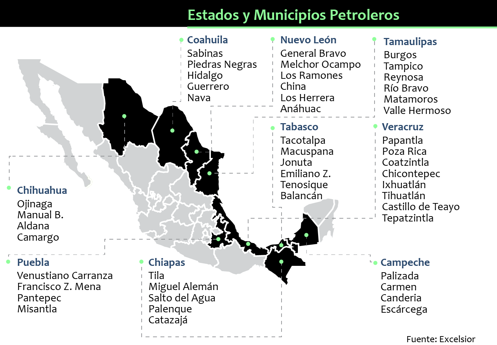

1. El tipo de industria que se ubica en la zona fronteriza del norte de Mexico es la: 

R: Maquiladora

> El tipo de industria que se ubica en la zona fronteriza del norte de México es principalmente la industria maquiladora. Estas industrias se dedican a la manufactura y ensamble de productos, aprovechando la cercanía con Estados Unidos y beneficios fiscales como el Programa IMMEX (Industria Manufacturera, Maquiladora y de Servicios de Exportación). La mayoría de estas maquiladoras se enfocan en sectores como electrónica, automotriz, textil y dispositivos médicos.

---

2. En que ciudades de la republica mexicana se encuentra la actividad petroquimica? 

R: Salamanca, Tula y Pozo rica 

> 

---
3. La existencia de aeropuertos internacionales en el sureste de Mexico se relaciona con las actividades:  

R: Turistica y de negocios

---
4. La escasez de tierras cultivables, asi como la carencia de creditos provocan: 

R: Inmigracion del campo a la ciudad

> La escasez de tierras cultivables y la carencia de créditos provocan dificultades en el desarrollo agrícola, lo que puede llevar a:
>
>   - Baja producción agrícola.
>   - Migración rural a zonas urbanas en busca de mejores oportunidades.
>   - Inseguridad alimentaria en las comunidades afectadas.
>   - Pobreza rural debido a la falta de recursos y oportunidades.
>   - Aumento de la dependencia de importaciones para cubrir la demanda interna de alimentos.

---
5. Los movimientos orogenicos son formadores de: 

**R: montañas**

> Los movimientos orogénicos son procesos geológicos que implican la deformación y el levantamiento de la corteza terrestre para formar montañas y cadenas montañosas. Estos movimientos son el resultado de las fuerzas tectónicas que actúan principalmente en los bordes de las placas tectónicas, donde se producen choques, compresiones y plegamientos de las rocas.
> Características de los movimientos orogénicos:
> 
> - Generan montañas a través del levantamiento y plegamiento de la corteza.
> - Ocurren en zonas de convergencia de placas tectónicas.
> - Se acompañan de fenómenos como fallas, pliegues y actividad volcánica.
> - Suelen estar relacionados con procesos de subducción o colisión continental.
> 
> Ejemplos de movimientos orogénicos:
> 
> - La formación de la Cordillera de los Andes.
> - El levantamiento del Himalaya.
> - La formación de los Alpes.

---
6. Las placas tectonicas son grandes porciones rocosas y compactas que se mueven debido a las: 

R: Corrientes convectivas

> Las **corrientes convectivas** son movimientos circulares del material en el manto terrestre causados por diferencias de temperatura y densidad. Funcionan como un mecanismo de transporte de calor desde el interior de la Tierra hacia la superficie.
>
> 
>
> ### Características:
> - Se originan debido al **calor interno** generado por la desintegración de elementos radiactivos en el núcleo.
> - Provocan el **ascenso del material caliente** hacia la superficie y el **descenso del material frío**.
> - Son responsables del **movimiento de las placas tectónicas**.
>
> ### Ejemplo:
> Imagina una olla con agua hirviendo. El agua caliente sube al alcanzar la superficie, se enfría y luego baja nuevamente, generando un **circuito de movimiento constante**.

---
7. A las zonas donde las placas tectonicas tienden a separarse, se les denomina: 

R: Divergentes

> A las zonas donde las placas tectónicas tienden a separarse se les denomina **zonas de divergencia** o **bordes divergentes**.
>
> 
> ### Características:
> - Son áreas donde las placas se **alejan** entre sí.
> - Permiten la **formación de nueva corteza oceánica** mediante la salida de magma desde el manto.
> - Suelen formar **dorsales oceánicas** como la **Dorsal Mesoatlántica**.
>
> ### Ejemplo:
> La **Dorsal del Atlántico** es una de las principales zonas de divergencia, donde la placa Norteamericana y la placa Euroasiática se están separando.

---
8.  Las corrientes convectivas se generan en la capa de la tierra llamada:  

R: Manto superior

> 

---
9. A las zonas donde las placas tectonicas tienden a entrar en contacto, se les denomina: 

R: Subduccion

> La **zona de subducción** es una región donde una placa tectónica se **sumerge** debajo de otra. Este proceso ocurre en los **bordes convergentes**, cuando una placa más densa (generalmente oceánica) se hunde bajo una placa menos densa (continental o oceánica).
>
> 
>
> ### Características:
> - Se generan **fosas oceánicas** en la superficie y **montañas** o **arcos volcánicos** en tierra.
> - Provoca **terremotos** y **actividad volcánica** intensa.
> - Es un proceso clave en el **reciclaje de la corteza oceánica**.
>
> ### Ejemplo:
> La **Fosa de las Marianas**, la más profunda del mundo, es una zona de subducción donde la Placa del Pacífico se hunde bajo la Placa de Filipinas.

---
10. Son ejemplos de paises con la mayoria de su poblacion adulta y anciana:

R: Alemania y Japon
