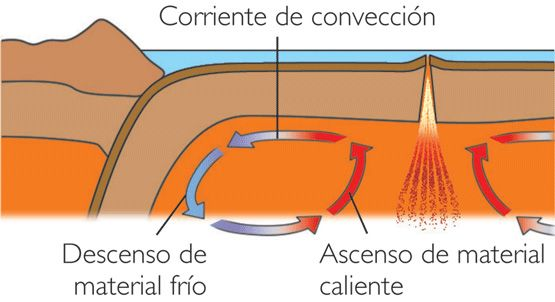
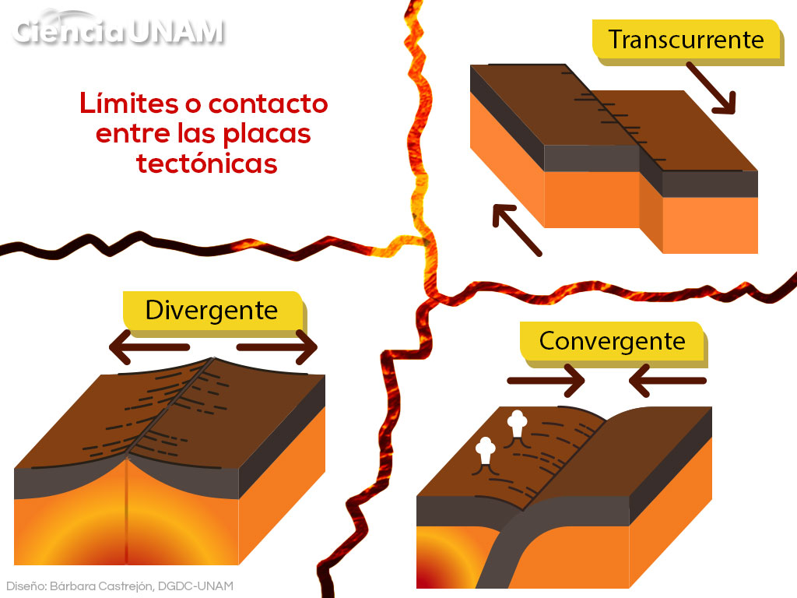
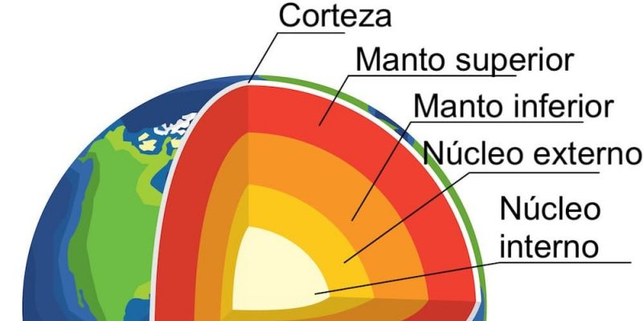
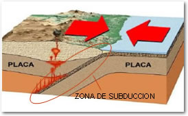

1. El tipo de industria que se ubica en la zona fronteriza del norte de México es la:  

R: Maquiladora  

> El tipo de industria que se ubica en la zona fronteriza del norte de México es principalmente la industria maquiladora. Estas industrias se dedican a la manufactura y ensamble de productos, aprovechando la cercanía con Estados Unidos y beneficios fiscales como el Programa IMMEX (Industria Manufacturera, Maquiladora y de Servicios de Exportación). La mayoría de estas maquiladoras se enfocan en sectores como electrónica, automotriz, textil y dispositivos médicos.  

---  

2. ¿En qué ciudades de la República Mexicana se encuentra la actividad petroquímica?  

R: Salamanca, Tula y Poza Rica  

>   

---  

3. La existencia de aeropuertos internacionales en el sureste de México se relaciona con las actividades:  

R: Turística y de negocios  

---  

4. La escasez de tierras cultivables, así como la carencia de créditos, provocan:  

R: Inmigración del campo a la ciudad  

> La escasez de tierras cultivables y la carencia de créditos provocan dificultades en el desarrollo agrícola, lo que puede llevar a:  
>  
> - Baja producción agrícola.  
> - Migración rural a zonas urbanas en busca de mejores oportunidades.  
> - Inseguridad alimentaria en las comunidades afectadas.  
> - Pobreza rural debido a la falta de recursos y oportunidades.  
> - Aumento de la dependencia de importaciones para cubrir la demanda interna de alimentos.  

---  

5. Los movimientos orogénicos son formadores de:  

**R: Montañas**  

> Los movimientos orogénicos son procesos geológicos que implican la deformación y el levantamiento de la corteza terrestre para formar montañas y cadenas montañosas. Estos movimientos son el resultado de las fuerzas tectónicas que actúan principalmente en los bordes de las placas tectónicas, donde se producen choques, compresiones y plegamientos de las rocas.  
>  
> ### Características de los movimientos orogénicos:  
> - Generan montañas a través del levantamiento y plegamiento de la corteza.  
> - Ocurren en zonas de convergencia de placas tectónicas.  
> - Se acompañan de fenómenos como fallas, pliegues y actividad volcánica.  
> - Suelen estar relacionados con procesos de subducción o colisión continental.  
>  
> ### Ejemplos de movimientos orogénicos:  
> - La formación de la Cordillera de los Andes.  
> - El levantamiento del Himalaya.  
> - La formación de los Alpes.  

---  

6. Las placas tectónicas son grandes porciones rocosas y compactas que se mueven debido a las:  

R: Corrientes convectivas  

> Las **corrientes convectivas** son movimientos circulares del material en el manto terrestre causados por diferencias de temperatura y densidad. Funcionan como un mecanismo de transporte de calor desde el interior de la Tierra hacia la superficie.  
>  
>   
>  
> ### Características:  
> - Se originan debido al **calor interno** generado por la desintegración de elementos radiactivos en el núcleo.  
> - Provocan el **ascenso del material caliente** hacia la superficie y el **descenso del material frío**.  
> - Son responsables del **movimiento de las placas tectónicas**.  
>  
> ### Ejemplo:  
> Imagina una olla con agua hirviendo. El agua caliente sube al alcanzar la superficie, se enfría y luego baja nuevamente, generando un **circuito de movimiento constante**.  

---  

7. A las zonas donde las placas tectónicas tienden a separarse, se les denomina:  

R: Divergentes  

> A las zonas donde las placas tectónicas tienden a separarse se les denomina **zonas de divergencia** o **bordes divergentes**.  
>  
>   
>  
> ### Características:  
> - Son áreas donde las placas se **alejan** entre sí.  
> - Permiten la **formación de nueva corteza oceánica** mediante la salida de magma desde el manto.  
> - Suelen formar **dorsales oceánicas**, como la **Dorsal Mesoatlántica**.  
>  
> ### Ejemplo:  
> La **Dorsal del Atlántico** es una de las principales zonas de divergencia, donde la Placa Norteamericana y la Placa Euroasiática se están separando.  

---  

8. Las corrientes convectivas se generan en la capa de la Tierra llamada:  

R: Manto superior  

>   

---  

9. A las zonas donde las placas tectónicas tienden a entrar en contacto, se les denomina:  

R: Subducción  

> La **zona de subducción** es una región donde una placa tectónica se **sumerge** debajo de otra. Este proceso ocurre en los **bordes convergentes**, cuando una placa más densa (generalmente oceánica) se hunde bajo una placa menos densa (continental o oceánica).  
>  
>   
>  
> ### Características:  
> - Se generan **fosas oceánicas** en la superficie y **montañas** o **arcos volcánicos** en tierra.  
> - Provoca **terremotos** y **actividad volcánica** intensa.  
> - Es un proceso clave en el **reciclaje de la corteza oceánica**.  
>  
> ### Ejemplo:  
> La **Fosa de las Marianas**, la más profunda del mundo, es una zona de subducción donde la Placa del Pacífico se hunde bajo la Placa de Filipinas.  

---  

10. Son ejemplos de países con la mayoría de su población adulta y anciana:  

R: Alemania y Japón  
