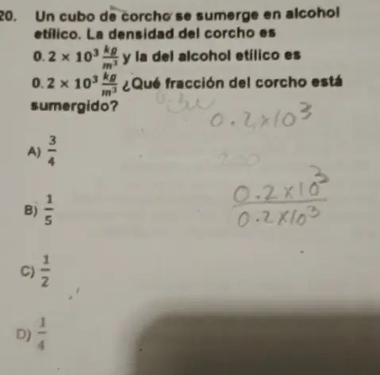

1. ¿Cual es la aceleracion de un objeto de 90kg sise le aplican 360 N?

La aceleración (a) de un objeto se puede calcular utilizando la segunda ley de Newton, que establece que la fuerza neta (F) aplicada a un objeto es igual al producto de su masa (m) y su aceleración (a): 

$F=m*a.$

En este caso, la masa (m) del objeto es de 90 kg y la fuerza neta (F) aplicada es de 360 N. Para encontrar la aceleración, podemos usar la fórmula rearranjada:

$a = F / m$

Sustituimos los valores conocidos:

$a = 360 N / 90 kg$

Realizamos la operación:

$a = 4 m/s^2$

Por lo tanto, la aceleración del objeto es de 4 m/s24m/s2 cuando se le aplica una fuerza de 360 N360N.

--- 
2. Si a un bloque de 20 kg se le aplica 2 fierzas, una de 30 N y otra de 20 N en la misma direccion y sentidos opuestos (Sin friccion), ¿Cual es su aceleración?

Para calcular la aceleración del bloque, podemos usar la segunda ley de Newton, que establece que la fuerza neta aplicada a un objeto es igual al producto de su masa y su aceleración. La fuerza neta es la suma de todas las fuerzas aplicadas al objeto.

En este caso, hay dos fuerzas aplicadas en la misma dirección pero con sentidos opuestos. La fuerza neta ($F_{\text{neta}}$​) se calcula restando la fuerza que actúa en la dirección opuesta de la que actúa en la misma dirección. Entonces:

$F_{\text{neta}} = F_1 - F_2$

Donde F1F1​ es la fuerza aplicada en la misma dirección (30 N) y F2F2​ es la fuerza aplicada en la dirección opuesta (20 N).

$F_{\text{neta}} = 30N - 20N$

$F_{\text{neta}} = 10N$

Ahora, podemos usar la segunda ley de Newton:

$F_{\text{neta}} = m * a$

Donde mm es la masa del bloque (20 kg) y aa es la aceleración que estamos tratando de encontrar.

$10 \, \text{N} = a * 20 \, \text{kg}$

Simplificamos la ecuación para encontrar aa:

$a = \frac{10 \, \text{N}}{20 \, \text{kg}}$

$a = 0.5 \, \text{m/s}^2$

Por lo tanto, la aceleración del bloque es de $a = 0.5 \, \text{m/s}^2$.

---
3. Dos niños de la misma masa se balancean cada uno en un columpio, en determinado momento se encuentran a la misma altura, pero en extremos opuestos como se muestra en la figura. Cual de las  siguientes afirmaciones a cerca de sus energias potenciales con respecto al piso es verdadera?

Dado que $EP = m*g*h$ y ambos niños (A y B) tienen la misma masa, estan a la misma altura y tiene la misma gravedad nos da que:

R:  $EP_{\text{A}} = EP_{\text{B}} \neq 0$

---

4. Un objeto de 60N de peso esta sujeto a dos fuerza $F_1 = F_2 = 30{\text{N}}$ (No tenemos friccion) ¿Cual es su aceleración?
 

El movimiento es horizontal, dado que esta apoyado en el piso. Las fuerzas perpendiculares, normales o verticales no intervienen en el movimiento.

Solo $F_{2}$ produce el movimiento

$F_{neta}=m*g$

$m = F_{neta}/g = 60/10 = 6kg$

$F_{1} = F_{2} = 30 = 6 * a$

$30 = 6*a$

$ a = 30/6 = 5 m/s^2$ 

--- 
5. Se mezcla 200 g de agua en fase líquida a 20 °C con 100 gramos de agua en fase líquida a 80 °C. ¿Cuál es su temperatura de equilibrio?

Sabiendo que se mezcla 200 g de agua en fase líquida a 20 ºC con 100 gramos de agua en fase líquida a 80 ºC, tenemos que la temperatura de equilibrio es de 40 ºC.

¿Cómo encontrar la cantidad de calor?

La cantidad de calor se define mediante la siguiente fórmula:

Q = m·cp·ΔT

Donde:

    Q = cantidad de calor
    m = masa
    cp = calor específico
    ΔT = diferencia de temperatura

Condición para resolver el problema

Para solucionar este problema debemos plantear que todo el calor cedido por el agua caliente es absorbido por el agua fría, es decir:

Q = -Q'

Resolución del problema

Teniendo en cuenta la consideración anterior, procedemos a buscar la temperatura de equilibrio definiendo cada calor:

Q = -Q'

m·cp·ΔT = -m'·cp·ΔT'

Tenemos que el calor específica se cancela porque estamos hablando de la misma sustancia (agua), entonces:

m·ΔT = -m'·ΔT'

(200 g)·(Te - 20 ºC) = -(100 g)·(Te - 80 ºC)

(Te - 20 ºC) = (100/200)·(80 ºC - Te)

Te - 20 ºC = (1/2)·(80 ºC - Te)

Te - 20 ºC = 40 ºC - Te/2

Te + Te/2 = 40 ºC + 20 ºC

3Te/2 = 60 ºC

Te = (2)·(60 ºC)/3

Te = 40 ºC

Por tanto, la temperatura de equilibrio es de 40 ºC.

R:
--- 

6. Para que exista energia en forma de calor deben ser diferentes:

R:  Diferentes temperaturas

--- 

7. Un corcho tiene una densidad de 0.2 kg/m³ y se sumerge en alcohol etílico cuya densidad es de 0.8 kg/m³ 
¿Que porción del objeto representa el parte sumergida?​

Explanation: 

Step 1: Determine the relationship between the densities to find the fraction of the cork submerged.

Step 2: Use the formula for the fraction of an object submerged in a fluid: 
 $\frac{V_{\text{submerged}}}{V_{\text{total}}} = \frac{\rho_{\text{object}}}{\rho_{\text{fluid}}}$.

Step 3: Substitute the given densities into the formula: 
 $\frac{V_{\text{submerged}}}{V_{\text{total}}} = \frac{0.2\times 10^{3}}{0.8\times 10^{3}}$.

Step 4: Simplify the fraction: 
 $\frac{V_{\text{submerged}}}{V_{\text{total}}} = \frac{1}{4}$

R: 1/4

--- 

8. ¿Cuales son los 3 fenomenos que se pueden llegar a realizar en un nucleo atomico?

R: Fision, Fusion y Radioactividad

--- 

9. Si al introducir punta una pieza de sevilleta al agua esta absorve sobre ella, sobre el nivel del agua, en el recipiente lleno que la contiene esto se asocia al fenomeno de _________ y que permite que un mosquito se posa sobre el agua sin undirse esto se explica con __________ .

R: Capilaridad, Tension superficial

--- 

10. En una superficie plana y reflejante el angulo de incidencia es de 45 grados, Cual es el valor del angulo reflejado:

R: 45 grados
