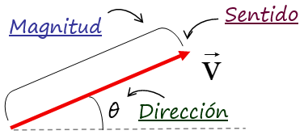

1. ¿Cual es la aceleracion de un objeto de 90kg sise le aplican 360 N?

***R: $4 m/s^2$***

> La aceleración (a) de un objeto se puede calcular utilizando la segunda ley de Newton, que establece que la fuerza neta (F) aplicada a un objeto es igual al producto de su masa (m) y su aceleración (a): 
>
> $F=m*a.$
>
> En este caso, la masa (m) del objeto es de 90 kg y la fuerza neta (F) aplicada es de 360 N. Para encontrar la aceleración, podemos usar la fórmula rearranjada:
>
> $a = F / m$
>
> Sustituimos los valores conocidos:
>
> $a = 360 N / 90 kg$
>
> Realizamos la operación:
>
> $a = 4 m/s^2$
>
> Por lo tanto, la aceleración del objeto es de 4 m/s24m/s2 cuando se le aplica una fuerza de 360 N.

--- 
2. Si a un bloque de 20 kg se le aplica 2 fierzas, una de 30 N y otra de 20 N en la misma direccion y sentidos opuestos (Sin friccion), ¿Cual es su aceleración?

***R: $a = 0.5 \, \text{m/s}^2$***

> Para calcular la aceleración del bloque, podemos usar la segunda ley de Newton, que establece que la fuerza neta aplicada a un objeto es igual al producto de su masa y su aceleración. La fuerza neta es la suma de todas las fuerzas aplicadas al objeto.
> 
> En este caso, hay dos fuerzas aplicadas en la misma dirección pero con sentidos opuestos. La fuerza neta ($F_{\text{neta}}$​) se calcula restando la fuerza que actúa en la dirección opuesta de la que actúa en la misma dirección. Entonces:
> 
> $F_{\text{neta}} = F_1 - F_2$
> 
> Donde F1​ es la fuerza aplicada en la misma dirección (30 N) y F2​ es la fuerza aplicada en la dirección opuesta (20 N).
> 
> $F_{\text{neta}} = 30N - 20N$
> 
> $F_{\text{neta}} = 10N$
> 
> Ahora, podemos usar la segunda ley de Newton:
> 
> $F_{\text{neta}} = m * a$
> 
> Donde m es la masa del bloque (20 kg) y a es la aceleración que estamos tratando de encontrar.
> 
> $10 \, \text{N} = a * 20 \, \text{kg}$
> 
> Simplificamos la ecuación para encontrar a:
> 
> $a = \frac{10 \, \text{N}}{20 \, \text{kg}}$
> 
> $a = 0.5 \, \text{m/s}^2$
> 
> Por lo tanto, la aceleración del bloque es de $a = 0.5 \, \text{m/s}^2$.

> NOTA: 
>
>

---
3. Dos niños de la misma masa se balancean cada uno en un columpio, en determinado momento se encuentran a la misma altura, pero en extremos opuestos como se muestra en la figura. Cual de las  siguientes afirmaciones a cerca de sus energias potenciales con respecto al piso es verdadera?

Dado que $EP = m*g*h$ y ambos niños (A y B) tienen la misma masa, estan a la misma altura y tiene la misma gravedad nos da que:

***R: $EP_{\text{A}} = EP_{\text{B}} \neq 0 \text{ J}$***

> **Fórmulas de Energía Cinética y Energía Potencial:**
>
> La unidad de medida en ambas energias es **joule (J)**, que se utiliza para medir energía, trabajo y calor, se define como:
>
>$ 1\text{ J} = 1\text{ N} \cdot \text{m} = 1\text{ kg}\cdot\text{m}^2\cdot\text{s}^{-2}$
>
> 1. **Energía Cinética (Ec)**:
> 
> La energía cinética de un objeto en movimiento se calcula con la siguiente fórmula:
> 
> 
> $E_c = \frac{1}{2} m * v^2$
> 
> Donde:
> - $E_c$ = Energía cinética (en julios, J)
> - $m$ = Masa del objeto (en kilogramos, kg)
> - $v$  = Velocidad del objeto (en metros por segundo, m/s)
> 
> 2. **Energía Potencial Gravitatoria (Ep)**:
> 
> La energía potencial de un objeto debido a su altura se calcula con la fórmula:
> 
> $E_p = m*g*h$
> 
> Donde:
> - $E_p$ = Energía potencial (en julios, J)
> - $m$ = Masa del objeto (en kilogramos, kg)
> - $g$ = Aceleración debida a la gravedad (9.8 m/s²)
> - $h$ = Altura sobre el nivel de referencia (en metros, m)

---

4. Un objeto de 60N de peso esta sujeto a dos fuerza $F_1 = F_2 = 30{\text{N}}$ (No tenemos friccion) ¿Cual es su aceleración?
 

> La fórmula del **peso (P)** es:
>
> $P = m \cdot g$
> 
> $ F_(neta) m = P/g = 60/10 = 6kg $ (masa del objeto)
>
> Analizar las fuerzas:
> - F₁ actúa verticalmente hacia arriba
> - F₂ actúa horizontalmente hacia la derecha
> - El peso actúa verticalmente hacia abajo
> 
> Determinar la aceleración vertical:
> - $\text{(La fuerza neta vertical Σ)} = F_1 - Peso = 30 N - 60 N = -30 N$. Sin embargo, como el objeto está sobre una superficie, no se moverá verticalmente.

> Determinar la aceleración horizontal:
> - La única fuerza horizontal es $F_2 = 30 N$ .Usando la Segunda Ley de Newton:
>
> $F = m * a$
>
> $30 N = 6 kg * a$
>
> $a = 30 N / 6 kg = 5 m/s^2$
> 
> $F_{1} = F_{2} = 30 = 6 * a$
> 
> $30 = 6*a$
> 
> $ a = 30/6 = 5 m/s^2$ 

--- 
5. Se mezcla 200 g de una sustacia a 60 °C con 100 gramos de la misma sustacia pero a 20 °C. ¿Cuál es su temperatura de equilibrio?

***R: 40 °C***

> **Procedimiento para calcular la temperatura de equilibrio:**
> 
> Cuando se mezclan dos masas de agua a diferentes temperaturas, la temperatura de equilibrio se determina utilizando el principio de conservación de la energía:
> 
> $
> Q_{\text{fría}} = - Q_{\text{caliente}}
> $
> 
> Donde:
> - $Q$ es la cantidad de calor intercambiado.
> - El calor ganado por el agua fría es igual al calor perdido por el agua caliente.
> 
> La fórmula general para la cantidad de calor es:
> 
> $
> Q = m \cdot c \cdot \Delta T
> $
> 
> Como la capacidad calorífica específica $c$ del agua es la misma para ambas, y $\Delta T$ es el cambio de temperatura, podemos simplificar el cálculo de la temperatura de equilibrio $T_e$:
> 
> $
> m_1 \cdot (T_e - T_1) = m_2 \cdot (T_2 - T_e)
> $
> 
> Despejamos $T_e$:
> 
> $
> T_e = \frac{m_1 \cdot T_1 + m_2 \cdot T_2}{m_1 + m_2}
> $
> 
> Donde:
> - $m_1 = 200 \, \text{g}$ es la masa del agua fría.
> - $T_1 = 20 \, °C$ es la temperatura del agua fría.
> - $m_2 = 100 \, \text{g}$ es la masa del agua caliente.
> - $T_2 = 80 \, °C$ es la temperatura del agua caliente.
> 
> Sustituyendo los valores:
> 
> $
> T_e = \frac{200 \cdot 20 + 100 \cdot 80}{200 + 100} = 40 \, °C
> $
> 
> Por lo tanto, la **temperatura de equilibrio** es **40 °C**.

--- 

6. Para que exista energia en forma de calor deben ser diferentes:

***R:  Diferentes temperaturas***

> Para que exista energía en forma de calor, deben ser diferentes las **temperaturas** de los cuerpos o sistemas involucrados.
> 
> El calor se transfiere de un cuerpo con **mayor temperatura** a otro con **menor temperatura** hasta que ambos alcanzan el **equilibrio térmico**. Esta diferencia de temperaturas es lo que genera la transferencia de energía térmica.

--- 

7. Un corcho tiene una densidad de 0.2 kg/m³ y se sumerge en alcohol etílico cuya densidad es de 0.8 kg/m³ 
¿Que porción del objeto representa el parte sumergida?​

***R: 1/4***

Explanation: 
- Paso 1: Determinadmos la relacion entre la densidad para buscar la fraccion del corcho sumergido
- Paso 2: Usamos la formula para la fraccion de oun objeto sumergido en un fluido:
$\frac{V_{\text{submerged}}}{V_{\text{total}}} = \frac{\rho_{\text{object}}}{\rho_{\text{fluid}}}$.

- Paso 3: Sustituimos la densidad dentro de la formula: 
$\frac{V_{\text{submerged}}}{V_{\text{total}}} = \frac{0.2\times 10^{3}}{0.8\times 10^{3}}$.

- Paso 4: Simplifica la fraccion: 

$\frac{V_{\text{submerged}}}{V_{\text{total}}} = \frac{1}{4}$

--- 

8. ¿Cuales son los 3 fenomenos que se pueden llegar a realizar en un nucleo atomico?

***R: Fision, Fusion y Radioactividad***

> ### Fenómenos Nucleares
> #### 1. Fisión
> La fisión es un proceso nuclear en el cual un núcleo atómico pesado se divide en dos o más núcleos más ligeros, junto con la liberación de energía. Este proceso generalmente ocurre en núcleos de elementos como el uranio-235 o el plutonio-239. La fisión puede ser desencadenada por la absorción de un neutrón y se utiliza en reactores nucleares y armas nucleares.
> 
> **Características:**
> - **Liberación de energía**: Se libera una gran cantidad de energía debido a la conversión de masa en energía (según la ecuación de Einstein \(E=mc^2\)).
> - **Productos de fisión**: Los productos de la fisión son radiactivos y pueden ser peligrosos.
> 
> #### 2. Fusión
> La fusión es el proceso en el cual dos núcleos atómicos ligeros se combinan para formar un núcleo más pesado, también liberando energía. Este proceso es el que ocurre en el sol y en otras estrellas, donde los núcleos de hidrógeno se fusionan para formar helio.
> 
> **Características:**
> - **Liberación de energía**: La fusión libera más energía que la fisión, ya que la masa del núcleo resultante es menor que la suma de las masas de los núcleos originales.
> - **Condiciones extremas**: Requiere altas temperaturas y presiones para que los núcleos superen la repulsión electrostática entre ellos.
> 
>#### 3. Radioactividad
> La radioactividad es el proceso por el cual núcleos inestables de ciertos elementos se descomponen espontáneamente, emitiendo partículas o radiación en el proceso. Este fenómeno puede ocurrir en elementos como el uranio, el radio y el carbono-14.
> 
> **Tipos de radiación:**
> - **Radiación alfa**: Emisión de partículas compuestas por dos protones y dos neutrones.
> - **Radiación beta**: Emisión de electrones o positrones.
> - **Radiación gamma**: Emisión de fotones de alta energía.
> 
> **Características:**
> - **Desintegración**: Los núcleos se transforman en núcleos de otros elementos o isótopos.
> - **Aplicaciones**: La radioactividad tiene aplicaciones en medicina (radioterapia), arqueología (datación por carbono) y energía nuclear.
> 

--- 

9. Si al introducir punta una pieza de sevilleta al agua esta absorve sobre ella, sobre el nivel del agua, en el recipiente lleno que la contiene esto se asocia al fenomeno de _________ y que permite que un mosquito se posa sobre el agua sin undirse esto se explica con __________ .

R: Capilaridad, Tension superficial

> ### Capilaridad
> La capilaridad es el fenómeno por el cual un líquido asciende o desciende en un tubo estrecho (capilar) o en un material poroso debido a la interacción entre las fuerzas cohesivas (entre las moléculas del líquido) y las fuerzas adhesivas (entre las moléculas del líquido y las superficies del material). 
> 
> **Ejemplos:**
> - El agua sube por un tubo delgado o en el interior de una planta, permitiendo que el agua llegue a las hojas.
> 
> **Factores que influyen:**
> - Diámetro del tubo: Cuanto más estrecho es el tubo, mayor es el efecto capilar.
> - Naturaleza del líquido: Líquidos con alta adhesión (como el agua) muestran mayor capilaridad.
> 
> ### Tensión Superficial
> La tensión superficial es la fuerza que actúa en la superficie de un líquido, causando que se comporte como una "película elástica". Esta propiedad se debe a las fuerzas intermoleculares que mantienen unidas a las moléculas del líquido.
> 
> **Características:**
> - Las moléculas en la superficie experimentan una fuerza neta hacia el interior, ya que no están completamente rodeadas por otras moléculas de líquido.
> - Esto permite que ciertos objetos, como un mosquito, floten sobre el agua sin hundirse, siempre y cuando su peso no supere la tensión superficial del líquido.
> 
> **Ejemplos:**
> - La forma esférica de las gotas de agua.
> - Los insectos que caminan sobre la superficie del agua.

--- 

10. En una superficie plana y reflejante el angulo de incidencia es de 45 grados, Cual es el valor del angulo reflejado:

***R: 45 grados***

> Cuando un rayo de luz incide en una superficie plana y reflejante, el ángulo de incidencia es igual al ángulo de reflexión, de acuerdo con la ley de reflexión.
> 
> Si el ángulo de incidencia es de $45^\circ$, entonces el ángulo de reflexión también será:
> 
> $\text{Ángulo reflejado} = 45^\circ$
