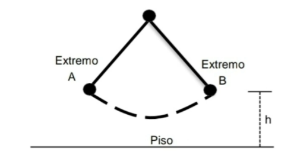
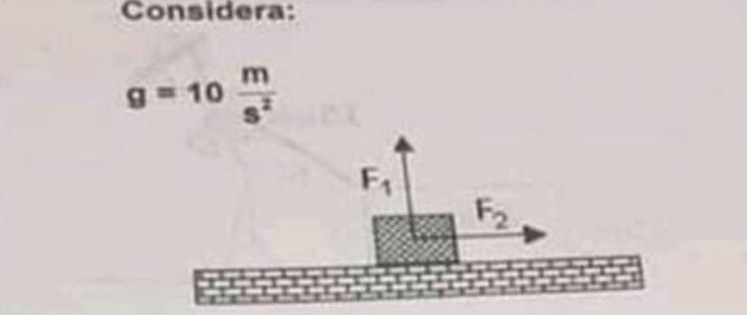

1. ¿Cuál es la aceleración de un objeto de 90 kg si se le aplican 360 N?

***R: $4 \, \text{m/s}^2$***

> La aceleración ($a$) de un objeto se puede calcular utilizando la segunda ley de Newton, que establece que la fuerza neta ($F$) aplicada a un objeto es igual al producto de su masa ($m$) y su aceleración ($a$): 
>
> $F = ma$
>
> En este caso, la masa ($m$) del objeto es de 90 kg y la fuerza neta ($F$) aplicada es de 360 N. Para encontrar la aceleración, usamos la fórmula:
>
> $a = \frac{F}{m}$
>
> Sustituyendo los valores:
>
> $a = \frac{360 \, \text{N}}{90 \, \text{kg}}$
>
> Realizando la operación:
>
> $a = 4 \, \text{m/s}^2$
>
> Por lo tanto, la aceleración del objeto es de $4 \, \text{m/s}^2$ cuando se le aplica una fuerza de 360 N.

---

2. Si a un bloque de 20 kg se le aplican dos fuerzas, una de 30 N y otra de 20 N en la misma dirección y sentidos opuestos (sin fricción), ¿cuál es su aceleración?

***R: $a = 0.5 \, \text{m/s}^2$***

> Para calcular la aceleración del bloque, usamos la segunda ley de Newton. La fuerza neta ($F_{\text{neta}}$) se obtiene restando las fuerzas en sentidos opuestos:
>
> $F_{\text{neta}} = F_1 - F_2$
>
> Donde $F_1$ es la fuerza de 30 N y $F_2$ la de 20 N.
>
> $F_{\text{neta}} = 30 \, \text{N} - 20 \, \text{N} = 10 \, \text{N}$
>
> Aplicamos la segunda ley de Newton:
>
> $F_{\text{neta}} = ma$
>
> Despejamos $a$:
>
> $a = \frac{10 \, \text{N}}{20 \, \text{kg}}$
>
> $a = 0.5 \, \text{m/s}^2$
>
> Por lo tanto, la aceleración del bloque es de $0.5 \, \text{m/s}^2$.

---

3. Dos niños de la misma masa se balancean en un columpio y, en determinado momento, están a la misma altura pero en extremos opuestos. ¿Cuál de las siguientes afirmaciones acerca de sus energías potenciales con respecto al piso es verdadera?

Dado que $E_p = mgh$ y ambos niños (A y B) tienen la misma masa, están a la misma altura y experimentan la misma gravedad, se cumple que:

***R: $E_{pA} = E_{pB} \neq 0 \, \text{J}$***

> **Fórmulas de Energía Cinética y Energía Potencial:**
>
> - **Energía Cinética ($E_c$)**:
>   $E_c = \frac{1}{2} mv^2$
> - **Energía Potencial Gravitatoria ($E_p$)**:
>   $E_p = mgh$
>
> Donde:
> - $m$: Masa del objeto (kg)
> - $v$: Velocidad del objeto (m/s)
> - $g$: Aceleración gravitatoria ($9.8 \, \text{m/s}^2$)
> - $h$: Altura (m)

---

4. Un objeto de 60 N de peso está sujeto a dos fuerzas $F_1 = F_2 = 30 \, \text{N}$. ¿Cuál es su aceleración? (Sin fricción)

> - Cálculo de la masa:
>
>   $m = \frac{P}{g} = \frac{60 \, \text{N}}{10 \, \text{m/s}^2} = 6 \, \text{kg}$
>
> - Aceleración horizontal:
>
>   $F = ma$
>
>   $30 \, \text{N} = 6 \, \text{kg} \cdot a$
>
>   $a = \frac{30}{6} = 5 \, \text{m/s}^2$
>
> Por lo tanto, la aceleración es de $5 \, \text{m/s}^2$.

---

5. Se mezclan 200 g de una sustancia a 60 °C con 100 g de la misma sustancia a 20 °C. ¿Cuál es su temperatura de equilibrio?

***R: 40 °C***

> Se usa la ecuación de conservación de la energía:
>
> $T_e = \frac{m_1 T_1 + m_2 T_2}{m_1 + m_2}$
>
> Sustituyendo valores:
>
> $T_e = \frac{200 \times 60 + 100 \times 20}{200 + 100}$
>
> $T_e = 40 °C$

---

6. Para que exista energía en forma de calor, deben ser diferentes:

***R: Diferentes temperaturas***

> El calor se transfiere de un cuerpo con mayor temperatura a otro con menor temperatura, hasta alcanzar el equilibrio térmico.

---

7. Un corcho de densidad $0.2 \, \text{kg/m}^3$ se sumerge en alcohol etílico de densidad $0.8 \, \text{kg/m}^3$. ¿Qué fracción del corcho queda sumergida?

***R: $\frac{1}{4}$***

> Usamos la ecuación:
>
> $\frac{V_{\text{sub}}}{V_{\text{total}}} = \frac{\rho_{\text{obj}}}{\rho_{\text{fluido}}}$
>
> Sustituyendo valores:
>
> $\frac{0.2}{0.8} = \frac{1}{4}$

---

8. ¿Cuáles son los tres fenómenos que pueden ocurrir en un núcleo atómico?

***R: Fisión, fusión y radiactividad***

> - **Fisión:** División de un núcleo pesado en núcleos más pequeños, liberando energía.
>
> - **Fusión:** Unión de núcleos ligeros para formar uno más pesado, liberando gran cantidad de energía.
>
> - **Radiactividad:** Desintegración espontánea de núcleos inestables, emitiendo radiación.

---

9. Si la punta de una servilleta absorbe agua y un mosquito puede posarse sobre la superficie sin hundirse, estos fenómenos se explican por:

***R: Capilaridad y tensión superficial***

> - **Capilaridad:** Fenómeno que permite que el agua suba en tubos delgados o materiales porosos.
>
> - **Tensión superficial:** Propiedad que permite que algunos insectos caminen sobre el agua sin hundirse.

---

10. En una superficie plana y reflectante, si el ángulo de incidencia es de 45°, ¿cuál es el ángulo reflejado?

***R: 45°***

> Según la ley de reflexión:
>
> $\theta_{\text{incidencia}} = \theta_{\text{reflexión}}$
>
> Entonces, si $\theta_{\text{incidencia}} = 45°$, el ángulo reflejado también es $45°$.
