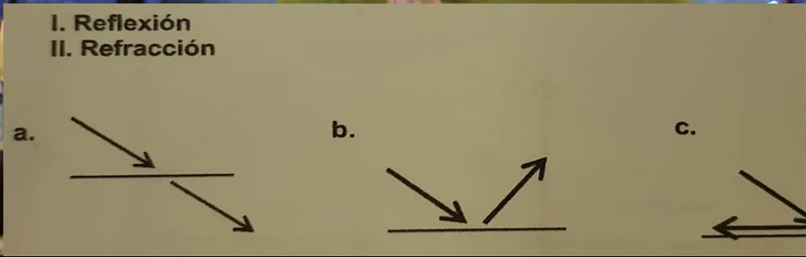

  1. Si un peatón recorre 40 m en 80 s, repentinamente se detiene durante 10 s y posteriormente avanza 20 m en 10 s. ¿Cuál es la rapidez media?

***R: $0.6 \, \text{m/s}$***

> La fórmula principal para calcular la rapidez es:
>
> $V = \frac{d}{t}$
>
> Donde:
>
> - $d$: Distancia total recorrida (m)
> - $t$: Tiempo total transcurrido (s)
> - $V$: Rapidez media (m/s)
>
> Sumamos las distancias:
>
> $d = 40 \, \text{m} + 0 \, \text{m} + 20 \, \text{m} = 60 \, \text{m}$
>
> Sumamos los tiempos:
>
> $t = 80 \, \text{s} + 10 \, \text{s} + 10 \, \text{s} = 100 \, \text{s}$
>
> Sustituyendo en la fórmula:
>
> $V = \frac{60 \, \text{m}}{100 \, \text{s}}$
>
> $V = 0.6 \, \text{m/s}$
>
> Por lo tanto, la rapidez media del peatón es de $0.6 \, \text{m/s}$.

---

2. ¿Cuál de los siguientes materiales sirve para medir la antigüedad de los fósiles?

***R: Carbono-14***

> El carbono-14 ($^{14}C$) es un isótopo radiactivo utilizado en la datación de restos orgánicos, ya que permite estimar la antigüedad de fósiles o materiales que contuvieron vida.

---

3. ¿Cuál es el peso en Newtons de un cuerpo con una masa de 10 kg? (g = $9.8 \, \text{m/s}^2$)

***R: $98 \, \text{N}$***

> La fórmula para calcular el peso es:
>
> $P = m \cdot g$
>
> Donde:
>
> - $P$: Peso (N)
> - $m$: Masa (kg)
> - $g$: Gravedad ($\text{m/s}^2$)
>
> Datos:
>
> - $m = 10 \, \text{kg}$
> - $g = 9.8 \, \text{m/s}^2$
>
> Sustituyendo:
>
> $P = 10 \, \text{kg} \times 9.8 \, \text{m/s}^2$
>
> $P = 98 \, \text{N}$
>
> Por lo tanto, el peso del cuerpo es de $98 \, \text{N}$.

---

4. Un gato hidráulico se utiliza para cambiar la llanta de un coche. Si se le aplica una fuerza de $80 \, \text{N}$ en un área de $5 \, \text{cm}^2$ sobre el émbolo del pistón y el auto se recarga en un área de $25 \, \text{cm}^2$, ¿qué fuerza se genera?

***R: $400 \, \text{N}$***

> Según el principio de Pascal:
>
> Las presiones en ambos émbolos son iguales:
>
> $P_1 = P_2$
>
> Por lo tanto:
>
> $\frac{F_1}{A_1} = \frac{F_2}{A_2}$
>
> Datos:
>
> - $F_1 = 80 \, \text{N}$
> - $A_1 = 5 \, \text{cm}^2$
> - $A_2 = 25 \, \text{cm}^2$
>
> Sustituyendo:
>
> $F_2 = \frac{A_2 \times F_1}{A_1}$
>
> $F_2 = \frac{25 \, \text{cm}^2 \times 80 \, \text{N}}{5 \, \text{cm}^2}$
>
> $F_2 = 400 \, \text{N}$
>
> Por lo tanto, la fuerza generada es de $400 \, \text{N}$.

---

5. En un cuerpo con Movimiento Rectilíneo Uniforme (MRU), ¿cómo aumentas su velocidad?

***R: Disminuyendo su cantidad de inercia***

> La inercia es la resistencia de un cuerpo a cambiar su estado de movimiento. Si se disminuye la inercia (por ejemplo, reduciendo la masa), es más fácil aumentar la velocidad del cuerpo en MRU.

---

6. Una persona que pesa $500 \, \text{N}$ salta sobre un resorte de $25 \, \text{cm}$ y se comprime $10 \, \text{cm}$. Si una persona de $900 \, \text{N}$ salta sobre el mismo resorte, sabiendo que su coeficiente es de $50 \, \text{N/cm}$, ¿cuánto se comprime el resorte?

***R: $18 \, \text{cm}$***

> Aplicamos la **Ley de Hooke**:
>
> $F = k \cdot x$
>
> Donde:
>
> - $F$: Fuerza aplicada ($\text{N}$)
> - $k$: Constante del resorte ($\text{N/cm}$)
> - $x$: Deformación o compresión ($\text{cm}$)
>
> Queremos despejar $x$:
>
> $x = \frac{F}{k}$
>
> Sustituimos:
>
> $x = \frac{900 \, \text{N}}{50 \, \text{N/cm}}$
>
> $x = 18 \, \text{cm}$
>
> Por lo tanto, el resorte se comprime $18 \, \text{cm}$.

---

7. Relaciona los diagramas considerando la trayectoria de un haz de luz que corresponde a los fenómenos de reflexión y refracción respectivamente.

***R: I-b y II-a***

> La reflexión ocurre cuando la luz rebota sobre una superficie, mientras que la refracción es cuando la luz cambia de dirección al pasar de un medio a otro.

---

8. Desde cierta altura se deja caer una piedra en un estanque. ¿Cómo son las ondas que se forman en el agua?

***R: Las ondas son transversales, pues se desplazan de forma perpendicular con respecto a la dirección del movimiento.***

> Las partículas del agua oscilan de forma perpendicular al avance de la onda.

---

9. Si la aceleración de la gravedad en la CDMX es de aproximadamente $9.78 \, \text{m/s}^2$, se puede decir que:

***R: La velocidad de los objetos aumenta $9.78 \, \text{m/s}$ cada segundo de caída.***

> Es decir, por cada segundo de caída libre, la velocidad del objeto se incrementa en $9.78 \, \text{m/s}$ debido a la gravedad.

---

10. La potencia que produce un horno de microondas es de $1200 \, \text{W}$. Si la diferencia de potencial es de $120 \, \text{V}$, ¿cuánta corriente circula?

> Usamos la fórmula de potencia eléctrica:
>
> $P = I \cdot V$
>
> Despejamos la corriente:
>
> $I = \frac{P}{V}$
>
> Sustituyendo valores:
>
> $I = \frac{1200 \, \text{W}}{120 \, \text{V}}$
>
> $I = 10 \, \text{A}$

***R: 10 A***
