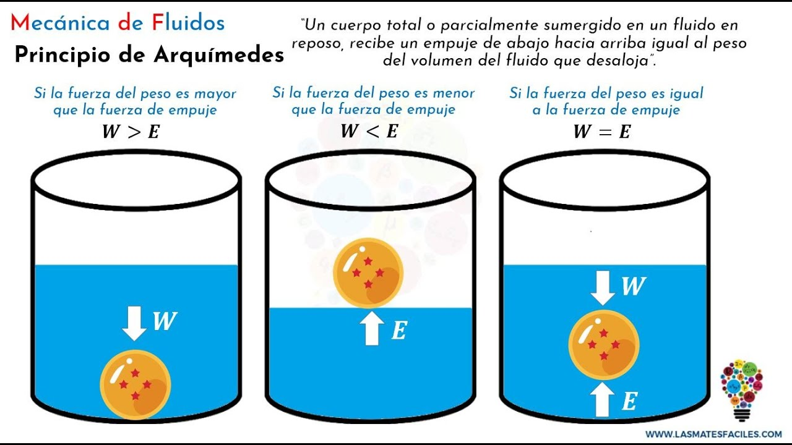
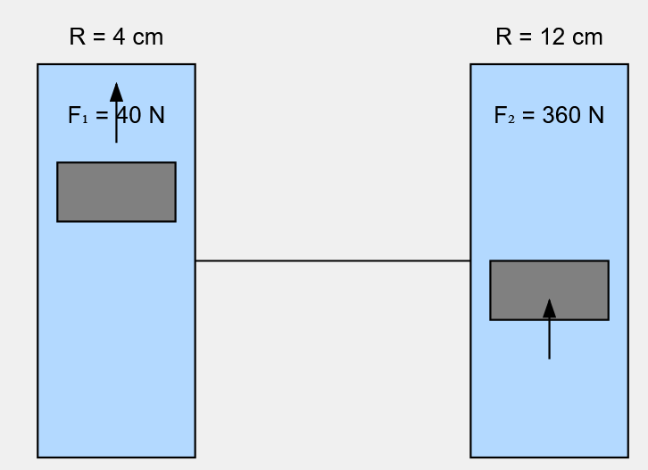
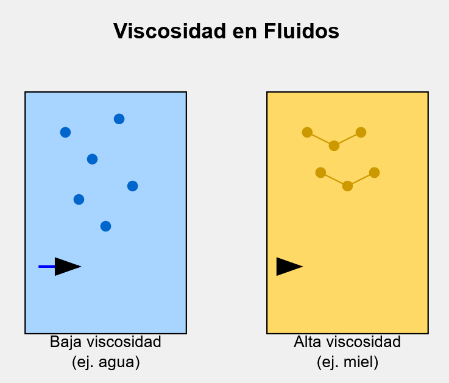
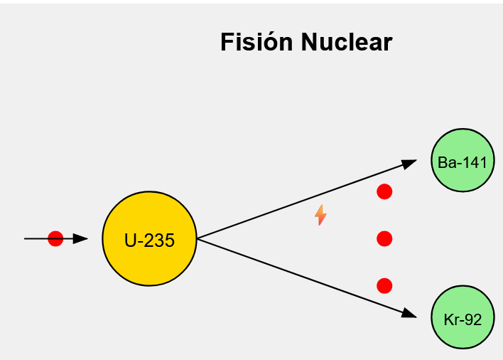
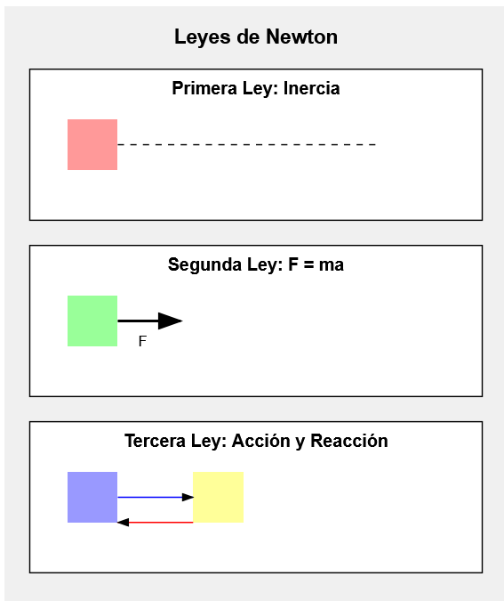
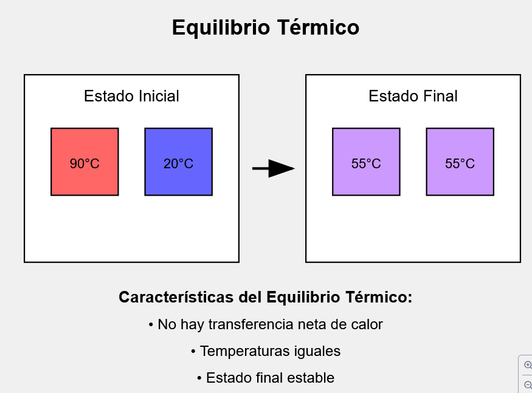

1. Como se le llama al fenomeno en el cual un cuerpo al ser sumergido en un fluido desplaza al mismo volumen de fluido que su volumen sumergido.

R: Empuje / Principio de Arquimedes

> 

---

2. Si en el embolo menor tengo una fuerza de 40 N y un Radio = 4 cm, 
De cuanto sera la Fuerza del embolo mayor?, Si tiene un Radio=12 cm

R:$F_{mayor} = 360 N$

> 
> $F1/A1 = F2/A2$ (A: Area)
>
> El émbolo menor (izquierda):
> - Radio = 4 cm
> - Fuerza aplicada = 40 N
> - Área menor = π(4 cm)² = 16π cm²
> 
> El émbolo mayor (derecha):
> - Radio = 12 cm
> - Fuerza resultante = F2 
> - Área mayor = π(12 cm)² = 144π cm²
> $ F1 = \frac{(40 \, N) \cdot (144\pi)}{16\pi} = (40\,N)\cdot(9) = 360 \, N $

---

3. Si el embolo mayour tengo una fuerza de 8000 N y n Radio= 80 cm, De cuanto sera la Fuerza del embolo menor?, Si tiene un Radio = 5 cm     

R: Fmayor: 31.25 N

> 
>
> ### Problema de Prensa Hidráulica
> 
> **Datos:**
> - F₂ (Fuerza mayor) = 8000 N
> - R₂ (Radio mayor) = 80 cm
> - R₁ (Radio menor) = 5 cm
> - F₁ (Fuerza menor) = ? (buscamos esto)
> 
> **Solución:**
> 1. Calculamos las áreas:
>    - A₁ = π(R₁)² = π(5 cm)² = 25π cm²
>    - A₂ = π(R₂)² = π(80 cm)² = 6400π cm²
> 
> 2. Usando el principio de Pascal:
>    - F₁/A₁ = F₂/A₂
>    - F₁ = F₂(A₁/A₂)
>    - F₁ = 8000 N × (25π/6400π)
>    - F₁ = 8000 N × (25/6400)
>    - F₁ = 8000 N × (1/256)
>    - F₁ = 31.25 N
> 
> **Respuesta: La fuerza en el émbolo menor será de 31.25 N**

---

4. Se considera dual a aquello que presenta comportamiento de particula y onda, un ejemplo es: 

R: La luz

---

5. La oposicion de un fluido a sufrir deformaciones por la oposicion de la fuerza de cohesion de sus moleculas se conoce como: 

R: Viscosidad

La respuesta es:

> VISCOSIDAD
> 
> Es la resistencia que presenta un fluido a fluir debido a la fuerza de cohesión entre sus moléculas. Mayor viscosidad significa mayor resistencia al flujo.
>
> 
> En la imagen se muestra:
> 
> 1. A la izquierda: 
>    - Fluido con baja viscosidad (como el agua)
>    - Moléculas más separadas
>    - Mayor velocidad de flujo
> 
> 2. A la derecha:
>    - Fluido con alta viscosidad (como la miel)
>    - Moléculas más juntas y cohesionadas
>    - Menor velocidad de flujo
> 

---

6. Cual es el indice de refraccion de un medio si en la velocidad de la luz es de 240,000 km/s?

R: n = 1.25 

>Vamos a resolver este problema paso a paso usando la fórmula del índice de refracción.
>
 

> Datos:
> - Velocidad de la luz en el medio (v) = 240,000 km/s
> - Velocidad de la luz en el vacío (c) = 300,000 km/s
> 
> Fórmula del índice de refracción (n):
>- $N: \text{indice de retencio}$
>- $c: \text{Velocidad de la luz}$
>- $v: \text{Velocidad de la luz en el medio}$
>
> $n = \frac{c}{v} $

>Procedimiento:
>1. Sustituimos los valores en la fórmula:
>
>    $n = \frac{300,000 km/s}{ 240,000 km/s} = \frac{30}{24} = \frac{5}{4} $
>
>    $n = 1.25$

---

7. Algunos animales como os murcielagos para poder moverse en la noche y no chocar contra objetos, que fenomeno ondulatorio utilizan?

R:  Reflexion

---

8. Proceso en el cual los nucles atomicos pesados se dividen en dos o mas nucleos ligeros:  

R: Fision nuclear

>Un proceso nuclear donde el núcleo de un átomo pesado se divide en núcleos más pequeños, liberando una gran cantidad de energía y neutrones.
>
>Proceso:
>
> - Un neutrón golpea un átomo pesado (generalmente Uranio-235)
> - El átomo se divide en elementos más ligeros
> - Se liberan más neutrones
> - Se libera una gran cantidad de energía
>
>

---

9. Todo cuerpo permanece en reposo o en movimiento rectilineo uniforme a menos que una fuerza externa cambie su estado. Lo anterior pertenece a:

R: 1era ley de Newton 

>
>
> Las Tres Leyes de Newton:
> 
>1. Primera Ley - Ley de la Inercia:
> - Un cuerpo permanece en reposo o en movimiento rectilíneo uniforme a menos que actúe sobre él una fuerza externa.
> 
> 
>2. Segunda Ley - Ley de la Fuerza:
> - La fuerza es igual a la masa por la aceleración (F = ma).
> - La aceleración de un objeto es directamente proporcional a la fuerza neta que actúa sobre él e inversamente proporcional a su masa.
> 
> 
>3. Tercera Ley - Ley de Acción y Reacción:
> - A toda acción le corresponde una reacción igual y opuesta.
> - Las fuerzas siempre ocurren en pares.

---

10. Cuando se da el equilibrio termico 

R: Cuando no hay intercambio de energia entre los cuerpos y sus temperaturas son iguales

> El equilibrio térmico es:
>
>Un estado en el que dos o más cuerpos que están en contacto térmico alcanzan la misma temperatura. En este estado, no hay transferencia neta de calor entre los cuerpos.
>
>Proceso:
> - El calor fluye del cuerpo más caliente al más frío
> - La transferencia continúa hasta alcanzar la misma temperatura
> - No hay más transferencia de calor una vez alcanzado el equilibrio

>