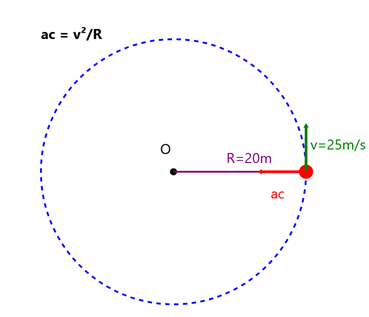

1. Desde lo alto de una torre de 6.05 metros, se deja caer un objeto. ¿Cuál es la velocidad con la que llega al suelo? 
Considera que: $ g = 10 \, \text{m/s}^2 $

**R: 11 m/s**

> Para calcular la velocidad con la que el objeto llega al suelo, usamos la fórmula de **caída libre**:
> 
> $ v = \sqrt{2 \cdot g \cdot h} $
> 
> ### Donde:
> - $ v $ = velocidad final
> - $ g $ = aceleración gravitacional (10 m/s²)
> - $ h $ = altura (6.05 m)
> 
> ### Sustituyendo los valores:
> $ v = \sqrt{2 \cdot 10 \, \text{m/s}^2 \cdot 6.05 \, \text{m}} = \sqrt{121} = 11 \, \text{m/s} $
>
> La velocidad con la que llega al suelo es **11 m/s**.

---

2. Un proyectil se dispara con una velocidad de 80 m/s y forma un ángulo de 30 grados con la horizontal. ¿Cuál es la altura máxima que alcanza?
Considera que: $ g = 10 \, \text{m/s}^2 $

**R: 80 metros**

> Usaremos las ecuaciones de tiro parabólico:
> 
> La altura máxima se puede calcular con la fórmula:
> 
> $ h_{\text{max}} = \frac{(v_{0y})^2}{2g} $
> ```
> Y ↑
> |   * (altura máxima)
> |  / \    
> | /   \   
> |/     \  
> ------+-\----------→ X
> |
> ```
> $ v_0 = 80 \, \text{m/s} $
> $ \theta = 30^\circ $
> 
> Donde $ v_{0y} $ es la componente vertical de la velocidad inicial:
>
> $ v_{0y} = v_0 \cdot \sin(\theta) $
> 
> Paso a paso:
> 1) Calculamos $ v_{0y} $:
>    * $ v_{0y} = 80 \, \text{m/s} \cdot \sin(30^\circ) $
>    * $ v_{0y} = 80 \, \text{m/s} \cdot 0.5 $
>    * $ v_{0y} = 40 \, \text{m/s} $
> 
> 2) Aplicamos la fórmula de altura máxima:
>    * $ h_{\text{max}} = \frac{(40 \, \text{m/s})^2}{(2 \cdot 10 \, \text{m/s}^2)} $
>    * $ h_{\text{max}} = \frac{1600}{20} $
>    * $ h_{\text{max}} = 80 \, \text{metros} $
> 
> Por lo tanto, el proyectil alcanzará una altura máxima de 80 metros.

---

3. En el movimiento circular uniforme, la aceleración centrípeta es igual a la velocidad tangencial al cuadrado entre el radio de la trayectoria. Si un auto de prueba viaja a razón de 25 m/s en una curva de 20 metros de radio, ¿cuál es el valor de su aceleración? 

**R: 31.25 m/s²**

> 
> 
> Para calcular la aceleración centrípeta:
> La fórmula es: $ a_c = \frac{v^2}{R} $
> 
> Donde:
> - $ v = 25 \, \text{m/s} $ (velocidad tangencial)
> - $ R = 20 \, \text{m} $ (radio de la curva)
> - $ a_c $ = aceleración centrípeta
> 
> Sustituyendo:
> - $ a_c = \frac{(25 \, \text{m/s})^2}{20 \, \text{m}} $
> - $ a_c = \frac{625 \, \text{m}^2/\text{s}^2}{20 \, \text{m}} $
> - $ a_c = 31.25 \, \text{m/s}^2 $

---

4. Se tienen 4 resistencias conectadas en paralelo de 2, 4, 5 y 7 ohmios respectivamente, calcula la resistencia total del circuito:

**R: 0.915 ohmios**

> Para calcular la **resistencia total** $ R_t $ en un circuito en paralelo, usamos la fórmula:
>
> $ 
> \frac{1}{R_t} = \frac{1}{R_1} + \frac{1}{R_2} + \frac{1}{R_3} + \frac{1}{R_4}
> $
>
> ### Donde:
> - $ R_1 = 2 \, \Omega $
> - $ R_2 = 4 \, \Omega $
> - $ R_3 = 5 \, \Omega $
> - $ R_4 = 7 \, \Omega $
>
> ### Sustituyendo:
> $ 
> \frac{1}{R_t} = \frac{1}{2} + \frac{1}{4} + \frac{1}{5} + \frac{1}{7}
> $
>
> ### Calculando cada término:
> $ \frac{1}{2} = 0.5, \quad \frac{1}{4} = 0.25, \quad \frac{1}{5} = 0.2, \quad \frac{1}{7} \approx 0.1429 $
>
> ### Sumando las fracciones:
> $ 
> \frac{1}{R_t} = 0.5 + 0.25 + 0.2 + 0.1429 = 1.0929
> $
>
> ### Invirtiendo para encontrar $ R_t $:
> $ 
> R_t = \frac{1}{1.0929} \approx 0.915 \, \Omega
> $
>
> La **resistencia total** del circuito es aproximadamente **0.915 \, \Omega**.
>
>
> ```
>        ┌───R1───┐
>        │ 2 Ω    │
>        │        │
>     ┬──┴────────┴──┬
>     │              │
>     │  ┌───R2───┐  │
>     │  │ 4 Ω    │  │
>     │  │        │  │
>     ┼──┴────────┴──┼
>     │              │
>     │  ┌───R3───┐  │
>     │  │ 5 Ω    │  │
>     │  │        │  │
>     ┼──┴────────┴──┼
>     │              │
>     │  ┌───R4───┐  │
>     │  │ 7 Ω    │  │
>     │  │        │  │
>     ┴──┴────────┴──┴
>
> ```

---

---

5. ¿Cuál es el volumen de un cubo de platino de 50 kg?  
$ \rho = 21,450 \, \text{kg/m}^3$  
(Toma $ \rho$ como símbolo de densidad en este caso)

**R: 0.0023 m³**

> Para calcular el **volumen** de un cubo, usamos la fórmula de la densidad ($ \rho$):
>
> $ \rho = \frac{m}{V}$
>
> ### Donde:
> - $ \rho$ = densidad (21,450 kg/m³)
> - $ m$ = masa (50 kg)
> - $ V$ = volumen (en m³)
>
> ### Despejando $ V$:
> $ V = \frac{m}{\rho}$
>
> ### Sustituyendo los valores:
> $ V = \frac{50 \, \text{kg}}{21,450 \, \text{kg/m}^3} \approx 0.00233 \, \text{m}^3$
>
> El **volumen** del cubo es aproximadamente **0.00233 m³**.

---

6. Un objeto de masa $ M$ se deja caer desde una altura de 20 metros, ¿cuál es la rapidez con la que llegará al suelo?   

**R: 19.8 m/s**

> Para calcular la **rapidez** con la que el objeto llega al suelo, usamos la fórmula de caída libre:
>
> $ v = \sqrt{2 \cdot g \cdot h}$
>
> ### Donde:
> - $ v$ = velocidad final (en m/s)
> - $ g$ = aceleración gravitacional (10 m/s²)
> - $ h$ = altura (20 m)
>
> ### Sustituyendo los valores:
> $ v = \sqrt{2 \cdot 10 \, \text{m/s}^2 \cdot 20 \, \text{m}} = \sqrt{400} = 20 \, \text{m/s}$
>
> Resultado: La raíz cuadrada de 400 es **20**.
>
> La **rapidez** con la que llega al suelo es **20 m/s**.
>
> ### Representación gráfica con caracteres:
>
> ```plaintext
>          Objeto en caída
>               O
>               │
>               │
>               │
>               │
>               │
>               │  h = 20 m
>               │
>               │
>               │
>               │
>              \│/
>               ■  (Suelo)
>
> Velocidad final: 20 m/s
> ```

---

---

7. ¿Cómo es la aceleración de un cuerpo en caída libre, despreciando la resistencia del aire? 

**R: Permanece constante y es igual a la gravedad**

> La **aceleración** de un cuerpo en **caída libre**, despreciando la resistencia del aire, es constante y está determinada por la **gravedad** del planeta. En la Tierra, esta aceleración se representa como **$g$** y su valor estándar es:
>
> $g = 9.81 \, \text{m/s}^2$
> 
> ### Características:
> 1. **Constante**: La aceleración no cambia con el tiempo mientras el cuerpo esté en caída libre.
> 2. **Dirección**: Apunta siempre hacia el centro de la Tierra (dirección vertical hacia abajo).
> 3. **Independiente de la masa**: Todos los cuerpos, sin importar su masa, experimentan la misma aceleración cuando se descarta la resistencia del aire.
> 
> ### Representación gráfica con caracteres:
> 
> ```plaintext
>    Altura inicial (h)       → Aceleración constante: g = 9.81 m/s²
>           O
>           │      │      │      │      │      
>           │      │      │      │      ▼      
>           │      │      │      ▼            
>           │      │      ▼                  
>           │      ▼                          
>           ▼
>        (Suelo)
> ```

---

8. "En la tercera ley de Newton, si un cuerpo interactúa con otro aplicándole una fuerza, entonces el segundo cuerpo reaccionará aplicando al primero fuerza ... "

(Completa la ley)

**R: "de igual magnitud y sentido opuesto"**

> 
>
> Las Tres Leyes de Newton:
> 
> 1. Primera Ley - Ley de la Inercia:
> - Un cuerpo permanece en reposo o en movimiento rectilíneo uniforme a menos que actúe sobre él una fuerza externa.
> 
> 2. Segunda Ley - Ley de la Fuerza:
> - La fuerza es igual a la masa por la aceleración (F = ma).
> - La aceleración de un objeto es directamente proporcional a la fuerza neta que actúa sobre él e inversamente proporcional a su masa.
> 
> 3. Tercera Ley - Ley de Acción y Reacción:
> - A toda acción le corresponde una reacción igual y opuesta.
> - Las fuerzas siempre ocurren en pares.

---

---

9. Se aplican las siguientes fuerzas sobre un cuerpo:
- **F1 = 120 N, 0 grados**
- **F2 = 50 N, 270 grados**

¿Cuál es la magnitud de la fuerza resultante sobre dicho cuerpo?

**R: 130 N**

> Para encontrar la **magnitud de la fuerza resultante** sobre un cuerpo cuando se aplican varias fuerzas, primero debemos descomponer cada fuerza en sus componentes x (horizontal) e y (vertical) y luego sumarlas.
>
> ### Dadas las fuerzas:
> 1. **F1 = 120 N, 0 grados**:
>    - Componente x: $F_{1x} = 120 \, \text{N} \cdot \cos(0°) = 120 \, \text{N}$
>    - Componente y: $F_{1y} = 120 \, \text{N} \cdot \sin(0°) = 0 \, \text{N}$
>
> 2. **F2 = 50 N, 270 grados**:
>    - Componente x: $F_{2x} = 50 \, \text{N} \cdot \cos(270°) = 0 \, \text{N}$
>    - Componente y: $F_{2y} = 50 \, \text{N} \cdot \sin(270°) = -50 \, \text{N}$
>
> ### Sumamos las componentes:
> - Componente total en x:
>   $$F_{Rx} = F_{1x} + F_{2x} = 120 \, \text{N} + 0 \, \text{N} = 120 \, \text{N}$$
>
> - Componente total en y:
>   $$F_{Ry} = F_{1y} + F_{2y} = 0 \, \text{N} - 50 \, \text{N} = -50 \, \text{N}$$
>
> ### Magnitud de la fuerza resultante:
> Usamos el teorema de Pitágoras:
> $$F_R = \sqrt{(F_{Rx})^2 + (F_{Ry})^2}$$
>
> $$F_R = \sqrt{(120 \, \text{N})^2 + (-50 \, \text{N})^2}$$
> $$F_R = \sqrt{14400 + 2500}$$
> $$F_R = \sqrt{16900}$$
> $$F_R = 130 \, \text{N}$$
>
> ### Resultado:
> La **magnitud de la fuerza resultante** sobre el cuerpo es **130 N**.

---

10. El enunciado: "La fuerza de atracción de dos cuerpos es directamente proporcional al producto de sus masas e inversamente proporcional al cuadrado de la distancia que las separa" corresponde a:

**R: La ley de la gravitación universal**

> La **Ley de la Gravitación Universal**, formulada por **Isaac Newton**, establece que todos los cuerpos en el universo se atraen mutuamente con una fuerza que es directamente proporcional al producto de sus masas e inversamente proporcional al cuadrado de la distancia que los separa. Se expresa matemáticamente como:
>
> $$ F = G \frac{m_1 m_2}{r^2} $$
>
> ### Donde:
> - **$F$**: Fuerza de atracción gravitacional entre dos cuerpos.
> - **$G$**: Constante de gravitación universal (aproximadamente $6.674 \times 10^{-11} \, \text{N m}^2/\text{kg}^2$).
> - **$m_1$ y $m_2$**: Masas de los dos cuerpos.
> - **$r$**: Distancia entre los centros de los dos cuerpos.
>
> ### Características de la ley:
> 1. **Gravitación universal**: Se aplica a todos los cuerpos, sin importar su tamaño o masa.
> 2. **Atracción**: La fuerza es siempre atractiva y actúa a lo largo de la línea que une los centros de los cuerpos.
> 3. **Inversamente proporcional**: A medida que la distancia entre los cuerpos aumenta, la fuerza de atracción disminuye rápidamente.


