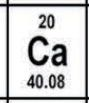

1. **¿Cuál de los siguientes es un compuesto?**

   > **R:** **Metano (CH₄)**

   > **E:**
   > - **Elemento:** Una sustancia pura formada solo por un tipo de átomo. Ejemplos: oxígeno (O), carbono (C). No se puede descomponer en algo más simple.
   > - **Compuesto:** Una sustancia pura formada por la combinación química de dos o más elementos en proporciones fijas. Ejemplos: agua (H₂O), sal (NaCl). Se puede descomponer en sus elementos.
   > - **Mezcla homogénea:** Una mezcla en la que los componentes están uniformemente distribuidos y no se pueden distinguir a simple vista. Ejemplo: agua con sal.
   > - **Mezcla heterogénea:** Una mezcla en la que los componentes son visibles y no están uniformemente distribuidos. Ejemplo: ensalada o arena con piedras.

   

---

2. **¿Un elemento con peso atómico de 55 y número atómico 25, qué cantidad de protones, electrones y neutrones tiene?**

   > **R:** 25 protones, 25 electrones y 30 neutrones

   > **E:** Para realizar los cálculos aplicaremos varias fórmulas básicas:
   >
   > - `(Número Atómico) = (Número de Protones)`: Por lo tanto, si el número atómico es 25, el número de protones es 25.
   > - `Átomos neutros: (Protones) = (Electrones)`: El número de protones es igual al número de electrones, que es 25.
   > - `(Número de Masa) = (Protones) + (Neutrones)`: Si despejamos la fórmula, `(Neutrones) = (Número de Masa) - (Protones)`, obtenemos 30 neutrones.

   

---

3. **¿Cuáles son las sustancias puras?**

   > **R:** 1. Agua, 2. Sodio, 3. Yodo, 4. Mercurio y 5. Calcio

   > **E:** Existen dos tipos de clasificación de la materia:
   >
   > - **Sustancias Puras:** Formadas por átomos o moléculas todas iguales, tienen propiedades específicas que las caracterizan y no pueden separarse en otras sustancias por procedimientos físicos. Se clasifican en elementos y compuestos.
   > - **Mezcla:** Resulta de la combinación de dos o más sustancias donde la identidad básica de cada una no se altera. Las mezclas se pueden separar por métodos físicos.

---

4. **¿Cuál es la masa molecular del bicarbonato de calcio (Ca(HCO₃)₂)?**

   > **R:** 162 g/mol

   > **E:**
   > 
   > | Elemento     | Masa Atómica | Cantidad | Total      |
   > |--------------|--------------|----------|------------|
   > | Calcio (Ca)  | 40.08        | 1        | 40.08      |
   > | Hidrógeno (H) | 1.008        | 2        | 2.016      |
   > | Carbono (C)  | 12.01        | 2        | 24.02      |
   > | Oxígeno (O)  | 16           | 6        | 96         |
   >
   > Total = 162.116 g/mol

   > 
   > 
   > 
   > 

---

5. **¿Cuál es el cambio de estado de líquido a sólido?**

   > **R:** Solidificación

   > **E:**

   > | Tipo de Cambio de Estado | Estado Inicial | Estado Final | Ejemplo                      |
   > |--------------------------|----------------|--------------|------------------------------|
   > | Fusión                   | Sólido         | Líquido      | Hielo a agua                 |
   > | Solidificación           | Líquido        | Sólido       | Agua a hielo                 |
   > | Vaporación               | Líquido        | Gas          | Agua hirviendo               |
   > | Condensación             | Gas            | Líquido      | Vapor de agua en un espejo   |
   > | Sublimación              | Sólido         | Gas          | Hielo seco (CO₂)             |
   > | Deposición               | Gas            | Sólido       | Escarcha en una ventana      |
   >
   > **Vaporación:** Cambio de estado de líquido a gas. Incluye:
   > - **Ebullición:** Vaporación rápida que ocurre a una temperatura específica (punto de ebullición). Ejemplo: agua hirviendo.
   > - **Evaporación:** Vaporación lenta que ocurre en la superficie del líquido. Ejemplo: el agua en una taza que se evapora a temperatura ambiente.

---

6. **Si la solubilidad es de 50 g/100 cm³ de agua a 70 grados Celsius y tengo 75 g a 70 grados Celsius en 100 cm³ de agua, por lo tanto, es una solución:**

   > **R:** Es una solución saturada y sobran 25 gramos sin disolver.

   > **E:** Dado que la solubilidad es de 50 g/100 cm³ y tienes 75 g disueltos en 100 cm³ de agua, la solución es sobresaturada.

   > **Cantidad de soluto que sobra:**

   > 75 g - 50 g = 25 g

   > Por lo tanto, **sobran 25 gramos** de soluto en la solución.

   > **Nota:**
   > - **Solución saturada:** Contiene la máxima cantidad de soluto que se puede disolver en el disolvente a una temperatura y presión específicas. No se puede disolver más soluto sin que se forme un precipitado.
   > - **Solución insaturada:** Contiene menos soluto del que puede disolverse en el disolvente a una temperatura y presión específicas. Se puede disolver más soluto en esta solución.

---

7. **¿Qué se forma al unir un elemento no metálico con oxígeno?**

   > **R:** Óxido ácido

   > **E:** Los óxidos ácidos son compuestos formados por un elemento no metálico y oxígeno que, cuando se disuelven en agua, forman ácidos. Estos óxidos reaccionan con agua para producir un ácido correspondiente.

   

---

8. **¿Qué sustancia se ioniza completamente en agua?**

   > **R:** Ácido clorhídrico (HCl)

   > **E:** Una **sustancia que se ioniza completamente en agua** es una **base fuerte** o un **ácido fuerte**.

   > #### Ácidos Fuertes
   > - **Ácido clorhídrico (HCl):** Se ioniza completamente en H⁺ y Cl⁻.
   > - **Ácido sulfúrico (H₂SO₄):** Se ioniza completamente en H⁺, HSO₄⁻, y luego SO₄²⁻.

   > #### Bases Fuertes
   > - **Hidróxido de sodio (NaOH):** Se ioniza completamente en Na⁺ y OH⁻.
   > - **Hidróxido de potasio (KOH):** Se ioniza completamente en K⁺ y OH⁻.

   > Los compuestos iónicos solubles en agua, como muchas sales, también se ionizan completamente en solución.

---

9. **El pH de una sustancia es de 4, este se determina como:**

   > **R:** Ácido

   > **E:** El pH es una medida de la acidez o alcalinidad de una solución. Se define en una escala que va de 0 a 14, donde:
   > - pH menor a 7: La solución es ácida.
   > - pH igual a 7: La solución es neutra.
   > - pH mayor a 7: La solución es básica o alcalina.

---

10. **¿Cuáles son los elementos con mayor electronegatividad?**

    > **R:** Flúor, Oxígeno, Cloro

    
