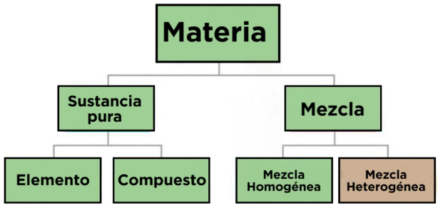

1. ¿Cual de las siguientes sustancias es un compuesto? 

***R: CO***

> **E:**
> - **Elemento:** Una sustancia pura formada solo por un tipo de átomo. Ejemplos: oxígeno (O), carbono (C). No se puede descomponer en algo más simple.
> - **Compuesto:** Una sustancia pura formada por la combinación química de dos o más elementos en proporciones fijas. Ejemplos: agua (H₂O), sal (NaCl). Se puede descomponer en sus elementos.
> - **Mezcla homogénea:** Una mezcla en la que los componentes están uniformemente distribuidos y no se pueden distinguir a simple vista. Ejemplo: agua con sal.
> - **Mezcla heterogénea:** Una mezcla en la que los componentes son visibles y no están uniformemente distribuidos. Ejemplo: ensalada o arena con piedras.

--- 
2. En la tabla periodica se encuentran organizados todos los elemmntos conocidos. Con respecto a esta organización la unica aseveración cierta es que:  

***R: Los elementos que se encuentran en una misma columna tienen un comportamiento quimico similar***

> Es **cierto** que los elementos que se encuentran en una misma columna (o **grupo**) de la tabla periódica tienen un comportamiento químico similar. Esto se debe a que los elementos en un mismo grupo tienen la misma cantidad de electrones en su capa de valencia, lo que determina cómo reaccionan químicamente.
> ### Razones:
>- **Electrones de valencia**: Los electrones en la capa externa son los que participan en las reacciones químicas. Los elementos en un grupo tienen configuraciones electrónicas similares en su capa de valencia.
> - **Propiedades químicas similares**: Elementos en el mismo grupo tienden a formar compuestos de tipo y estructura similares.
> ### Ejemplos:
> - **Grupo 1 (Alcalinos)**: Litio (Li), sodio (Na) y potasio (K) reaccionan de forma similar con el agua y forman compuestos iónicos.
> - **Grupo 17 (Halógenos)**: Flúor (F), cloro (Cl) y bromo (Br) son altamente reactivos y tienden a formar sales con los metales.

--- 
3. ¿Cuales de los siguientes compuestos reaccionan al agua para formar un acido? 

R: 
ClO_2 : Dioxido de cloro
SO_2: Dioxido de azufre

> ClO₂ : Dióxido de cloro
> 
> El ClO₂ es un compuesto que, al reaccionar con agua, no forma un ácido directamente. En su lugar, se disuelve en agua formando una solución mixta que contiene ácido cloroso (HClO₂) y ácido clórico (HClO₃). La reacción es compleja y se puede representar de manera simplificada así:
>
> 2 ClO₂ + H₂O → HClO₂ + HClO₃
>
> Aunque el ClO₂ no es un ácido por sí mismo, su reacción con agua produce ácidos, lo que resulta en una solución ácida.
> 
> SO₂ : Dióxido de azufre
> 
> El SO₂ es un óxido no metálico (también llamado anhídrido ácido) que reacciona con agua para formar un ácido. La reacción es:
>
> SO₂ + H₂O → H₂SO₃ (ácido sulfuroso)
>
> Este es un ejemplo clásico de formación de un ácido a partir de un óxido no metálico y agua.
>
> Verificación experimental:
>
> Para ambos casos, se podría verificar la formación de ácidos midiendo el pH de la solución resultante. Una disminución significativa del pH (por debajo de 7) indicaría la presencia de ácidos.
>
> Es posible inferir si un compuesto es un ácido a partir de su fórmula química, aunque no siempre es absolutamente definitivo. Aquí hay algunas pautas generales:
> 1. Presencia de hidrógeno:
> - La mayoría de los ácidos tienen hidrógeno (H) en su fórmula.
> - Sin embargo, no todos los compuestos con H son ácidos.
> 
> 2. Estructura típica:
> - Ácidos binarios: HX, donde X es un no metal (ej. HCl, HF)
> - Oxoácidos: HxAOy, donde A es generalmente un no metal (ej. H2SO4, HNO3)
> 
> 3. Grupos funcionales:
> 
> - COOH (grupo carboxilo) indica un ácido carboxílico
> - SO3H indica un ácido sulfónico
> - PO(OH)2 indica un ácido fosfónico
> 
> 4. Nomenclatura:
> 
> - Nombres que comienzan con "ácido" suelen indicar ácidos
>   - Ej: ácido sulfúrico (H2SO4), ácido nítrico (HNO3)
> 
> 5. Elementos no metálicos:
>- Compuestos de H con no metales de los grupos 15-17 suelen ser ácidos
>   - Ej: HCl, H2S, HBr
> 
> 6. Óxidos no metálicos:
> 
> - Aunque no son ácidos por sí mismos, forman ácidos al reaccionar con agua
>   - Ej: SO3, N2O5
> 
> Sin embargo, es importante notar que:
> 
> No todos los compuestos que contienen H son ácidos (ej. NH3, CH4)
> Algunos ácidos no contienen H en su fórmula molecular (ej. BF3, ácido de Lewis)
> El comportamiento ácido puede depender del contexto y la reacción
--- 
4. La formula $\text{KClO}_3$ (Clorato de potacio), establece que un mol de este compuesto contiene:

R: 1 mol de atomos de potacio, 1 mol de atomos de cloro y 3 moles de atomos de oxigeno 

> La fórmula $\text{KClO}_3$ (clorato de potasio) describe la composición de un mol de este compuesto. Veamos si la respuesta es correcta:
> 
> - **KClO₃** se descompone en:
>   - 1 átomo de potasio (K)
>   - 1 átomo de cloro (Cl)
>   - 3 átomos de oxígeno (O)
> 
> ### Verificación:
> - **1 mol de átomos de potasio (K)**: Correcto, ya que hay un átomo de potasio en la fórmula.
> - **1 mol de átomos de cloro (Cl)**: Correcto, ya que hay un átomo de cloro en la fórmula.
> - **3 moles de átomos de oxígeno (O)**: Correcto, ya que hay 3 átomos de oxígeno en la fórmula.

--- 
5. ¿Que sustancia reune las siguientes 3 caracteristicas "en contacto con el papel tornasol produce un color azul con el indicador fenolftaleina"? 

R: Base o hidroxido

> #### Uso del Papel Tornasol 
> 
> El **papel tornasol** es un indicador comúnmente utilizado para identificar si una sustancia es ácida o básica. Viene en dos formas: **papel tornasol rojo** y **papel tornasol azul**. Cuando se usa en la detección de ácidos, el papel tornasol responde de la siguiente manera:
> 
> #### Comportamiento del papel tornasol 
> 
> - Si el papel tornasol azul se vuelve rojo, la solución es ácida.
> - Si el papel tornasol rojo se vuelve azul, la solución es básica o alcalina.
>
> #### Conclusion rapida: 
> - AZUL: Acido
> - ROJO: Base

---

6. La solubilidad de una cantidad dada de un soluto en un disolvente aumenta 

R: Al aumentar la temperatura

> Un soluto es la sustancia que se disuelve en un disolvente para formar una solución. Aquí tienes algunos puntos clave sobre los solutos:
>
>    Ejemplos:
        Sólido: Sal (NaCl) disuelta en agua.
        Líquido: Alcohol (etanol) disuelto en agua.
        Gas: Dióxido de carbono (CO₂) disuelto en agua carbonatada.
>
> La solubilidad de un soluto en un disolvente puede aumentar por varios motivos:
> 
> 1. **Aumento de la temperatura**: 
>    - Para **sólidos y líquidos**, la solubilidad generalmente incrementa. 
>    - Para **gases**, la solubilidad disminuye con el aumento de la temperatura.
> 
> 2. **Cambio en la naturaleza del soluto o disolvente**: 
>    - La regla **"lo semejante disuelve a lo semejante"** indica que solutos polares son más solubles en disolventes polares, y viceversa.
> 
> 3. **Presión (para gases)**: 
>    - Aumentar la presión sobre un gas en un disolvente incrementa su solubilidad, siguiendo la **Ley de Henry**.
> 
> 4. **Adición de sustancias que alteren la solubilidad**: 
>    - La adición de otros componentes al sistema puede aumentar la solubilidad del soluto.

--- 
7. ¿Cual de los siguientes compuestos es un oxido basico? 

R: CaO

> La respuesta es correcta. **CaO** (óxido de calcio) es un óxido básico. Aquí tienes la validación:
> 
> #### Razones:
> 
> 1. **Definición de óxido básico**:
>    - Un óxido básico es un compuesto que se forma por la reacción de un metal con oxígeno y que puede reaccionar con ácidos para formar sales y agua.
> 
> 2. **Características del CaO**:
>    - **Composición**: CaO está compuesto por calcio (Ca), un metal alcalinotérreo, y oxígeno (O).
>    - **Propiedades**: CaO reacciona con ácidos, como el ácido clorhídrico (HCl), para formar cloruro de calcio (CaCl₂) y agua. Esta propiedad es típica de los óxidos básicos.
> 
> 3. **Ejemplo de reacción**:
>    - Cuando CaO se mezcla con HCl:
>    $
>      \text{CaO} + 2 \text{HCl} \rightarrow \text{CaCl}_2 + \text{H}_2\text{O}
>    $

--- 
8. ¿Cual de los siguientes compuestos es un oxido acido?

***R: $SO_3$***

> La respuesta es correcta. **SO₃** (trióxido de azufre) es un óxido ácido. Aquí tienes la validación:
> 
> #### Razones:
> 
> 1. **Definición de óxido ácido**:
>    - Un óxido ácido es un compuesto que se forma por la reacción de un no metal con oxígeno y que puede reaccionar con bases para formar sales y agua.
> 
> 2. **Características del SO₃**:
>    - **Composición**: SO₃ está compuesto por azufre (S), un no metal, y oxígeno (O).
>    - **Propiedades**: SO₃ reacciona con agua para formar ácido sulfúrico (H₂SO₄), que es un ácido fuerte.
> 
> 3. **Ejemplo de reacción**:
>    - Cuando SO₃ se mezcla con agua:
>     $
>      \text{SO}_3 + \text{H}_2\text{O} \rightarrow \text{H}_2\text{SO}_4
>     $
> ### Conclusión:
> Por lo tanto, **SO₃ es efectivamente un óxido ácido**.

--- 
9.  Enlace presente entre aminoacidos cuando forma un  a proteina 

R: Peptidico
> ### Enlace Peptídico
> 
> 1. **Definición**:
>    - El enlace peptídico es un tipo de enlace covalente que se forma entre el grupo carboxilo (-COOH) de un aminoácido y el grupo amino (-NH₂) de otro aminoácido.
> 
> 2. **Proceso de formación**:
>    - Durante la formación del enlace peptídico, se produce una **reacción de condensación** o **deshidratación**, donde se libera una molécula de agua (H₂O).
> 
> 3. **Estructura**:
>    - El enlace peptídico tiene una estructura planar y es relativamente rígido debido a la resonancia, lo que limita la rotación entre los átomos involucrados.
> 
> 4. **Importancia**:
>    - Los enlaces peptídicos son fundamentales para la formación de proteínas, que son polímeros de aminoácidos. La secuencia y la disposición de los aminoácidos en la cadena polipeptídica determinan la estructura y función de la proteína.
> 
> 5. **Ejemplo**:
>    - Un dipeptídico (como la alanina y la glicina) se forma de la siguiente manera:
>       $\text{Aminoácido 1} + \text{Aminoácido 2} \rightarrow \text{Dipeptídico} + \text{H}_2\text{O}$
> 

--- 
10. El aire es un ejemplo de:

R: Mezcla homogenia

> - **Elemento:** Una sustancia pura formada solo por un tipo de átomo. Ejemplos: oxígeno (O), carbono (C). No se puede descomponer en algo más simple.
> - **Compuesto:** Una sustancia pura formada por la combinación química de dos o más elementos en proporciones fijas. Ejemplos: agua (H₂O), sal (NaCl). Se puede descomponer en sus elementos.
> - **Mezcla homogénea:** Una mezcla en la que los componentes están uniformemente distribuidos y no se pueden distinguir a simple vista. Ejemplo: agua con sal.
> - **Mezcla heterogénea:** Una mezcla en la que los componentes son visibles y no están uniformemente distribuidos. Ejemplo: ensalada o arena con piedras.
>
> 