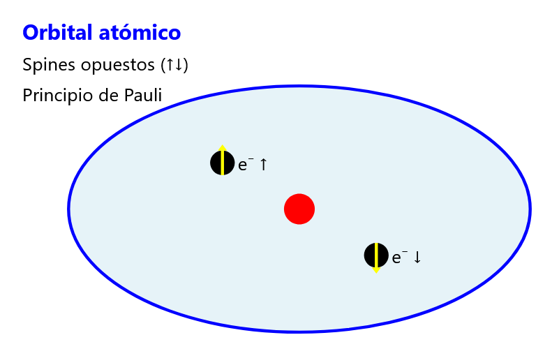
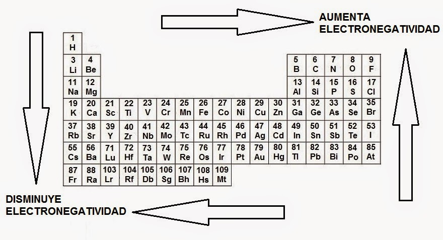
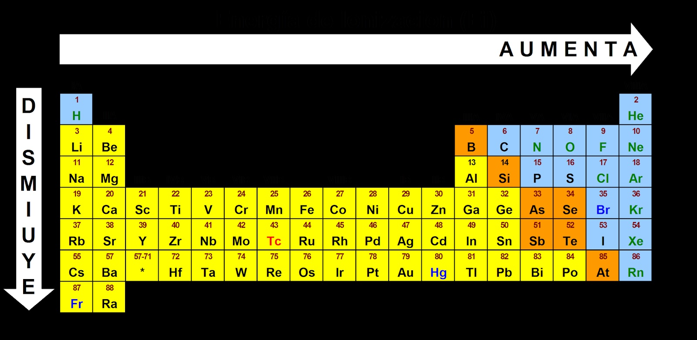
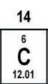
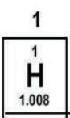
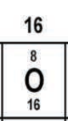

1. Cual de las siguientes no es una de las caracteristicas de una mezcla homogenea

R: Se puede observar a simple vista sus componentes

> **E:**
> - **Elemento:** Una sustancia pura formada solo por un tipo de átomo. Ejemplos: oxígeno (O), carbono (C). No se puede descomponer en algo más simple.
> - **Compuesto:** Una sustancia pura formada por la combinación química de dos o más elementos en proporciones fijas. Ejemplos: agua (H₂O), sal (NaCl). Se puede descomponer en sus elementos.
> - **Mezcla homogénea:** Una mezcla en la que los componentes están uniformemente distribuidos y no se pueden distinguir a simple vista. Ejemplo: agua con sal.
> - **Mezcla heterogénea:** Una mezcla en la que los componentes son visibles y no están uniformemente distribuidos. Ejemplo: ensalada o arena con piedras.


--- 
2. Cuales son caracteristicas de una mezcla? 

R:
 I. Se pueden separar por metodos fisicos
 II. Sus compoonentes conservan sus propiedades originales 


> ### Características de una mezcla:
> 1. **Separación Física**:
>    - Los componentes se pueden separar mediante métodos físicos como la filtración, decantación o destilación.
>
> 2. **No hay reacción química**:
>    - Las sustancias componentes no se combinan químicamente y mantienen sus propiedades originales.
>
> 3. **Composición Variable**:
>    - Las sustancias presentes en una mezcla pueden estar en proporciones diferentes, lo que permite variar su composición.
>
> 4. **Heterogénea u homogénea**:
>    - Las mezclas pueden ser **homogéneas** (uniformes en toda su extensión, como el aire) o **heterogéneas** (no uniformes, como agua y aceite).
>
> 5. **Propiedades Variables**:
>    - Las propiedades de la mezcla (como el punto de ebullición y la densidad) dependen de las proporciones de sus componentes.
>
> 6. **No tienen fórmula química definida**:
>    - A diferencia de los compuestos, las mezclas no tienen una fórmula química fija.

---
3. Caracteristicas que tienen los elementos en estado basal

R:
Tienen la misma cantidad de electrones y protones

> Un elemento en **estado basal** tiene el mismo número de **electrones** y **protones**, lo cual lo hace **electrónicamente neutro**. Sin embargo, esta característica se cumple para todos los átomos neutros, no solo en estado basal. Por lo tanto, aunque la respuesta es cierta, no cubre todas las características del estado basal: 
>
> Un átomo o elemento llega a su **estado basal** cuando:
>
> 1. **Regresa de un estado excitado**:
>    - Si un átomo ha absorbido energía (por ejemplo, luz o calor), sus electrones pueden saltar a niveles de energía más altos (estado excitado).
>    - Cuando los electrones pierden esta energía, regresan a sus posiciones originales, devolviendo al átomo a su estado basal.
>
> 2. **Emisión de energía**:
>    - Al regresar al estado basal, el átomo libera la energía absorbida en forma de luz (fotones) o calor. 
>    - Un ejemplo común es la emisión de luz en las lámparas fluorescentes, donde los átomos de gas se excitan y emiten luz al regresar a su estado basal.
>
> 3. **Distribución Electrónica Estable**:
>    - En el estado basal, los electrones ocupan los niveles de energía más bajos disponibles, según las reglas de la configuración electrónica (Principio de Aufbau, regla de Hund y el principio de exclusión de Pauli).
>  
> ### Estado Excitado ➜ Emisión de Energía ➜ Estado Basal
> Por lo tanto, un átomo en **estado basal** es aquel que ha liberado su exceso de energía y está en su **nivel energético más bajo y estable**.
>
> ### Características de los elementos en estado basal:
> 1. **Configuración Electrónica Más Estable**:
>    - Un elemento en estado basal tiene sus electrones distribuidos en los niveles de energía más bajos posibles, es decir, en su configuración más estable.
>
> 2. **Sin Energía Externa**:
>    - No se le ha proporcionado energía adicional, como calor o electricidad, que pudiera excitar a los electrones a niveles superiores.
>
> 3. **Propiedades Químicas y Físicas Propias**:
>    - Los elementos en estado basal muestran sus características químicas y físicas naturales, las cuales cambian si el elemento se excita.
>
> 4. **Estado de Menor Energía**:
>    - El estado basal representa la menor energía que el átomo puede tener sin perder estabilidad.
>
> 5. **Configuración Predecible**:
>    - La disposición de los electrones en estado basal sigue el principio de Aufbau, la regla de Hund y el principio de exclusión de Pauli.
>
> 6. **Emisión de Energía al Regresar**:
>    - Si un elemento es excitado y sus electrones pasan a un nivel de energía superior, al regresar al estado basal, libera esa energía en forma de luz o calor.


---
4. Particula subatomica con carga electrica negativa:

R:Electron

> Un **electrón** es una de las **partículas subatómicas** fundamentales que componen los átomos. Se caracteriza por las siguientes propiedades:
>
> ### Características:
> 1. **Carga Eléctrica Negativa**:
>    - Tiene una carga eléctrica de **-1.602 x 10⁻¹⁹ C (culombios)**.
>
> 2. **Masa Muy Pequeña**:
>    - La masa de un electrón es **9.109 x 10⁻³¹ kg**, aproximadamente 1/1836 de la masa de un protón.
>
> 3. **Orbita Alrededor del Núcleo**:
>    - Los electrones se mueven en regiones alrededor del núcleo llamadas **orbitales**, siguiendo una distribución que determina la configuración electrónica de un átomo.
>
> 4. **Determina Propiedades Químicas**:
>    - La disposición de los electrones en los átomos define sus **propiedades químicas**, como la reactividad y los enlaces que pueden formar.
>
> 5. **Partícula Elemental**:
>    - Es considerado una partícula elemental, ya que no está compuesto de partículas más pequeñas (según el Modelo Estándar).
>
> ### Importancia:
> Los electrones son responsables de las **interacciones químicas** y de la **conductividad eléctrica** en los materiales, siendo una pieza clave en la estructura y comportamiento de la materia.


---

5. Es la suma de protones y neutrones del nucleo de un atomo 

R: Numero de masa

> La **suma de protones y neutrones** en el núcleo de un átomo se denomina **Número de Masa (A)**.
>
> ### Fórmula:
> $$ A = Z + N $$
>
> - **$A$**: Número de masa.
> - **$Z$**: Número de protones (Número atómico).
> - **$N$**: Número de neutrones.
>
> ### Explicación:
> El número de masa indica la **cantidad total de nucleones** (protones + neutrones) en el núcleo de un átomo y determina la **masa aproximada** del átomo. Por ejemplo:
>
> - Para un átomo de Carbono-12 ($^{12}C$):
>   - Número de protones ($Z$) = 6.
>   - Número de neutrones ($N$) = 6.
>   - Número de masa ($A$) = 6 + 6 = 12.

---

6. Dos electrones se encuentran girando en un mismo orbital, esto se debe a que:  

R: Tienen espines diferentes
> ## Explicación:
> Dos electrones pueden encontrarse girando en un mismo orbital debido al **Principio de Exclusión de Pauli**, el cual establece que:
>
> > "En un átomo, no pueden existir dos electrones con **los mismos cuatro números cuánticos** en un mismo orbital."
>
> ### ¿Qué implica esto?
> - Cada electrón dentro de un orbital debe diferenciarse al menos por un número cuántico. 
> - En un mismo orbital, los **dos electrones** deben tener **espines opuestos** para cumplir con el principio de exclusión.
>
> ### Representación del Espín:
> - Los electrones se representan como flechas en direcciones opuestas:
>
> ```plaintext
> ↑↓
> ```
> - Esto indica que un electrón tiene **espín positivo ($+1/2$)** y el otro tiene **espín negativo ($-1/2$)**.
>
> ### Resumen:
> Dos electrones se encuentran en el mismo orbital debido a que tienen **espines opuestos**, permitiendo así que ambos compartan el mismo orbital sin violar el **Principio de Exclusión de Pauli**.
>
> 
> 
> La imagen muestra que dos electrones pueden estar en el mismo orbital debido a que:
> 1. Tienen spines opuestos (uno "up" ↑ y otro "down" ↓)
> 2. Esto cumple con el Principio de Exclusión de Pauli
> 3. La nube azul representa el orbital (región de probabilidad de encontrar los electrones)
> 4. Los electrones se muestran como puntos negros con flechas amarillas indicando la dirección de su spin
> 
> Esta configuración es posible gracias al Principio de Exclusión de Pauli, que establece que dos electrones en un mismo orbital deben tener spines opuestos. Es una de las reglas fundamentales que gobierna la estructura electrónica de los átomos.

---
7. La medida de la capacidad de un atomo (o de manera menos frecuente de un grupo funcional) para atraer a los electrones cuando forma un enlace quimico en una moleculas, es:  

R: Electronegatividad

> La medida de la capacidad de un átomo para atraer electrones cuando forma un enlace químico en una molécula se denomina **electronegatividad**.
>
> ### Definición:
> - La **electronegatividad** es una propiedad que indica la **tendencia** de un átomo a atraer los **electrones compartidos** en un enlace químico.
>
> ### Características:
> 1. **Escala de Electronegatividad**:
>    - La escala más común es la **escala de Pauling**, en la cual el **Flúor** (F) tiene la electronegatividad más alta (4.0) y los metales alcalinos, como el **Cesio** (Cs), tienen electronegatividades bajas.
>
> 2. **Factores que influyen**:
>    - La electronegatividad depende del **tamaño del átomo** y de la **carga nuclear** efectiva.
>
> 3. **Uso en la predicción de enlaces**:
>    - Se utiliza para predecir el **tipo de enlace químico** (covalente, iónico o polar) entre dos átomos.
>
> ### Ejemplo:
> - El oxígeno (O) tiene una electronegatividad de 3.44, por lo que tiende a atraer electrones más fuertemente que el hidrógeno (H), que tiene una electronegatividad de 2.20.
>
> 

---

8. Cual elemento tiene la mayor energia de ionizacion? 

R: Fluor

> La **energía de ionización** es la **cantidad de energía** necesaria para **remover un electrón** de un átomo o ion en su estado gaseoso. Se mide en unidades de **kJ/mol** o **eV**.
>La **energía de ionización** y la **electronegatividad** están interrelacionadas, aunque son conceptos diferentes. Ambas propiedades están relacionadas con la capacidad de un átomo para atraer electrones y se ven afectadas por la **carga nuclear efectiva** y la **disposición electrónica**. A continuación se describen sus conexiones:
>
> ### Conexiones Clave:
> 1. **Definiciones**:
>    - **Energía de Ionización**: Es la energía necesaria para remover un electrón de un átomo en estado gaseoso.
>    - **Electronegatividad**: Es la capacidad de un átomo para atraer electrones compartidos en un enlace químico.
>
> 2. **Tendencias en la Tabla Periódica**:
>    - Ambas propiedades tienden a **aumentar** de **izquierda a derecha** en un periodo y a **disminuir** de **arriba hacia abajo** en un grupo.
>    - Esto se debe a que, al aumentar la carga nuclear efectiva (número de protones), el átomo puede atraer electrones con más fuerza.
>
> 3. **Elementos Altamente Electronegativos**:
>    - Elementos como el **Flúor (F)** y el **Oxígeno (O)**, que tienen alta electronegatividad, también poseen altas energías de ionización.
>    - Esto significa que estos átomos no solo atraen electrones con fuerza en enlaces, sino que también requieren mucha energía para perder sus electrones.
>
> 4. **Ejemplo**:
>    - El **Flúor**, que tiene una de las electronegatividades más altas (4.0 en la escala de Pauling), también tiene una alta energía de ionización (14.2 eV).
>
> ### Resumen:
> La energía de ionización y la electronegatividad están conectadas en el sentido de que ambas propiedades reflejan la capacidad de un átomo para atraer electrones. Sin embargo, se aplican en contextos diferentes: la energía de ionización se refiere a la pérdida de electrones, mientras que la electronegatividad se refiere a la atracción de electrones en un enlace químico.
>
> 

---

9. Ser menos electronegativos y agentes reductores son propiedades quimicas de:

R: Metales

> ### Metales
> 1. **Menor Electronegatividad**:
>    - Los metales, en general, tienen **bajas electronegatividades**. Esto significa que no atraen electrones con tanta fuerza como los no metales.
>    - Por ejemplo, elementos como el **sodio (Na)** y el **potasio (K)** tienen electronegatividades bajas, lo que los hace propensos a perder electrones.
>
> 2. **Agentes Reductores**:
>    - Los metales son **agentes reductores** porque pueden **donar electrones** fácilmente en reacciones químicas, lo que los convierte en parte activa en procesos de reducción.
>    - Al perder electrones, los metales se oxidan, mientras que otros compuestos que ganan esos electrones se reducen.
>    - Ejemplo: En la reacción del zinc con el ácido clorhídrico, el zinc actúa como un agente reductor:
>      $$ \text{Zn} + 2 \text{HCl} \rightarrow \text{ZnCl}_2 + \text{H}_2 $$
>
> ### Resumen:
> La combinación de ser menos electronegativos y actuar como agentes reductores hace que los metales sean fundamentales en muchas reacciones químicas, especialmente en las de **oxidación-reducción** (redox).

---

10. Cuantas moles de acido acetico (CH₃COOH) habra en 256 gr de este?

calculo de moles apartir de la masa

n= m/M 
                                
R:
4.266 moles

> Para determinar cuántas moles de ácido acético (CH₃COOH) hay en 256 gramos, se utiliza la siguiente fórmula:
>
> $$ \text{Moles} = \frac{\text{masa (g)}}{\text{masa molar (g/mol)}} $$
>
> #### Paso 1: Calcular la Masa Molar del Ácido Acético
> - **Fórmula molecular**: CH₃COOH
> - **Masa molar**:
>   - Carbono (C): 12.01 g/mol × 2 = 24.02 g/mol
>   - Hidrógeno (H): 1.01 g/mol × 4 = 4.04 g/mol
>   - Oxígeno (O): 16.00 g/mol × 2 = 32.00 g/mol
>
>
>
>
>
> $$ \text{Masa molar de CH}_3\text{COOH} = 24.02 + 4.04 + 32.00 = 60.06 \text{ g/mol} $$
>
> #### Paso 2: Calcular el Número de Moles
> - Dada la masa de ácido acético: 256 g
>
> $$ \text{Moles de CH}_3\text{COOH} = \frac{256 \text{ g}}{60.06 \text{ g/mol}} \approx 4.26 \text{ moles} $$
>
> ### Resultado
> Por lo tanto, en 256 gramos de ácido acético (CH₃COOH) hay aproximadamente **4.26 moles**.
