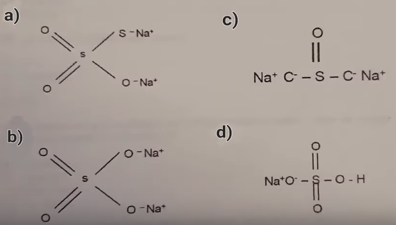
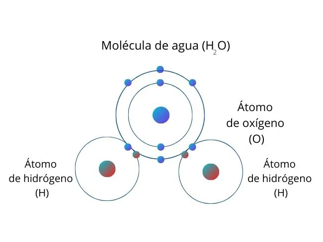
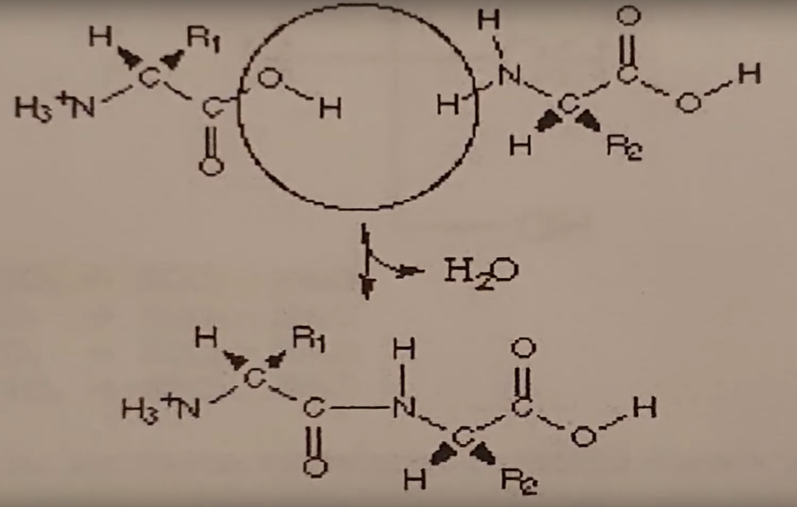
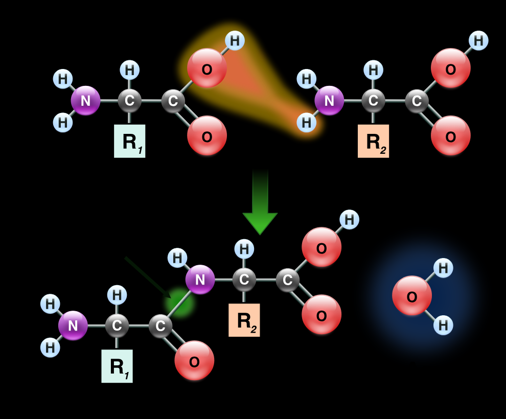
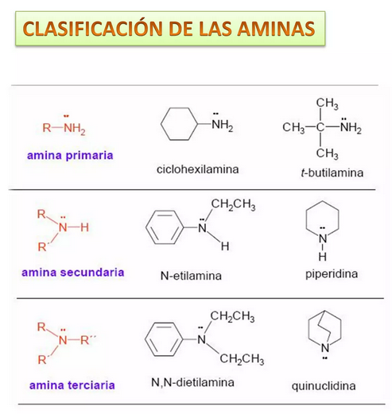
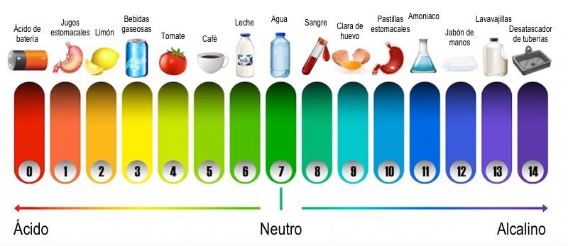
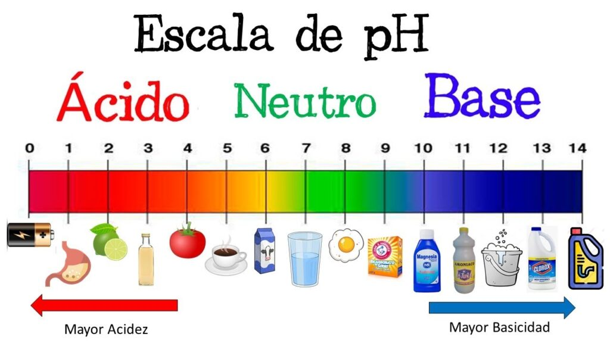

1. La siguiente tabla describe cuatro atomos diferentes con el numero de protones, electrones y neutrones que contienen cada uno: 

En relacion a ello es cierto que: 

R:  La masa atomica del C es 22  

> ## Cálculo de la Masa Atómica del Neón (Ne) y del Sodio (Na) 
> La masa atómica de un elemento se puede calcular considerando el número de protones, electrones y neutrones en el núcleo del átomo. Sin embargo, la masa atómica real se basa en la masa de los isótopos y su abundancia, pero aquí calcularemos una aproximación considerando el número de partículas.
>
> ### 1. Neón (Ne)
> - **Número atómico**: 10 (protones)
> - **Electrones**: 10 (en estado neutro)
> - **Número de neutrones**: Generalmente, el isótopo más abundante es Ne-20:
>   - Neutrones = Masa atómica aproximada - Protones
>   - Neutrones = 20 - 10 = 10
>
> - **Cálculo de la masa atómica**:
>   $$ 
>   \text{Masa atómica} \approx (\text{Protones} \times \text{masa de protones}) + (\text{Neutrones} \times \text{masa de neutrones}) + (\text{Electrones} \times \text{masa de electrones}) 
>   $$
>
> - Usando las masas aproximadas:
>   - Masa de un protón ≈ 1.007 g/mol
>   - Masa de un neutrón ≈ 1.008 g/mol
>   - Masa de un electrón ≈ 0.00055 g/mol
>
>   $$ 
>   \text{Masa atómica} \approx (10 \times 1.007) + (10 \times 1.008) + (10 \times 0.00055) 
>   $$
>
>   $$ 
>   \approx 10.07 + 10.08 + 0.0055 \approx 20.1555 \text{ g/mol} 
>   $$
>
> ### 2. Sodio (Na)
> - **Número atómico**: 11 (protones)
> - **Electrones**: 11 (en estado neutro)
> - **Número de neutrones**: Generalmente, el isótopo más abundante es Na-23:
>   - Neutrones = Masa atómica aproximada - Protones
>   - Neutrones = 23 - 11 = 12
>
> - **Cálculo de la masa atómica**:
>   $$ 
>   \text{Masa atómica} \approx (11 \times 1.007) + (12 \times 1.008) + (11 \times 0.00055) 
>   $$
>
>   $$ 
>   \approx 11.077 + 12.096 + 0.00605 \approx 23.17905 \text{ g/mol} 
>   $$
>


---

2. De acuerdo con la regla del octeto de Lewis ..
Cual es la estructura correcta del tiosulfato de sodio?



R: a 

> ### Estructura de Lewis del Tiosulfato de Sodio (Na₂S₂O₃)
> Para dibujar la estructura del tiosulfato de sodio (Na₂S₂O₃) de acuerdo con la regla del octeto de Lewis, puedes seguir estos pasos:
> 
> 1. **Identificación de Átomos**:
>    - Contiene sodio (Na), azufre (S) y oxígeno (O).
> 
> 2. **Conteo de Electrones de Valencia**:
>    - Sodio (Na): 1 × 2 = 2 electrones
>    - Azufre (S): 6 × 2 = 12 electrones
>    - Oxígeno (O): 6 × 3 = 18 electrones
>    - **Total**: 32 electrones de valencia.
> 
> 3. **Distribución de Electrones**:
>    - Colocar los Na⁺ y enlazar los átomos de azufre y oxígeno.
> 
> 4. **Representación de la Estructura**:
> 
> ```plaintext
>          O
>          ||
>      O - S - S - Na⁺
>          |  
>          O
>          |
>         Na⁺
> ```
> 
> - Los **oxígenos** tienen pares de electrones no compartidos.
> - El **azufre central** se une al otro azufre y a los oxígenos.
> - Cada Na⁺ representa un catión de sodio.
> 
> La estructura respeta la regla del octeto y muestra cómo se enlazan los átomos en la molécula.


---

3. Que condiciones deben presentar los metales para cumplir la regla del octeto?

R: Tendran tendencia a perder electrones para asemejarse a los gases nobles que los precede 

> ## Condiciones para que los Metales Cumplan la Regla del Octeto
> 
> La regla del octeto establece que los átomos tienden a estabilizarse al tener ocho electrones en su capa de valencia. Aunque los metales generalmente no cumplen la regla del octeto de la misma manera que los no metales, pueden participar en reacciones químicas que los ayuden a alcanzar configuraciones estables. Aquí hay algunas condiciones que deben presentar los metales para cumplir la regla del octeto:
> 
> 1. **Tendencia a Perder Electrones**:
>    - Los metales tienen pocos electrones en su capa de valencia (generalmente 1 a 3) y tienden a perder estos electrones para formar cationes, logrando una configuración electrónica similar a la del gas noble más cercano.
> 
> 2. **Formación de Enlaces Iónicos**:
>    - Los metales pueden reaccionar con no metales (que ganan electrones) para formar compuestos iónicos. Al perder electrones, los metales alcanzan una configuración estable.
> 
> 3. **Estabilidad de la Capa de Valencia**:
>    - Al perder electrones, los metales pueden alcanzar la configuración electrónica de la capa de valencia completa del gas noble anterior, lo que resulta en una mayor estabilidad.
> 
> 4. **Interacción con No Metales**:
>    - En la formación de compuestos, los metales suelen interactuar con no metales que tienen alta electronegatividad, permitiendo que los no metales tomen los electrones perdidos.
> 
> 5. **Configuración Electrónica**:
>    - La configuración electrónica de los metales debe permitir la pérdida de electrones de forma relativamente fácil para alcanzar un estado más estable.
> 
> 6. **Presión de los Átomos Vecinos**:
>    - En condiciones de alta presión, algunos metales pueden comportarse de manera diferente y alcanzar estados de valencia más altos, aunque esto es menos común.
> 
> ### Resumen
> Aunque los metales no "cumplen" la regla del octeto de la misma manera que los no metales, pueden alcanzar configuraciones estables al perder electrones y formar compuestos iónicos o metálicos.


---

4. Enlace que involucra la comparacion de electrones en los que los nucles (+) cargados de 2 o mas atomos atraen simultaneamente a los electrones (-) cargados que estan siendo compartidos 

R: Covalente   

 ## Enlace Covalente
>
> El **enlace covalente** es el tipo de enlace químico que involucra la **compartición de electrones** entre dos o más átomos. En este tipo de enlace:
> 
> 1. **Comparación de Electrones**:
>    - Los núcleos cargados positivamente de los átomos atraen simultáneamente a los electrones compartidos, lo que permite que los átomos se mantengan unidos.
> 
> 2. **Formación del Enlace**:
>    - Los átomos involucrados en un enlace covalente comparten electrones para alcanzar una configuración electrónica estable, similar a la de los gases nobles.
> 
> 3. **Ejemplos Comunes**:
>    - Ejemplos de compuestos que presentan enlaces covalentes incluyen el agua (H₂O) y el dióxido de carbono (CO₂).
>
>
> 
> 4. **Tipos de Enlaces Covalentes**:
>    - Se pueden clasificar en:
>      - **Enlace covalente simple**: un par de electrones se comparte entre dos átomos.
>      - **Enlace covalente doble**: dos pares de electrones se comparten entre dos átomos.
>      - **Enlace covalente triple**: tres pares de electrones se comparten entre dos átomos.
> 
> ### Resumen
> El enlace covalente se forma a través de la compartición de electrones, donde los núcleos de los átomos involucrados atraen a los electrones compartidos, resultando en la estabilidad de la molécula.


---

5. En la siguiente estructura se muestra la representacion de la union entre 2 aminoacidos, Que tipo de enlace se lleva a cabo entre ellos? 



R: peptidico 
> ## Enlace Peptídico
>
> Un **enlace peptídico** es un tipo de enlace covalente que se forma entre dos aminoácidos durante el proceso de síntesis de proteínas. Este enlace es crucial para la formación de cadenas polipeptídicas y, por ende, para la estructura de las proteínas. Aquí se describen sus características principales:
>
> 1. **Formación**:
>    - Se forma mediante una **reacción de condensación** (o deshidratación) entre el grupo amino (-NH₂) de un aminoácido y el grupo carboxilo (-COOH) de otro.
>    - Durante esta reacción, se libera una molécula de agua (H₂O).
>
>
>
> 2. **Estructura**:
>    - La estructura resultante del enlace peptídico es un **enlace C-N** (carbono-nitrógeno) que conecta el carbono del grupo carboxilo de un aminoácido con el nitrógeno del grupo amino del siguiente.
> 
> 3. **Polaridad**:
>    - Los enlaces peptídicos son generalmente **polares**, lo que contribuye a la solubilidad de las proteínas en medios acuosos.
>
> 4. **Rigidez**:
>    - Los enlaces peptídicos presentan cierta rigidez debido a la resonancia, lo que significa que no pueden rotar libremente, afectando así la conformación de las proteínas.
>
> 5. **Longitud y Energía**:
>    - La longitud de un enlace peptídico es aproximadamente **1.33 Å** y tiene una energía de enlace de aproximadamente **80-100 kcal/mol**.
>
> ### Resumen
> Los enlaces peptídicos son fundamentales para la estructura y función de las proteínas, ya que conectan aminoácidos en cadenas polipeptídicas que se pliegan en estructuras tridimensionales específicas, permitiendo a las proteínas llevar a cabo sus funciones biológicas.


---

6. Tienes 1.8 gramos de glucosa en 100 mililitros de agua. La solucion resultante tiene una concentracion molar de (M.M o P.M de la glucosa 180 g/m) 

R: 0.10 M  

> ### Cálculo de la Concentración Molar de la Glucosa
>
> Dado que tienes 1.8 gramos de glucosa (C₆H₁₂O₆) en 100 mililitros de agua, se puede calcular la concentración molar de la solución utilizando la siguiente fórmula:
>
> $$
> C = \frac{n}{V}
> $$
> 
> Donde:
> - $C$ = concentración molar (M)
> - $n$ = número de moles de soluto (glucosa)
> - $V$ = volumen de la solución en litros (L)
>
> 1. **Calcular el número de moles de glucosa**:
>    - La masa molar (M.M) de la glucosa es **180 g/mol**.
>    
> $$
> n = \frac{\text{masa}}{\text{M.M}} = \frac{1.8 \text{ g}}{180 \text{ g/mol}} = 0.01 \text{ mol}
> $$
>
> 2. **Convertir el volumen de la solución a litros**:
>    - 100 mL = 0.1 L
>
> 3. **Calcular la concentración molar**:
> 
> $$
> C = \frac{0.01 \text{ mol}}{0.1 \text{ L}} = 0.1 \text{ M}
> $$
>
> ### Resumen
> La concentración molar de la solución de glucosa es **0.1 M** (molar).

---

7. Las aminas se comportan como base de lewis debido a que  

R: Donan pares de electrones    

> ### Comportamiento de las Aminas como Bases de Lewis
>
> Las **aminas** se comportan como bases de Lewis debido a las siguientes razones:
>
> 1. **Presencia de un Par de Electrones Libres**:
>    - Las aminas contienen un átomo de nitrógeno (N) que posee un par de electrones no compartidos en su capa de valencia. Este par de electrones es capaz de ser donado a un ácido de Lewis.
>
> 2. **Capacidad para Aceptar Protones**:
>    - Como base de Lewis, una amina puede aceptar un protón (H⁺) del medio, formando un ion amonio (R-NH₃⁺), donde R es un grupo alquilo o arilo. Esto demuestra su capacidad para actuar como un donador de electrones.
>
> 3. **Interacción con Ácidos**:
>    - Las aminas pueden reaccionar con ácidos para formar sales de amonio, lo que resalta su comportamiento básico. Por ejemplo:
>    
> $$
> R-NH₂ + HCl \rightarrow R-NH₃^+ + Cl^-
> $$
>
> 4. **Electronegatividad del Nitrógeno**:
>    - El nitrógeno tiene una electronegatividad moderada, lo que le permite atraer electrones y al mismo tiempo donar su par de electrones no compartidos a un ácido.
>
> 
>
> ### Resumen
> Las aminas actúan como bases de Lewis gracias a su capacidad para donar un par de electrones libres y aceptar protones, lo que les permite interactuar con ácidos de Lewis y formar compuestos más complejos.


---
8. Si al medir el ph de una sustancia se obtiene un valor de 2, la sustancia es:  

R:  Acida 

> 
---
9. Cual es la base mas fuerte: NH3,NAHCO3, H2O, KOH

R: KOH   

> De las sustancias mencionadas, la **base más fuerte** es **KOH** (hidróxido de potasio). A continuación se explica el porqué:
>
> 1. **KOH (Hidróxido de potasio)**:
>    - KOH es una base fuerte, ya que se disocia completamente en solución acuosa para formar iones K⁺ y OH⁻:
>      $$
>      \text{KOH} \rightarrow \text{K}^+ + \text{OH}^-
>      $$
>    - Esto significa que aumenta significativamente la concentración de iones hidróxido (OH⁻) en la solución, lo que le confiere una alta capacidad para aceptar protones (H⁺).
>
> 2. **NH₃ (Amina)**:
>    - El amoníaco es una base débil. Acepta protones para formar NH₄⁺, pero no se disocia completamente en solución.
>      $$
>      \text{NH}_3 + \text{H}^+ \rightleftharpoons \text{NH}_4^+
>      $$
>
> 3. **NaHCO₃ (Bicarbonato de sodio)**:
>    - NaHCO₃ actúa como una base débil. En solución, puede reaccionar con ácidos, pero no aumenta significativamente la concentración de OH⁻.
>
> 4. **H₂O (Agua)**:
>    - El agua puede actuar como un ácido o una base (amfótero), pero en términos de capacidad básica, es menos fuerte que KOH.
>
>---
> ### Cómo Ubicar Rápidamente la Fuerza de Bases
>
> Para un principiante, aquí hay algunos pasos y consejos para ubicar rápidamente la fuerza de diferentes bases:
>
> 1. **Identifica si es una Base Fuerte o Débil**:
>    - **Bases Fuertes**: Se disocian completamente en solución acuosa. Ejemplos incluyen:
>      - **Hidróxidos de Metales Alcalinos** (como KOH, NaOH).
>      - **Sales de Ácidos Fuertes** (como NaCl).
>    - **Bases Débiles**: Se disocian parcialmente en solución. Ejemplos incluyen:
>      - **Aminas** (como NH₃).
>      - **Bicarbonatos** (como NaHCO₃).
>
> 2. **Recuerda los Hidróxidos**:
>    - Los hidróxidos de metales alcalinos (LiOH, NaOH, KOH) son generalmente **bases fuertes**.
>
> 3. **Aminas y Bicarbonatos**:
>    - Las aminas (como NH₃) y los bicarbonatos (como NaHCO₃) son ejemplos de **bases débiles**. Si un compuesto tiene un grupo amino, probablemente sea una base débil.
>
> 4. **Considera la Disociación**:
>    - Si una sustancia se disocia completamente para liberar iones OH⁻, es una base fuerte.
>
> 5. **Tabla de pH**:
>    - Familiarízate con una tabla de pH: las bases fuertes tienen pH alto (por encima de 12), mientras que las bases débiles tienen pH más bajo (por debajo de 12).
>
> ### Resumen
> - **Bases Fuertes**: KOH, NaOH (disociación completa).
> - **Bases Débiles**: NH₃, NaHCO₃ (disociación parcial).
> 
> Usar estos criterios puede ayudarte a clasificar rápidamente las bases.


---
10. Cuando es una solucion se le coloca papel tornasol y este se vuelve azul, indica que la solucion es: 

R:  Una base  


> 
