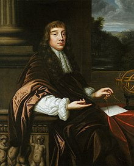
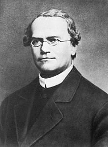
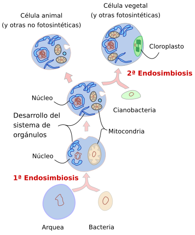

1. La reproduccion sexual de los organizmos pluricelulares se caracteriza por: 

> R: El intercambio de material genetico

> E: Un organismo pluricelular es aquel que está formado por más de una célula. Estas células trabajan de manera coordinada y suelen estar especializadas en funciones específicas, lo que permite que el organismo realice diversas actividades vitales de forma eficiente. Ejemplos de organismos pluricelulares incluyen animales, plantas y muchos hongos.

> - Meiosis: Proceso de división celular que reduce el número de cromosomas a la mitad, formando gametos (espermatozoides y óvulos).
> - Fusión de gametos: La unión de dos gametos (masculino y femenino) da lugar a un cigoto con la combinación de material genético de ambos progenitores.
> - Variabilidad genética: El intercambio genético entre los progenitores produce descendencia con combinaciones únicas de genes.
> - Desarrollo embrionario: El cigoto se divide y diferencia en un organismo multicelular a través de procesos de desarrollo embrionario.

--- 
2. Nombre del cientifico que dio el termino "Cellulae" despues de observar cortezas de arbol

R: Rober Hooke

> Robert Hooke fue un científico inglés del siglo XVII, conocido por sus importantes contribuciones en diversas áreas, como la física, biología y astronomía. Es famoso principalmente por:

> - Descubrimiento de la célula: En 1665, Hooke fue el primero en usar la palabra "célula" al observar un pedazo de corcho bajo el microscopio, describiendo las pequeñas cavidades que vio como "celdillas" o "células".
> - Ley de Hooke: Estableció una ley en física que describe la elasticidad, conocida como la "Ley de Hooke", que establece que la deformación de un material elástico es proporcional a la fuerza aplicada.

---
3. Cual es el proceso que promueve el cambio evolutivo en las especies

> R: Mutacion al azar 

> #### Procesos que promueven el cambio evolutivo: 
> | **Proceso**           | **Descripción**                                                                 | **Impacto en la Evolución**                                                |
> |-----------------------|---------------------------------------------------------------------------------|---------------------------------------------------------------------------|
> | **Selección Natural**  | Los individuos con características más aptas para su entorno tienen más éxito reproductivo. | Favorece la adaptación al ambiente, promoviendo la supervivencia de los más aptos. |
> | **Mutación**           | Cambios aleatorios en el ADN que generan nuevas variaciones genéticas.           | Introduce nuevas características que pueden ser seleccionadas o eliminadas. |
> | **Deriva Genética**    | Cambios en la frecuencia de alelos debido al azar, especialmente en poblaciones pequeñas. | Puede llevar a la pérdida o fijación de alelos sin relación con la adaptabilidad. |
> | **Migración (Flujo Génico)** | Movimiento de individuos entre poblaciones, introduciendo nuevas variaciones genéticas. | Aumenta la diversidad genética y puede alterar las frecuencias de alelos.    |
> | **Apareamiento no aleatorio** | Preferencia por ciertos individuos para la reproducción.                      | Aumenta la frecuencia de ciertos rasgos dentro de la población.              |

---

4. Cual es la agrupacion de los organizmos  por especie, grupo y genero 

> R:  Taxonomia 

> E: La taxonomía es la rama de la biología que se encarga de clasificar y nombrar a los organismos en un sistema ordenado. Su objetivo es organizar la biodiversidad en grupos que reflejen las relaciones evolutivas y las características compartidas entre los organismos.

> Los principales niveles jerárquicos en la clasificación taxonómica son:
> - Dominio
> - Reino
> - Filo (o División para plantas)
> - Clase
> - Orden
> - Familia
> - Género
> - Especie

> Este sistema permite identificar y agrupar a los organismos de manera coherente y facilita su estudio y comprensión.

---

5. La emision de gases como _______ son la causa del efecto invernadero.
> R: CO₂

> E: Los **gases de efecto invernadero (GEI)** son aquellos que atrapan el calor en la atmósfera, contribuyendo al **calentamiento global** y al **cambio climático**. Estos gases permiten que la radiación solar entre en la atmósfera, pero dificultan que el calor salga de la Tierra.

> #### Principales gases de efecto invernadero y ejemplos:
> **Dióxido de carbono (CO₂)**
> - **Fuentes**: Quema de combustibles fósiles (carbón, petróleo, gas natural), deforestación, producción de cemento.
> 
> **Metano (CH₄)**
> - **Fuentes**: Agricultura (ganadería), descomposición de residuos orgánicos en vertederos, extracción de petróleo y gas natural.
> 
> **Óxidos de nitrógeno (N₂O)**
> - **Fuentes**: Uso de fertilizantes nitrogenados, quema de biomasa y combustibles fósiles.
> 
> **Gases fluorados (CFCs, HFCs, PFCs)**
> - **Fuentes**: Industria de refrigeración, aerosoles, producción de espumas y solventes industriales.

> Estos gases aumentan la temperatura global al atrapar el calor, y su concentración en la atmósfera ha incrementado debido a actividades humanas, intensificando el **efecto invernadero**.

---
6. Cuales son los reinos de organizmos multicelulares y heterotrofos? 

> R: Fungi-Protista

> E: Los reinos tradicionales en la clasificación biológica son:

> 1. **Reino Monera**
>   - **Características**: Incluye organismos unicelulares procariontes, como bacterias y arqueas. No tienen núcleo definido y sus células son estructuralmente simples.
> 2. **Reino Protista**
>   - **Características**: Organismos eucariotas que no encajan en los reinos animal, vegetal o fungi. Incluye algas, protozoos y algunos organismos unicelulares y multicelulares simples.

> 3. **Reino Fungi**
>   - **Características**: Organismos eucariotas, mayormente multicelulares, que obtienen nutrientes por absorción. Incluye hongos, levaduras y mohos.
> 4. **Reino Plantae**
>   - **Características**: Organismos eucariotas multicelulares, autótrofos que realizan fotosíntesis para producir su propio alimento. Incluye musgos, helechos, coníferas y plantas con flores.

> 5. **Reino Animalia**
>   - **Características**: Organismos eucariotas multicelulares, heterótrofos que obtienen nutrientes al consumir otros organismos. Incluye invertebrados y vertebrados.

---
7. Cual es la etapa celular en la que aparece la coriocinesis y la citocinesis  

R: La etapa M

> E: La fase M es la fase del ciclo celular donde se produce la división de una célula madre en dos células hijas. Comprende una serie de procesos que discurren en paralelo encaminados a repartir los componentes celulares, sintetizados durante las fases anteriores del ciclo celular. La fase M se divide generalmente en dos procesos parcialmente solapados: la mitosis y la citocinesis. 

> - **Coriocinesis**:
>  - **Definición**: Es la división del núcleo celular que ocurre sin la separación del citoplasma.
>  - **Etapa**: Se produce en la **mitosis** y **meiosis**. Es parte de la **telofase**.

> - **Citocinesis**:
> - **Definición**: Es el proceso de división del citoplasma que sigue a la mitosis (o meiosis), resultando en la formación de dos células hijas.
> - **Etapa**: Ocurre **después** de la mitosis y la meiosis, durante la **telofase**.

---

8. Los organizmos eucariotes heterotofos con pared celular de quitina y digestion extracelular  pertenecen  al reino: 

> R: Fungi

> #### Reino Fungi
> - **Definición**: El Reino Fungi comprende organismos eucariotas, heterótrofos, que obtienen nutrientes por absorción. Incluye hongos, levaduras y mohos.
> - **Características**:
>   - **Estructura**: Generalmente multicelulares (aunque hay excepciones como las levaduras que son unicelulares).
>   - **Nutrición**: Heterótrofos que obtienen nutrientes descomponiendo materia orgánica. Liberan enzimas digestivas al ambiente y absorben los nutrientes resultantes.
>   - **Reproducción**: Puede ser sexual o asexual. Los hongos suelen reproducirse mediante esporas.
>   - **Pared Celular**: Contienen quitina, a diferencia de las plantas que contienen celulosa.
>   - **Hábitat**: Pueden vivir en ambientes terrestres, acuáticos, y algunos son parásitos de plantas, animales y otros organismos.
> - **Ejemplos**:
>   - **Hongos**: Champiñones, setas.
>   - **Levaduras**: Saccharomyces cerevisiae (utilizada en panadería y fermentación).
>   - **Mohos**: Penicillium (fuente del antibiótico penicilina).

--- 

9.  Los principios de la herencia en los que se basa la genetica moderna quedaron planteados por:

> R: Gregor Mendel

> #### Gregor Mendel
>
> - **Vida**: 
>   - Nació el 20 de julio de 1822 en Heinzendorf, Austria (ahora parte de la República Checa).
>   - Falleció el 6 de enero de 1884.
>
> - **Contribuciones Científicas**:
>   - **Experimentos**: Realizó cruzamientos de plantas de guisante para estudiar cómo se heredaban ciertos rasgos.
>   - **Leyes de la Herencia**: Formuló las **Leyes de Mendel**, que describen cómo se transmiten los rasgos hereditarios de una generación a la siguiente. Estas leyes incluyen:
>     - **Ley de la Segregación**: Los alelos para un rasgo se separan durante la formación de gametos, y cada gameto recibe solo uno de los dos alelos.
>     - **Ley de la Distribución Independiente**: Los alelos de diferentes genes se distribuyen independientemente unos de otros durante la formación de gametos.
>
> - **Impacto**:
>   - Su trabajo no fue ampliamente reconocido hasta después de su muerte, pero se convirtió en la base de la genética moderna.
>   - Sus principios son fundamentales para entender la herencia y la variabilidad genética en los organismos.
>
> - **Legado**:
>   - Mendel es considerado el padre de la genética debido a su influencia en el desarrollo de esta disciplina científica.

---

10. El origen de las celulas eucariote es una consecuencia de incorporaciones sucesivas de celular procariontes de aceuerdo con la teoria: 

R: Endosimbiotica

> #### Teoría Endosimbiótica
>
> La **Teoría Endosimbiótica** propone que las células eucariotas (células con núcleo) evolucionaron a partir de una simbiosis entre células procariontes (células sin núcleo). 
>
> - **Propuesta Principal**:
>   - Las mitocondrias y los cloroplastos en las células eucariotas modernas son descendientes de bacterias que fueron engullidas por células ancestrales procariontes.
>   - Estas bacterias engullidas se establecieron dentro de las células huésped y formaron una relación simbiótica beneficiosa, evolucionando con el tiempo para convertirse en organelos.
>
> - **Evidencia**:
>   - **Doble Membrana**: Tanto las mitocondrias como los cloroplastos tienen una doble membrana, una de las cuales es similar a la de las bacterias.
>   - **ADN Propio**: Estos organelos contienen su propio ADN, que es más similar al de las bacterias que al ADN del núcleo celular.
>   - **Ribosomas**: Los ribosomas en las mitocondrias y los cloroplastos son similares a los de las bacterias.
>   - **División Binaria**: Se dividen de manera similar a las bacterias por fisión binaria.
>
> - **Impacto**:
>   - La teoría explica cómo los eucariotas desarrollaron organelos especializados que realizan funciones específicas, como la producción de energía (mitocondrias) y la fotosíntesis (cloroplastos).
>   - Fue propuesta por Lynn Margulis en la década de 1960 y ha sido fundamental para la comprensión de la evolución celular.

> 