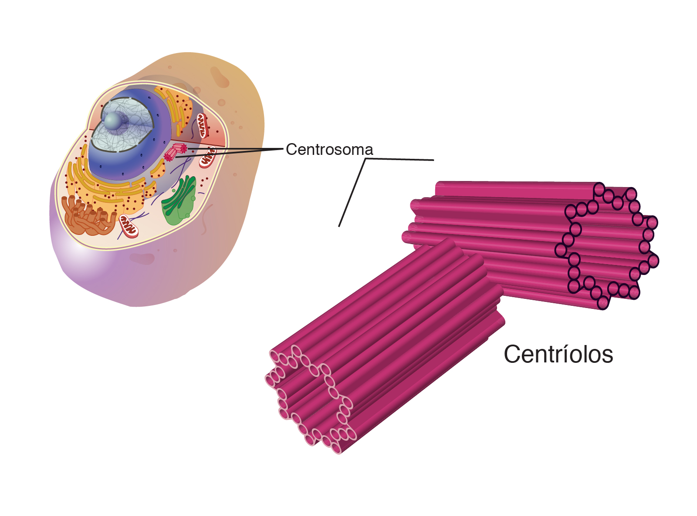
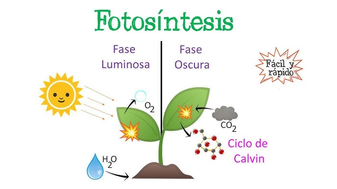
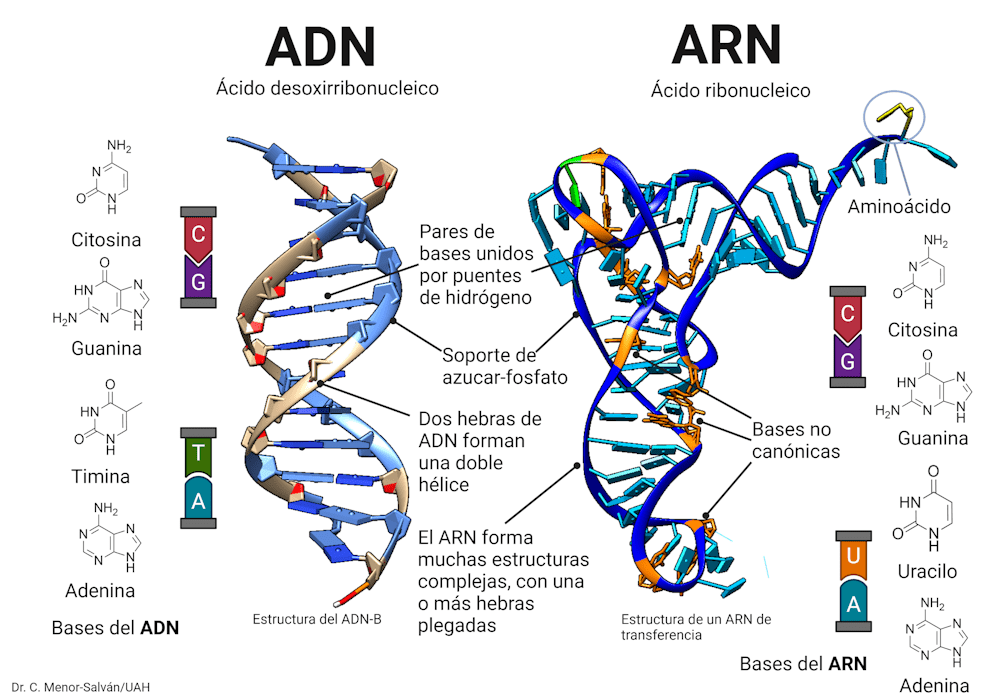
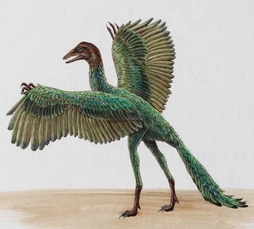

1. Estructura cercana al nucleo cuya funcion es intervenir en la division celular:   

R: Centriolo 

> #### Centriolo
> 
> 1. **Definición**:
>    - Un centriolo es una estructura cilíndrica formada por **microtúbulos**, específicamente compuesta por nueve tripletes de microtúbulos dispuestos en un patrón circular.
> 
> 
> 2. **Función principal**:
>    - Los centriolos participan en la formación del **huso mitótico** durante la división celular, ayudando a organizar los microtúbulos que separan los cromosomas.
>    - También son esenciales para la formación de **cilios** y **flagelos**, que son estructuras implicadas en el movimiento celular.
> 
> 3. **Ubicación**:
>    - En la mayoría de las células animales, los centriolos se encuentran en pares, orientados de forma perpendicular entre sí y localizados dentro del **centrosoma**, que es la región cercana al núcleo.
> 
> 4. **Durante la división celular**:
>    - Antes de la división celular (mitosis o meiosis), los centriolos se duplican, permitiendo que cada célula hija reciba un par. El huso mitótico formado organiza y asegura que los cromosomas se separen correctamente.
> 
> 5. **Importancia**:
>    - Los centriolos son cruciales para asegurar que las células se dividan de manera correcta. Sin su función adecuada, puede haber errores en la distribución de los cromosomas, lo que puede llevar a fallos en la división celular.

--- 

2. Energia utilizada para la realizacion de la fase oscura de la fotosintesis:

R: Quimica

> 1. **¿Es correcta la respuesta "química"?**
>    - Sí, en términos generales, la energía utilizada en la fase oscura es **energía química** almacenada en moléculas como el ATP y el NADPH.
> 
> 2. **Explicación detallada**:
>    - Durante la **fase oscura** (ciclo de Calvin), la energía química almacenada en el ATP y el NADPH es utilizada para fijar el CO₂ y sintetizar carbohidratos.
>
>
>
>    - El **ATP** proporciona la energía necesaria, mientras que el **NADPH** suministra los electrones para reducir las moléculas de CO₂.
> 
> 3. **¿Es suficiente la respuesta "química"?**
>    - Si bien "energía química" es técnicamente correcta, para mayor precisión se debería mencionar que la **energía específica** proviene de las moléculas de **ATP** y **NADPH**.

--- 
3.¿Que distinge estructuralmente al DNA del RNA?  

R: El tipo de azucar 
 
> 
> #### Diferencias estructurales entre ADN y ARN
> 
> 1. **Azúcar**:
>    - **ADN**: Contiene **desoxirribosa**, que es un azúcar con un átomo de oxígeno menos en el carbono 2' (2'-desoxirribosa).
>    - **ARN**: Contiene **ribosa**, que tiene un grupo hidroxilo (-OH) en el carbono 2'.
> 
> 2. **Bases nitrogenadas**:
>    - **ADN**: Tiene las bases nitrogenadas **adenina (A)**, **citosina (C)**, **guanina (G)** y **timina (T)**.
>    - **ARN**: Tiene las mismas bases excepto que en lugar de timina (T), tiene **uracilo (U)**.
> 
> 3. **Estructura de cadena**:
>    - **ADN**: Es típicamente una **doble hélice** de dos cadenas complementarias antiparalelas.
>    - **ARN**: Es generalmente una **cadena sencilla**, aunque puede formar estructuras secundarias como bucles y hélices.
> 
> 4. **Longitud**:
>    - **ADN**: Las moléculas de ADN suelen ser mucho más **largas** y contienen todo el material genético de un organismo.
>    - **ARN**: Las moléculas de ARN son generalmente **más cortas** y tienen funciones específicas (ARN mensajero, ARN de transferencia, ARN ribosomal, etc.).
> 
> 5. **Función principal**:
>    - **ADN**: Almacena y transmite la **información genética**.
>    - **ARN**: Participa en la **síntesis de proteínas** y tiene diversas funciones en la expresión y regulación de los genes.

--- 
4. La mayor parte de las mutaciones inocuas o neutras son esenciales para la:

R: Evolucion  

> #### Mutaciones Neutras e Inocuas
> 
> 1. **Definición de mutaciones neutras**:
>    - Son cambios en la secuencia del ADN que no tienen un efecto observable en el fenotipo del organismo. Esto ocurre porque no alteran la función de las proteínas o porque afectan regiones no codificantes del ADN.
> 
> 2. **Papel en la evolución**:
>    - Aunque no tienen un efecto inmediato, las mutaciones neutras proporcionan **variación genética** dentro de una población. Esta variabilidad es esencial para la evolución, ya que permite que los organismos se adapten a futuros cambios ambientales.
>    - Las mutaciones neutras pueden acumularse en el genoma a lo largo del tiempo, y algunas pueden convertirse en beneficiosas si cambian las condiciones ambientales o interacciones genéticas.
> 
> 3. **Selección natural**:
>    - Las mutaciones neutras no son eliminadas por la selección natural porque no confieren desventajas ni ventajas inmediatas. Sin embargo, con el tiempo, pueden contribuir a la **diversificación genética**, que es la base de la evolución de nuevas especies.
> 
> 4. **Evolución molecular**:
>    - En términos de **evolución molecular**, las mutaciones neutras son importantes porque los cambios en las secuencias de ADN que no afectan la supervivencia del organismo aún pueden ser heredados y transmitidos a las futuras generaciones.

--- 
5. Son componentes abioticos del ecosistema: 

R: La ENERGIA, los NUTRIENTES y la TEMPERATURA 

> #### Componentes Abióticos del Ecosistema
> Los **componentes abióticos** son factores físicos y químicos que no están vivos, pero que juegan un papel crucial en la estructura y funcionamiento de los ecosistemas.
> 
> 1. **Luz solar**:
>    - La luz solar es esencial para los procesos como la **fotosíntesis** en las plantas, y afecta a la temperatura del ecosistema.
> 
> 2. **Nutrientes**:
>    - Los **nutrientes minerales** (nitrógeno, fósforo, potasio, etc.) en el suelo y en el agua son esenciales para el crecimiento de los organismos.
>
> 3. **Temperatura**:
>    - La **temperatura** influye en la actividad metabólica de los organismos y en la distribución de especies dentro de un ecosistema.
> 
> 4. **Suelo**:
>    - El **suelo** proporciona nutrientes a las plantas y alberga organismos. Su composición, pH y estructura afectan la vegetación y los ciclos de nutrientes.
> 
> 5. **Aire**:
>    - El **aire** contiene gases como el oxígeno y el dióxido de carbono, esenciales para la **respiración** y la **fotosíntesis**.
> 
> 6. **Agua**:
>    - El **agua** es un recurso fundamental para todos los seres vivos. La disponibilidad de agua en un ecosistema determina la biodiversidad y los tipos de organismos que pueden habitar en él.
>
> 7. **Clima**:
>    - Los patrones de **precipitación**, **vientos**, y **humedad** determinan las características del ecosistema, influyendo en las especies y los ciclos ecológicos.
> 
> 8. **Salinidad**:
>    - La **salinidad** del agua o del suelo puede afectar la diversidad de organismos que pueden sobrevivir en ese ambiente, especialmente en ecosistemas acuáticos.
> 
> 9. **Presión atmosférica**:
>    - La **presión atmosférica** también afecta a los organismos, especialmente en zonas de gran altitud o en ambientes acuáticos profundos.

--- 
6. Interaccion entre dos especies en donde ambas pueden ser beneficiadas: 

R: Mutualizmo 

> El **mutualismo** es una interacción en la que ambas especies involucradas obtienen un beneficio, siendo una relación clave para la estabilidad y el equilibrio de los ecosistemas.  
>
> **Ejemplos**:
>    - **Abejas y flores**: Las abejas polinizan las flores mientras recolectan néctar para alimentarse, lo que beneficia tanto a la abeja como a la planta.
>    - **Hongos y raíces de plantas (micorrizas)**: Los hongos ayudan a las plantas a absorber nutrientes del suelo, mientras que las plantas proporcionan carbohidratos al hongo.
> 
> **Tipos de mutualismo**:
>    - **Obligado**: Cuando las dos especies dependen completamente una de la otra para sobrevivir.
>    - **Facultativo**: Cuando ambas especies se benefician, pero no dependen exclusivamente de la interacción para sobrevivir.
> 
> **Importancia ecológica**:
>    - El mutualismo es esencial para muchos ecosistemas, ya que ayuda en la **polinización**, la **dispersión de semillas**, y la **obtención de nutrientes**, entre otras funciones.
> 

--- 
7. La teoria de la evolucion propuesta por Darwin y Wallace, carecio de fundamentos _____ para explicar las ____ 

R: Geneticos - variaciones 

> La teoría de la evolución propuesta por Darwin y Wallace careció de fundamentos **genéticos** para explicar las **variaciones**. En ese tiempo, no se conocía el mecanismo de herencia, ya que las leyes de la genética y el ADN aún no se habían descubierto. Aunque observaron diferencias entre individuos de una misma especie, no pudieron explicar cómo surgían y se transmitían esas variaciones a nivel molecular. Hoy en día, sabemos que las **mutaciones genéticas** y la recombinación son las principales fuentes de variabilidad, algo que ellos no pudieron detallar en su teoría.

--- 
8. Los dientes y plumas del Archeopterix, en comparacion con aves y reptiles son una evidencia de: 

R: Evolucion 

> **Archaeopteryx en la Evolución**
>
>
>
> El **Archaeopteryx** es considerado uno de los primeros fósiles de aves y data de aproximadamente 150 millones de años, durante el período Jurásico. Su descubrimiento fue crucial para entender la evolución de las aves a partir de los reptiles. 
>
> Algunas características que lo destacan son:
>
> - **Plumas**: Posee plumas similares a las de las aves modernas, lo que sugiere que ya tenía capacidades de vuelo o planeo.
> - **Características de dinosaurio**: Presenta rasgos típicos de los dinosaurios terópodos, como dientes, garras en las alas y un largo esqueleto con una cola ósea.
> - **Evidencia de transición**: Archaeopteryx proporciona evidencia fósil de la transición evolutiva entre reptiles y aves, apoyando la teoría de la evolución de las especies a través de la selección natural.
>
> Su hallazgo contribuyó significativamente a la comprensión de cómo las aves evolucionaron a partir de ciertos grupos de dinosaurios, y su mezcla de características aviares y reptilianas continúa siendo un foco de estudio en paleontología y biología evolutiva.

--- 
9. Relaciona las celulas EUCARIONTES y PROCARIONTES con sus caracteristicas:
R: 

Procariontes: 
- Tamaño de 1 a 10 micras
- DNA circular en el citoplasma

Eucariontes:
- Reproduccion por mitosis
- Cromosomas multiples 

> **Procariotas**:
> - **Tamaño de 1 a 10 micras**: generalmente son más pequeñas que las eucariotas.
> - **DNA circular en el citoplasma**: el ADN en las células procariotas es típicamente circular y se encuentra en el citoplasma, ya que no tienen un núcleo definido.
>
> **Eucariotas**:
> - **Reproducción por mitosis**: las células eucariotas se reproducen por mitosis (y también por meiosis en el caso de la reproducción sexual).
> - **Cromosomas múltiples**: las células eucariotas tienen múltiples cromosomas lineales en su núcleo.

--- 
10. En la fotosintesis se rompe una molecula de H2O (agua) para producir inicialmente:  

R: Oxigeno 

> **Productos iniciales de la ruptura de H₂O en la fotosíntesis**
>
> Durante la fase luminosa de la fotosíntesis, el agua se descompone en un proceso llamado **fotólisis**. Los productos de esta reacción son:
>
> - **Electrones**: Liberados y utilizados en la cadena de transporte de electrones, son fundamentales para la generación de ATP y NADPH.
> - **Iones de hidrógeno (H⁺)**: Contribuyen a la formación de un gradiente electroquímico que ayuda en la producción de ATP.
> - **Oxígeno (O₂)**: Liberado como un subproducto, es el oxígeno que respiramos.
>
> Este proceso es crucial para la producción de energía que se utilizará en la fase oscura (ciclo de Calvin) para sintetizar glucosa a partir del dióxido de carbono.

> **ATP (Adenosín Trifosfato)**
>
> - **Definición**: El ATP es una molécula que actúa como la principal fuente de energía en las células. 
> - **Estructura**: Está compuesto por una base nitrogenada (adenina), un azúcar (ribosa) y tres grupos fosfato.
> - **Función**: Almacena y libera energía cuando se rompe un enlace fosfato (en un proceso llamado hidrólisis), convirtiéndose en ADP (adenosín difosfato) y un fosfato inorgánico. Esta energía es utilizada para llevar a cabo diversas reacciones metabólicas, como la síntesis de proteínas, la contracción muscular y el transporte activo de sustancias a través de las membranas celulares.
>
> **NADPH (Nicotinamida Adenina Dinucleótido Fosfato Reducido)**
>
> - **Definición**: El NADPH es una molécula que actúa como un transportador de electrones y un donador de poder reductor en las reacciones biosintéticas.
> - **Estructura**: Está formado por dos nucleótidos, uno con adenina y otro con nicotinamida, y contiene un grupo fosfato adicional.
> - **Función**: Se genera durante la fase luminosa de la fotosíntesis y es utilizado en la fase oscura (ciclo de Calvin) para reducir el CO₂ a glucosa. Además, el NADPH participa en reacciones de síntesis y en procesos anabólicos dentro de las células.
>
> En resumen, el ATP es la principal fuente de energía celular, mientras que el NADPH actúa como un transportador de electrones y poder reductor en reacciones biosintéticas.
