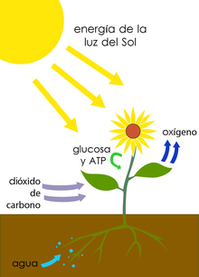
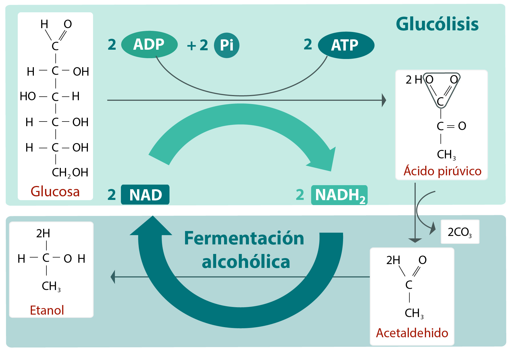
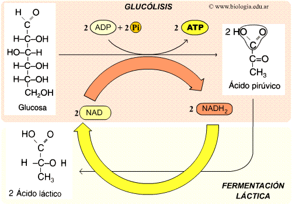
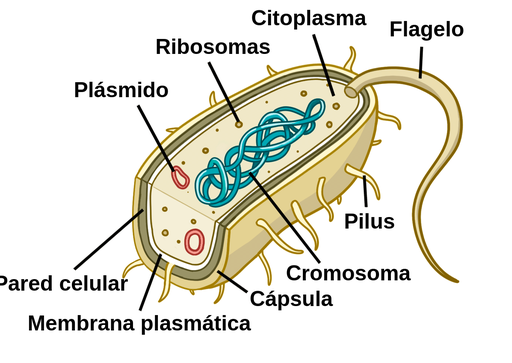
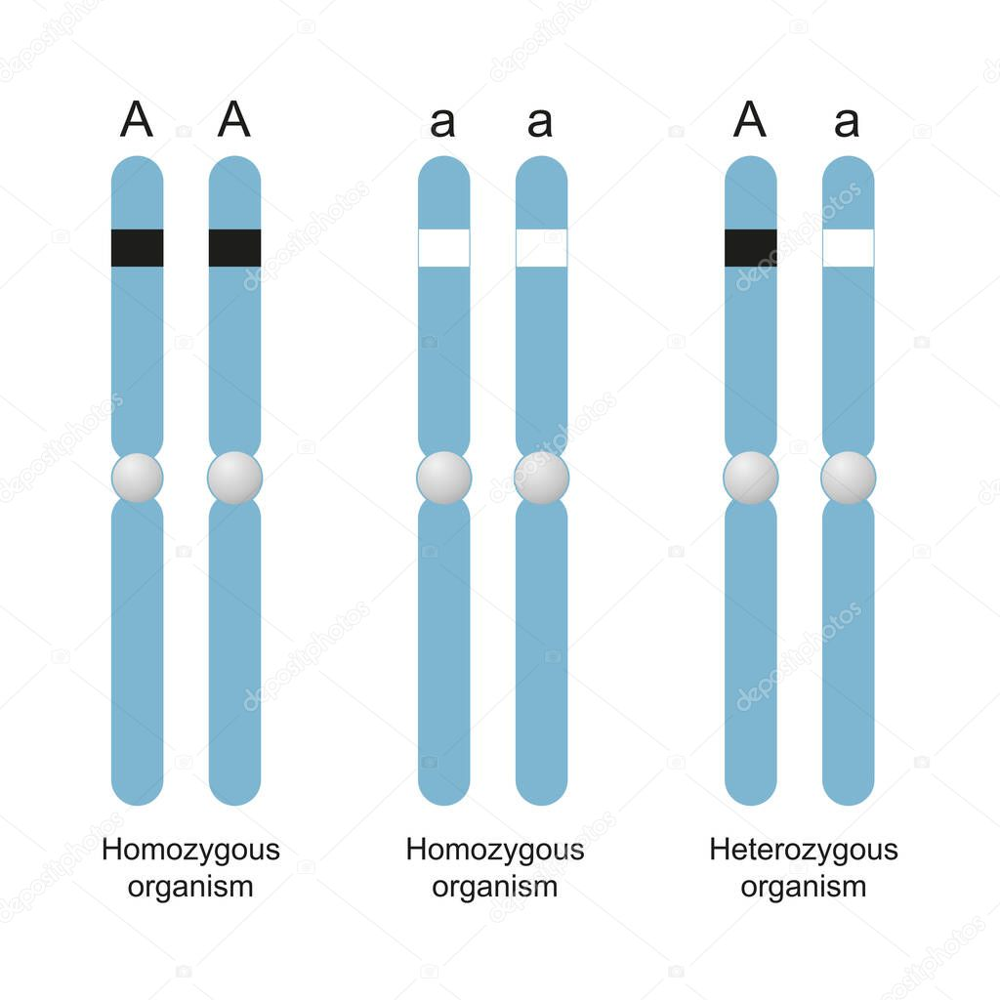
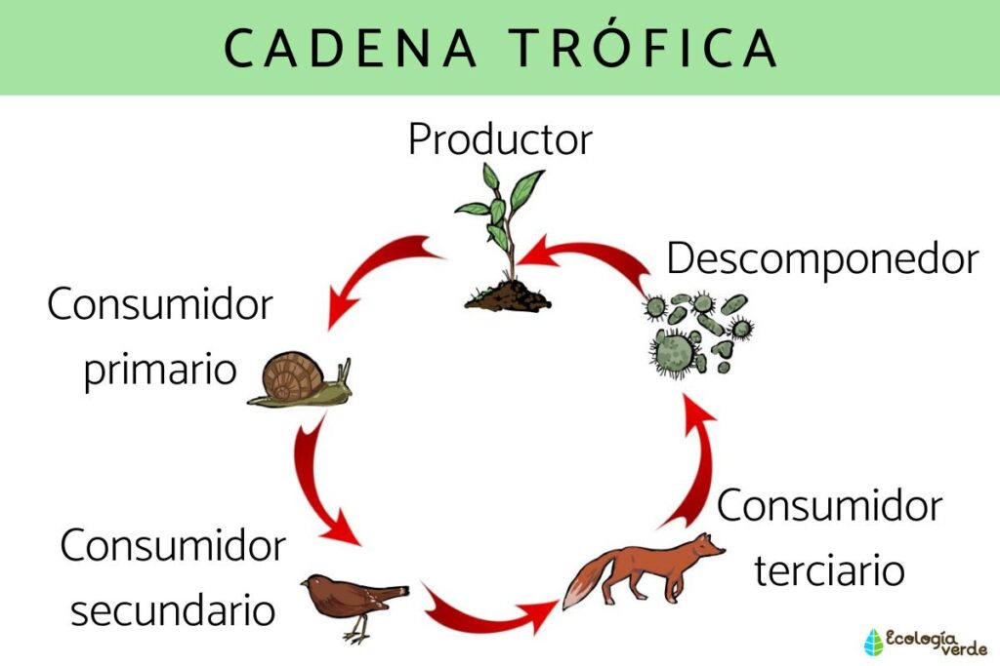
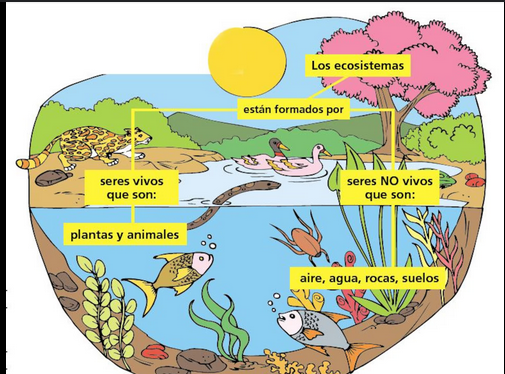

1.  En la fotosintesis se rompe una molecula de H2O para producir inicialmente:

R: Oxigeno O

> Durante la fotosíntesis, en la etapa de la **fotólisis del agua**, una molécula de **H₂O** se rompe para producir inicialmente:
>
> 
>
> 1. **Oxígeno (O₂)**.
> 2. **Protones (H⁺)**.
> 3. **Electrones (e⁻)**.
>
> La reacción de la fotólisis del agua se puede representar como:
>
> $$
> 2H_2O \rightarrow 4H^+ + 4e^- + O_2
> $$
>
> ### Explicación:
> - Esta reacción ocurre en la **fase luminosa** de la fotosíntesis dentro de los tilacoides.
> - Los **electrones** liberados se usan para reponer los electrones perdidos en la **clorofila** durante la excitación por la luz.
> - Los **protones (H⁺)** contribuyen a generar un gradiente de protones que se utiliza para la síntesis de **ATP**.
> - El **oxígeno** (O₂) se libera como un subproducto.
>
---
2. Durante el proceso anaerobico de fermentacion _______ el acido piruvico cambia a etanol. 

    De forma similar uan disminucion de oxigeno en los musculos durante el ejercicio ocasiona fatiga deducido a la acumulacion de acido lactico producto de la fermentacion _______

R: Alcoholica - Lactica 

> 1. **Fermentación Alcohólica**:
>    - El ácido pirúvico ($C_3H_4O_3$) se convierte en **etanol** ($C_2H_5OH$) y **dióxido de carbono** ($CO_2$).
>    - Reacción general:
>    
>    $$
>    C_3H_4O_3 \rightarrow C_2H_5OH + CO_2
>    $$
>   
>
> 2. **Fermentación Láctica**:
>    - El ácido pirúvico ($C_3H_4O_3$) se reduce a **ácido láctico** ($C_3H_6O_3$) en condiciones de baja disponibilidad de oxígeno.
>    - Reacción general:
>
>    $$
>    C_3H_4O_3 + NADH \rightarrow C_3H_6O_3 + NAD^+
>    $$
>
>   
>
---

3. Los plasmidos son:  

R: Material genetico extracromosomal que se localiza en el citoplasma de las bacterias

> Los **plásmidos** son **pequeñas moléculas de ADN circular** que se encuentran en el interior de las células bacterianas y, en algunos casos, en células eucariotas. A continuación, se describen sus características principales:
>
> 
>
> 1. **Autónomos y Replicativos**:
>    - Se replican de manera independiente del ADN cromosómico principal de la célula.
>
> 2. **Material Genético Extra**:
>    - Contienen genes que no son esenciales para la supervivencia de la bacteria, pero que pueden conferir ventajas adaptativas, como:
>      - **Resistencia a antibióticos**.
>      - Producción de toxinas.
>      - Capacidad de metabolizar compuestos inusuales.
>
> 3. **Intercambio Genético**:
>    - Los plásmidos pueden transferirse entre bacterias a través del proceso de **conjugación**, facilitando la diseminación de genes entre diferentes especies.
>
> 4. **Herramientas Biotecnológicas**:
>    - En biotecnología, los plásmidos se utilizan como **vectores** para insertar genes en organismos y producir proteínas específicas.

---

4. A un individuo que posee alelos identicos para un caracter se le conoce como: 

R: Homocigoto

> Un **homocigoto** es un organismo que posee **dos alelos idénticos** para un gen específico en un par de cromosomas homólogos. Los alelos pueden ser dominantes o recesivos. A continuación se detallan sus características:
>
> 1. **Tipos de Homocigotos**:
>    - **Homocigoto Dominante**:
>      - Tiene dos alelos dominantes (AA).
>    - **Homocigoto Recesivo**:
>      - Tiene dos alelos recesivos (aa).
>
> 2. **Expresión Genética**:
>    - Los homocigotos expresan de manera consistente el rasgo asociado con sus alelos, ya sea dominante o recesivo.
>
> 
> Un **heterocigoto** es un organismo que tiene **dos alelos diferentes** para un gen específico en un par de cromosomas homólogos. Estos alelos pueden ser uno dominante y el otro recesivo. A continuación, se detallan sus características:
>
> 1. **Genotipo**:
>    - El genotipo de un heterocigoto se representa como **Aa**, donde:
>      - **A** es el alelo dominante.
>      - **a** es el alelo recesivo.
>
> 2. **Expresión Fenotípica**:
>    - En un heterocigoto, el **alelo dominante** (A) generalmente enmascara la expresión del **alelo recesivo** (a).
>    - Como resultado, el fenotipo se expresa según el alelo dominante.
>
> 3. **Ejemplo en Genética Mendeliana**:
>    - Si el color púrpura de una flor es dominante (A) y el color blanco es recesivo (a), un individuo con genotipo **Aa** tendrá flores púrpuras.
>
> 4. **Variabilidad Genética**:
>    - Los heterocigotos contribuyen a la **variabilidad genética** dentro de las poblaciones, permitiendo mayor diversidad de rasgos y características.
>

---
5. Reino de la naturaleza formado por celulas procariotas 

R: Monera

> El reino formado por **células procariotas** es el **Reino Monera**. A continuación, se presentan sus características principales:
>
> 1. **Características de las Células Procariotas**:
>    - **No tienen núcleo definido**: El material genético (ADN) se encuentra disperso en el citoplasma en una región llamada **nucleoide**.
>    - **Carecen de orgánulos membranosos** como mitocondrias o cloroplastos.
>    - Poseen **pared celular** (en la mayoría de los casos) que proporciona estructura y protección.
>
> 2. **Organismos del Reino Monera**:
>    - Incluye **bacterias** y **arqueas**.
>    - Se encuentran en casi todos los ambientes de la Tierra y desempeñan roles ecológicos importantes, como la descomposición y la fijación de nitrógeno.
>
> 3. **Reproducción**:
>    - Generalmente se reproducen de manera **asexual** por **fisión binaria**.
>

---

6. Se conoce como especie endemica a aquella:  

R: Que se encuentra solo en determinada region de biosfera

> Una **especie endémica** es aquella que se encuentra **exclusivamente en una región geográfica específica** y **no existe de forma natural en ningún otro lugar del mundo**. A continuación, se presentan sus características principales:
>
> 1. **Distribución Limitada**:
>    - Su hábitat está restringido a una **zona geográfica específica**, como una isla, un país o una región determinada.
>    - No se encuentra de forma natural fuera de esa área.
>
> 2. **Adaptaciones Específicas**:
>    - Las especies endémicas suelen tener **adaptaciones únicas** a las condiciones ambientales de su hábitat.
>
> 3. **Vulnerabilidad**:
>    - Debido a su distribución limitada, las especies endémicas son más **vulnerables a la extinción** por cambios ambientales, pérdida de hábitat o introducción de especies invasoras.
>
> 4. **Ejemplo**:
>    - El **Ajolote Mexicano** ($Ambystoma~mexicanum$) es un ejemplo de especie endémica, ya que solo se encuentra en los canales de Xochimilco, en la Ciudad de México.
>

---

7. En una cadena trofica ocurre:   

R: Transformacion de energia

> En una **cadena trófica** se describe el **flujo de energía y nutrientes** a través de diferentes niveles de organismos dentro de un ecosistema. A continuación, se presentan los eventos principales que ocurren en una cadena trófica:
>
>
>
> 1. **Transferencia de Energía**:
>    - La energía fluye desde los **productores primarios** (plantas y algas) hasta los **consumidores** (herbívoros, carnívoros y omnívoros).
>    - Cada nivel trófico recibe energía del nivel anterior y transfiere una parte de esta al siguiente.
>  
> 2. **Niveles Tróficos**:
>    - **Productores**: Organismos fotosintéticos (plantas y fitoplancton) que convierten la energía solar en biomasa.
>    - **Consumidores Primarios**: Herbívoros que se alimentan de productores.
>    - **Consumidores Secundarios**: Carnívoros que se alimentan de herbívoros.
>    - **Consumidores Terciarios**: Carnívoros que se alimentan de otros carnívoros.
>    - **Descomponedores**: Bacterias y hongos que descomponen materia orgánica, devolviendo nutrientes al suelo.
>
> 3. **Pérdida de Energía**:
>    - A medida que se avanza en la cadena, se pierde energía en forma de **calor** en cada nivel trófico, lo que limita la longitud de la cadena.
>
> 4. **Ciclo de Nutrientes**:
>    - Los nutrientes se reciclan constantemente entre los organismos y el entorno gracias a la acción de los descomponedores.

---

8. Cual es la causa de que el CO2 sea un agente contaminante en la CDMX 

R: La quema de combustibles fosiles

> La **quema de combustibles fósiles** (como el carbón, el petróleo y el gas natural) tiene un impacto significativo en la concentración de dióxido de carbono (**CO₂**) en la atmósfera. A continuación, se explican los aspectos clave de esta relación:
>
> 1. **Producción de CO₂**:
>    - Cuando se queman combustibles fósiles, se produce una reacción química que libera energía, pero también genera **dióxido de carbono** como subproducto.
>    - La reacción general de combustión puede representarse como:
>      $$ 
>      \text{Combustible fósil} + \text{O}_2 \rightarrow \text{CO}_2 + \text{H}_2\text{O} + \text{Energía} 
>      $$
>
> 2. **Aumento de la Concentración de CO₂**:
>    - La quema de combustibles fósiles es una de las principales fuentes de emisión de CO₂, contribuyendo al aumento de la concentración de este gas en la atmósfera.
>    - Esto es especialmente relevante en el contexto del cambio climático, ya que el CO₂ es un **gas de efecto invernadero** que atrapa el calor en la atmósfera.
>
> 3. **Efectos Ambientales**:
>    - El incremento de CO₂ debido a la quema de combustibles fósiles contribuye al **calentamiento global** y a fenómenos climáticos extremos.
>    - También puede llevar a la acidificación de los océanos, afectando a los ecosistemas marinos.
>
> 4. **Alternativas Sostenibles**:
>    - Para mitigar el impacto ambiental, es esencial reducir el uso de combustibles fósiles y promover fuentes de energía renovable, como la solar y la eólica, que no producen CO₂.
>

---

9. ________ propuso que los cambios ambientales provocan modificaciones adaptativas en los organismos, los cuales son transmitidos a los descendientes. 

R: Lamarck

> **Jean-Baptiste de Lamarck** (1744-1829) fue un naturalista francés conocido principalmente por sus contribuciones a la teoría de la evolución. Sus ideas fueron fundamentales en el desarrollo de la biología evolutiva antes de la aceptación de la teoría de la selección natural de Charles Darwin. A continuación, se destacan los puntos clave sobre Lamarck:
>
> 1. **Teoría de la Evolución**:
>    - Lamarck propuso que los organismos evolucionan a lo largo del tiempo a través de la herencia de características adquiridas. Esta idea sugiere que los rasgos que un organismo desarrolla durante su vida pueden ser transmitidos a su descendencia.
>
> 2. **Ejemplo de la Jirafa**:
>    - Un ejemplo clásico de su teoría es el caso de la jirafa. Lamarck sugirió que los ancestros de las jirafas tenían cuellos más cortos y que, al estirarlos para alcanzar hojas altas, sus cuellos se alargaron. Este rasgo, adquirido por el estiramiento, se transmitiría a la próxima generación.
>
> 3. **Concepto de Uso y Desuso**:
>    - Lamarck creía que los órganos que se utilizan se desarrollan y fortalecen, mientras que los que no se usan se debilitan y eventualmente pueden desaparecer.
>
> 4. **Críticas y Revisión**:
>    - Aunque las ideas de Lamarck fueron influyentes, su teoría fue criticada y finalmente reemplazada por la teoría de la evolución por selección natural de Darwin, que se basa en la variación genética y la supervivencia del más apto.
>
> 5. **Legado**:
>    - A pesar de sus errores, Lamarck es considerado uno de los primeros en proponer un mecanismo para la evolución, y su trabajo sentó las bases para futuras investigaciones en biología y evolución.
>

---

10. Unidad natural de factores vivos y no vivos que interactuan de manera ciclica y estable: se define como: 

R: Ecosistema

> La definición que buscas se refiere a un **ecosistema**. A continuación, se explican sus características principales:
>
> 1. **Componentes**:
>    - Un ecosistema está compuesto por **factores bióticos** (organismos vivos, como plantas, animales, hongos y microorganismos) y **factores abióticos** (elementos no vivos, como agua, aire, suelo, luz solar y temperatura).
>
> 2. **Interacción**:
>    - Los factores vivos y no vivos interactúan de manera cíclica y estable, formando una red compleja de relaciones que sustentan la vida.
>    - Las interacciones pueden incluir la depredación, la competencia, la simbiosis y el ciclo de nutrientes.
>
> 3. **Ciclos Naturales**:
>    - En un ecosistema, ocurren ciclos biogeoquímicos (como el ciclo del agua, el ciclo del carbono y el ciclo del nitrógeno) que permiten el reciclaje de nutrientes.
>
> 4. **Equilibrio**:
>    - Los ecosistemas tienden a alcanzar un estado de equilibrio o **homeostasis**, donde los cambios en uno de los componentes afectan a los demás, pero la estructura general del ecosistema se mantiene.
>
> 5. **Ejemplos**:
>    - Hay diferentes tipos de ecosistemas, como los **ecosistemas terrestres** (bosques, praderas) y **ecosistemas acuáticos** (ríos, lagos, océanos).
>

