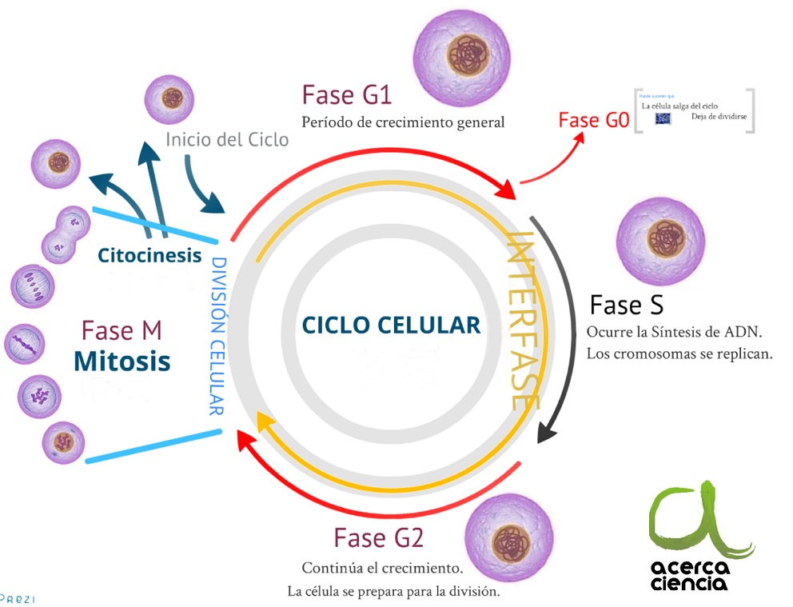
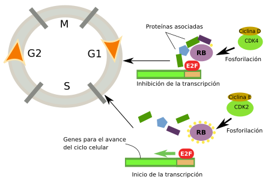
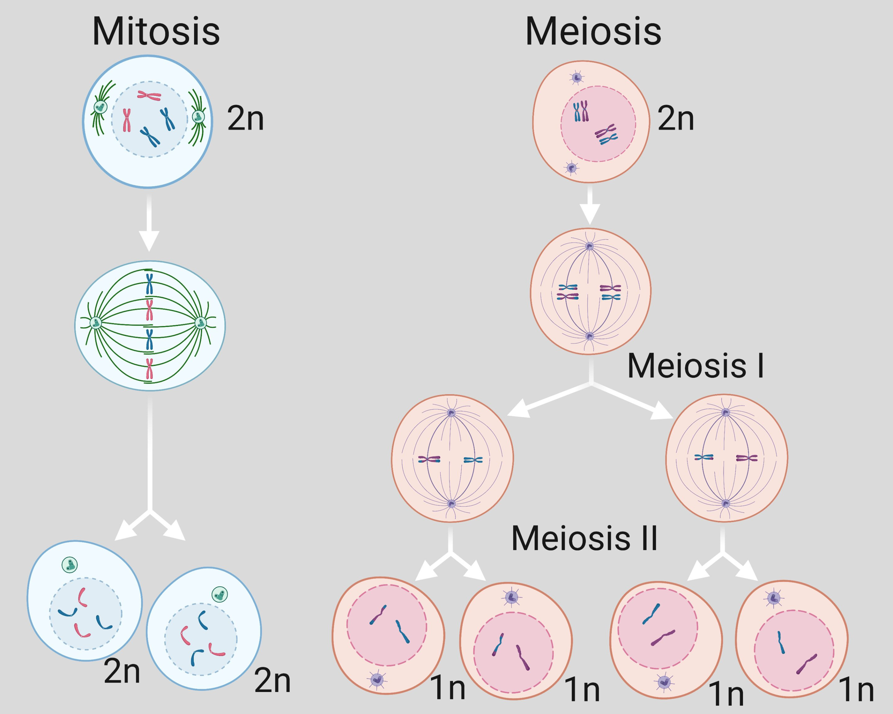
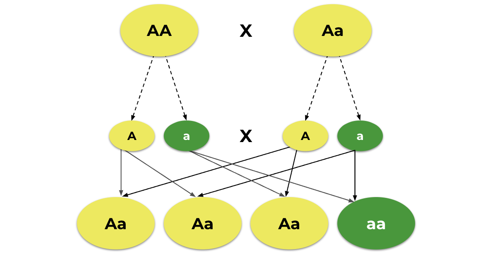
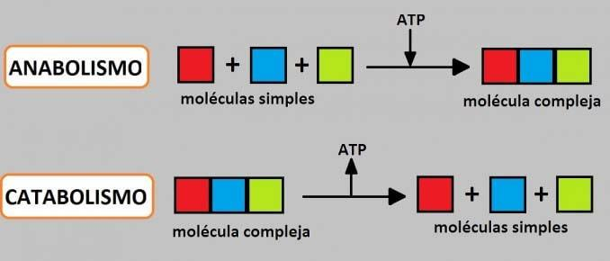
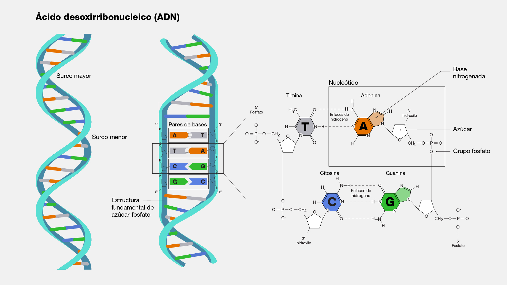
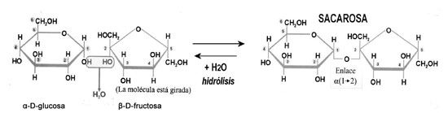

1. Cual es el proceso resultante del ciclo celular:  

R: Proliferacion celular

> El **ciclo celular** es el proceso mediante el cual una célula se divide para formar nuevas células. Este ciclo se compone de varias etapas y culmina en la división celular. A continuación, se detallan los aspectos clave:
>
> 1. **Fases del Ciclo Celular**:
>    - El ciclo celular se divide principalmente en dos etapas: **Interfase** y **Mitosis**.
>
>
>    
> 2. **Interfase**:
>    - Esta es la fase más larga del ciclo celular, donde la célula se prepara para la división. Se divide en tres subfases:
>      - **Fase G1 (Gap 1)**: La célula crece y realiza funciones metabólicas normales.
>      - **Fase S (Síntesis)**: La célula replica su ADN, duplicando así su material genético.
>      - **Fase G2 (Gap 2)**: La célula se prepara para la mitosis, produciendo proteínas y organelos necesarios.
>
> 3. **Mitosis**:
>    - Este es el proceso de división celular en sí, donde la PROLIFERACION celular se lleva a cabo de manera activa. La mitosis se divide en varias fases:
>      - **Profase**: El ADN se condensa en cromosomas visibles y la envoltura nuclear comienza a desintegrarse.
>      - **Metafase**: Los cromosomas se alinean en el centro de la célula.
>      - **Anafase**: Las cromátidas hermanas se separan y son arrastradas hacia los polos opuestos de la célula.
>      - **Telofase**: Se forma una nueva envoltura nuclear alrededor de cada conjunto de cromosomas y estos comienzan a descondensarse.
>
> 4. **Citosinesis**:
>    - Después de la mitosis, la **citosinesis** es el proceso que divide el citoplasma de la célula madre, resultando en dos células hijas.

---

2. Que proceso se lleva a cabo en la fase G1 de la interfase? 

R: Crecimiento celular

> La **fase G1** es la primera etapa de la **interfase** del ciclo celular y se caracteriza por varias actividades clave que preparan a la célula para la replicación del ADN. A continuación, se detallan los aspectos más importantes de esta fase:
>
> 
>
> 1. **Duración**:
>    - La duración de la fase G1 puede variar significativamente entre diferentes tipos de células y condiciones ambientales, pero generalmente dura varias horas. En algunas células, puede extenderse a días o incluso a años, especialmente en células que entran en un estado de reposo (fase G0).
>
> 2. **Crecimiento Celular**:
>    - Durante G1, la célula experimenta un crecimiento significativo. Aumenta de tamaño y se sintetizan proteínas, lípidos y otros componentes celulares necesarios para la división.
>    - Se lleva a cabo la síntesis de organelos, como mitocondrias y ribosomas, que son cruciales para las funciones celulares.
>
> 3. **Producción de ARN y Proteínas**:
>    - La célula también produce ARN y proteínas específicas que serán necesarias para la síntesis de ADN en la fase S y para otras funciones celulares.
>    - La activación de ciertos genes y la producción de sus productos proteicos son esenciales para preparar a la célula para el ciclo de división.
>
> 4. **Control del Ciclo Celular**:
>    - La fase G1 incluye varios puntos de control donde la célula evalúa si está lista para avanzar a la siguiente fase (fase S). 
>    - Los factores de crecimiento y las señales externas influyen en la decisión de la célula de entrar en la fase S. Si las condiciones no son adecuadas (por ejemplo, si hay daño en el ADN o recursos insuficientes), la célula puede detenerse o entrar en un estado de reposo (fase G0).
>
> 5. **Punto de Control G1/S**:
>    - Este es un punto crítico donde se evalúa el estado del ADN y la integridad celular antes de la replicación. 
>    - Si la célula pasa este punto de control, se compromete a completar el ciclo celular y avanzar a la fase S.

---

3. Una consecuencia de la meiosis es la:  

R: Variacion genetica

> 1. **Variabilidad Genética**:
>- La meiosis introduce variabilidad genética a través de dos mecanismos:
>- **Entrecruzamiento (Crossing Over)**: Durante la profase I de la meiosis, se produce el entrecruzamiento entre cromátidas homólogas, lo que resulta en la recombinación genética. Esto genera nuevas combinaciones de alelos en los cromosomas.
>
> 2. **Reducción del Número de Cromosomas**:
>- La meiosis reduce el número de cromosomas a la mitad, pasando de una célula diploide (2n) a células haploides (n). Por ejemplo, en los humanos, las células somáticas tienen 46 cromosomas (23 pares), mientras que los gametos (óvulos y espermatozoides) tienen 23 cromosomas.
>
>- **Distribución Independiente de Cromosomas**: Durante la metafase I, los pares de cromosomas homólogos se distribuyen de manera independiente a los gametos, lo que contribuye aún más a la variabilidad genética.
>
> 3. **Producción de Gametos**:
>- La meiosis es crucial para la formación de gametos. En los organismos con reproducción sexual, los espermatozoides y los óvulos se producen a través de este proceso, permitiendo la fertilización y la formación de un nuevo organismo.
>
> 4. **Efecto en la Evolución**:
>- La variabilidad genética generada por la meiosis es un motor fundamental de la evolución. Las nuevas combinaciones genéticas pueden favorecer la adaptación y la selección natural en las poblaciones.
>
> 

---
4. Durante la meiosis, cuando 2 elementos de cada par de cromosomas homologos se separan, los pares de genes se ubican en diferentes gametos como resultado algunos individuos  pueden transmitir un caracter determinado, aunque ellos no lo manifiesten esto se conoce coomo la ley de:  

R: Ley de segregacion (Ley de mendel)

>
> La **Ley de Segregación**, formulada por Gregor Mendel en el siglo XIX, es uno de los principios fundamentales de la genética. Esta ley establece que:
>
> - Durante la formación de los gametos (óvulos y espermatozoides), los alelos de un gen se segregan (separan) de manera que cada gameto recibe solo uno de los dos alelos que un organismo tiene para cada gen.
>
> 
>
> #### Principales Aspectos de la Ley de Segregación:
>
> 1. **Alelos**:
>    - Los alelos son las diferentes versiones de un gen. Por ejemplo, un gen que determina el color de las flores puede tener un alelo para flores rojas y otro para flores blancas.
>
> 2. **Formación de Gametos**:
>    - Durante la meiosis, los pares de alelos se separan, de modo que cada gameto recibe un solo alelo de cada par. Esto significa que, en el caso de un organismo heterocigoto (con dos alelos diferentes), el 50% de los gametos llevará un alelo y el otro 50% llevará el otro alelo.
>
> 3. **Fertilización**:
>    - Al momento de la fertilización, los gametos se combinan para formar un nuevo organismo con un par de alelos para cada gen, heredados de cada progenitor. Esto resulta en la posibilidad de que el descendiente muestre una combinación de rasgos de ambos padres.
>
> 4. **Experimentos de Mendel**:
>    - Mendel llegó a esta ley a través de experimentos con plantas de guisante, observando cómo se heredaban rasgos específicos entre generaciones. Sus observaciones de las proporciones de rasgos en la descendencia llevaron a la formulación de esta ley.
>
> 5. **Implicaciones en la Genética**:
>    - La Ley de Segregación es fundamental para comprender cómo se heredan los rasgos y la variabilidad genética en las poblaciones. Forma la base para el análisis de cruces genéticos en organismos.

---
5. Relaciona los procesos de anabolicos y catabolicos con los ejemplos correspondientes:  

R:
Anabolismo: 

            - Costa de moleculas organicas complejas
            - De aminoacidos a proteinas

Catabolismo:    

            - Degradacion de moleculas organicas complejas
            - De algodon a glucosa

> ### Procesos Anabólicos
>
> 1. **Definición**:
>    - Los procesos anabólicos son reacciones metabólicas que construyen moléculas complejas a partir de moléculas más simples. Estos procesos requieren energía para llevarse a cabo.
>
> 2. **Ejemplos**:
>    - **Síntesis de proteínas**: La unión de aminoácidos para formar proteínas.
>    - **Síntesis de ácidos nucleicos**: La formación de ADN y ARN a partir de nucleótidos.
>    - **Síntesis de carbohidratos**: La conversión de glucosa en glucógeno para almacenamiento.
>
> 3. **Función**:
>    - Los procesos anabólicos son cruciales para el crecimiento, la reparación de tejidos, la producción de biomoléculas y el almacenamiento de energía.
>
> 
>
> ### Procesos Catabólicos
>
> 1. **Definición**:
>    - Los procesos catabólicos son reacciones metabólicas que descomponen moléculas complejas en moléculas más simples. Estos procesos liberan energía, que puede ser utilizada por la célula para llevar a cabo diversas funciones.
>
> 2. **Ejemplos**:
>    - **Glicólisis**: La descomposición de glucosa para liberar energía en forma de ATP.
>    - **Respiración celular**: La oxidación de moléculas de glucosa y otros nutrientes para producir energía.
>    - **Degradación de lípidos**: La ruptura de grasas en ácidos grasos y glicerol.
>
> 3. **Función**:
>    - Los procesos catabólicos son esenciales para la obtención de energía, el reciclaje de componentes celulares y la eliminación de desechos metabólicos.

---
6. La informacion genetica del acido desoxirribonucleico esta en: 

R: Secuencia de las bases
> La información genética del ácido desoxirribonucleico (ADN) se encuentra en la **secuencia de nucleótidos** que componen la molécula de ADN. A continuación, se explican los componentes y aspectos clave relacionados con esta información genética:
>
> 1. **Nucleótidos**:
>    - El ADN está formado por unidades llamadas nucleótidos, que se componen de tres partes:
>      - **Un grupo fosfato**.
>      - **Un azúcar desoxirribosa**.
>      - **Una base nitrogenada** (adenina [A], timina [T], citosina [C], o guanina [G]).
>
> 2. **Secuencia de Bases**:
>    - La secuencia específica de las bases nitrogenadas (A, T, C, G) en el ADN es lo que codifica la información genética. Esta secuencia determina la información necesaria para la síntesis de proteínas y, por lo tanto, es esencial para las funciones celulares y el desarrollo del organismo.
>
> 
>
> 3. **Estructura del ADN**:
>    - El ADN tiene una estructura de doble hélice, donde las bases nitrogenadas de una cadena se emparejan con las de la cadena opuesta (A con T y C con G), formando "escalones" en la hélice. Esta estructura permite la replicación precisa del ADN durante la división celular.
>
> 4. **Genes**:
>    - Los segmentos de ADN que contienen la información para la producción de proteínas se conocen como **genes**. Cada gen tiene una secuencia específica de nucleótidos que determina la secuencia de aminoácidos en una proteína.
>
> 5. **Codificación de Características**:
>    - La información genética en el ADN es responsable de la herencia de características y rasgos en los organismos. Las variaciones en la secuencia de nucleótidos pueden dar lugar a diferencias fenotípicas entre individuos.

---
7. _________ y _________ son factores independientes de la densidad que limita el crecimiento de una poblacion 

R: Temperatura, Luz

> 1. **Temperatura**:
>    - La temperatura puede influir en la tasa de crecimiento, reproducción y supervivencia de los organismos. Cambios extremos en la temperatura pueden llevar a la mortalidad de la población o afectar su capacidad para reproducirse.
>
> 2. **Luz**:
>    - La luz es un factor crucial para la fotosíntesis en las plantas y, por ende, afecta la disponibilidad de alimento en los ecosistemas. La cantidad y calidad de luz pueden determinar el crecimiento y la distribución de las especies vegetales, lo que a su vez afecta a los consumidores.

---
8. La sacarosa resulta de la union de los monosacaridos

R: Glucosa + Fructuosa  

> La **sacarosa** resulta de la unión de los monosacáridos **glucosa** y **fructosa**. Este disacárido se forma a través de un enlace glucosídico, donde un grupo hidroxilo de la glucosa se combina con el grupo hidroxilo de la fructosa, liberando una molécula de agua en el proceso.
>
> ### Ecuación de la Formación de Sacarosa:
> 
> La reacción química se puede representar de la siguiente manera:
> 
> $$
> \text{Glucosa} + \text{Fructosa} \rightarrow \text{Sacarosa} + \text{H}_2\text{O}
> $$
> 
> 
>
> ### Características de la Sacarosa:
> - Es un disacárido comúnmente encontrado en muchas plantas, especialmente en la caña de azúcar y la remolacha azucarera.
> - Sirve como fuente de energía y es un compuesto importante en la dieta humana.

---
9. Concepto biologico de especie:  

R: Organizmos similares que se cruzan entre si y tienen descendencia fertil

> #### Concepto Biológico de Especie
>
> - **Definición**: Una especie se define como un grupo de organismos que son similares entre sí y que pueden cruzarse (reproducción sexual) para producir descendencia fértil. Esto significa que los miembros de una especie comparten características genéticas y pueden reproducirse con éxito.
>
> #### Clarificación:
> - La definición puede variar ligeramente según el contexto, pero en términos generales, el concepto biológico de especie enfatiza la capacidad de los organismos para reproducirse y producir descendencia que también pueda reproducirse.
>

---
10. Una enfermedad la tiene el padre y solo afecta a los hijos varones y en las hijas

R: Herencia ligada al sexo

> La **herencia ligada al sexo** se refiere a la transmisión de características genéticas que están asociadas con los cromosomas sexuales (X e Y) en los organismos. Este tipo de herencia es fundamental para entender cómo ciertos rasgos o enfermedades son heredados de manera diferente en hombres y mujeres.
>
> ### Características Principales:
>
> 1. **Cromosomas Sexuales**:
>    - Los humanos tienen dos tipos de cromosomas sexuales: **X** y **Y**. Las mujeres tienen dos cromosomas X (XX), mientras que los hombres tienen un cromosoma X y uno Y (XY).
>
> 2. **Rasgos Ligados al Cromosoma X**:
>    - Muchos rasgos y enfermedades hereditarias están ligados al cromosoma X. Ejemplos incluyen la hemofilia y la distrofia muscular de Duchenne. Debido a que los hombres solo tienen un cromosoma X, son más propensos a expresar estas condiciones si heredan el alelo afectado.
>
> 3. **Herencia de Rasgos**:
>    - Los rasgos ligados al sexo son transmitidos de manera diferente. Por ejemplo, un padre que tiene un rasgo ligado al cromosoma X (como el daltonismo) transmitirá ese alelo a sus hijas (quienes tendrán un cromosoma X de su madre) pero no a sus hijos, ya que estos heredan su cromosoma Y del padre.
>
> 4. **Herencia de Rasgos Ligados al Cromosoma Y**:
>    - Los rasgos ligados al cromosoma Y son heredados exclusivamente de padre a hijo y son menos comunes. Estos rasgos afectan solo a los hombres y no se transmiten a las mujeres.

