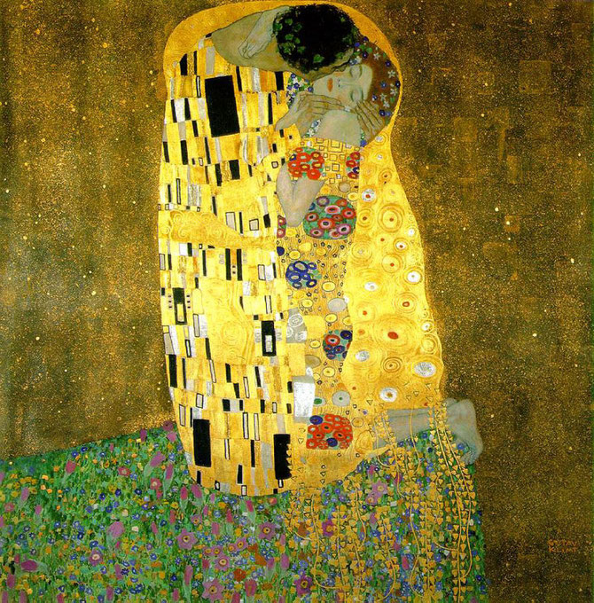

1. Un texto es:

R: Una comunicacion con un determinda sistema de signos

> ## Definición de Texto
>
> Un **texto** es un conjunto de palabras, frases y oraciones organizadas de manera coherente y con un propósito específico. Los textos pueden presentarse en diversas formas y formatos, y se utilizan para comunicar información, ideas, sentimientos o narrativas.
>
> ### Características de un Texto:
>
> 1. **Coherencia**:
>    Los elementos del texto deben estar conectados y tener un sentido lógico entre sí. Esto permite que el mensaje sea entendido de manera clara.
>
> 2. **Cohesión**:
>    Se refiere a la forma en que las palabras y oraciones se enlazan utilizando conectores y referencias, facilitando la fluidez del texto.
>
> 3. **Intención**:
>    Todo texto tiene un propósito, que puede ser informar, persuadir, entretener o expresar emociones.
>
> 4. **Contexto**:
>    El significado de un texto puede variar dependiendo del contexto en el que se presenta, incluyendo el contexto cultural y situacional.
>
> 5. **Estructura**:
>    Los textos pueden tener diferentes estructuras, como narrativas, descriptivas, argumentativas, expositivas, etc., dependiendo de su propósito.
>
> ### Tipos de Textos:
> - **Narrativos**: Relatan una historia o experiencia.
> - **Descriptivos**: Detallan características de un objeto, lugar o persona.
> - **Expositivos**: Presentan información y explicaciones sobre un tema.
> - **Argumentativos**: Defienden un punto de vista y persuaden al lector.

---

2. El texto dramatico es una obra que se elabora fundamentalmente con el objetivo de:

R: Repesentarse

> El texto dramático es una obra que se elabora fundamentalmente con el objetivo de **representar una historia a través de diálogos y acciones de personajes**, siendo diseñado para ser interpretado en un escenario ante una audiencia. Su estructura suele incluir actos y escenas, y se centra en conflictos, emociones y relaciones entre los personajes.
>
> ### Características del Texto Dramático:
>
> 1. **Diálogos**:
>    - La comunicación entre personajes es la principal forma de transmitir la historia, permitiendo el desarrollo de la trama.
>
> 2. **Acciones**:
>    - Las acciones de los personajes son cruciales para avanzar la historia y generar interés en el público.
>
> 3. **Estructura**:
>    - Generalmente se organiza en actos y escenas, facilitando la progresión de la narrativa.
>
> 4. **Personajes**:
>    - Incluye un elenco de personajes con características, motivaciones y conflictos que impulsan la historia.
>
> 5. **Escenografía**:
>    - Aunque el texto no describe físicamente los escenarios, permite la creación de un ambiente visual que complementa la narrativa.
>
> ### Objetivo
> El objetivo principal del texto dramático es **provocar emociones en el público** y hacerles reflexionar sobre temas universales a través de la actuación y la representación en vivo.

---
3. Cual es el movimiento armonico que se encuentra en un poema:

R: Ritmo

>
> El **movimiento armónico** que se encuentra en un poema se refiere a la **estructura rítmica y melódica** que se desarrolla a través de la repetición de sonidos, imágenes y patrones a lo largo del texto. Este movimiento se puede manifestar en varias formas:
>
> 1. **Rima**:
>    - La repetición de sonidos al final de los versos crea un patrón que proporciona musicalidad al poema.
>
> 2. **Métrica**:
>    - La cantidad de sílabas en cada verso puede seguir un patrón regular, contribuyendo al ritmo general del poema.
>
> 3. **Aliteración**:
>    - La repetición de consonantes en palabras cercanas genera un efecto sonoro que puede ser armonioso o enfatizar ciertas ideas.
>
> 4. **Anáfora**:
>    - La repetición de una palabra o frase al inicio de varios versos crea un sentido de continuidad y ritmo.
>
> 5. **Imágenes y Temas Recurrentes**:
>    - La reiteración de imágenes o temas a lo largo del poema puede generar un efecto de armonía y unidad en la obra.

---
4. Elige la opcion que incluya el uso de una "Metafora": 

R: Por la mañana sus cabellos de ceda negra, al atardecer, de nieve

> La frase **"Por la mañana sus cabellos de ceda negra, al atardecer, de nieve"** es una metáfora porque utiliza comparaciones implícitas que sugieren una relación entre dos conceptos sin emplear conectores explícitos como "como" o "parece".
>
> ### Elementos que hacen de esta una metáfora:
>
> - **Cabelos de ceda negra**: Aquí, se compara el color y la textura del cabello con la ceda, sugiriendo suavidad y riqueza sin decirlo directamente.
>
> - **Cabellos de nieve**: La frase implica que los cabellos al atardecer son tan blancos como la nieve. Esta imagen evoca una transformación del color, simbolizando posiblemente el paso del tiempo o el envejecimiento.
>
> ### Significado
> La metáfora no solo se refiere a los colores de los cabellos, sino que también puede insinuar cambios en la vida, la juventud frente a la vejez o la belleza que se transforma. Al utilizar estas imágenes, se enriquece la descripción y se profundiza el significado, llevando al lector a reflexionar sobre el paso del tiempo y sus efectos.

---
5. ¿Cual de las siguientes caracteristicas fue propia del realizmo?

R: El escritor PONE FRENO A LA FANTASIA Y A LA IMAGINACION para ser un fiel testigo de la vida cotidiana

> El **realismo** es un movimiento literario y artístico que surgió en la segunda mitad del siglo XIX como una reacción al romanticismo. Se caracteriza por la representación fiel y objetiva de la vida cotidiana y la realidad social. A continuación, se enumeran sus principales características:
>
> 1. **Representación Fiel de la Realidad**:
>    - El realismo busca retratar la vida tal como es, sin idealizaciones ni exageraciones. Los autores se enfocan en los aspectos cotidianos y mundanos de la existencia.
>
> 2. **Detallismo**:
>    - Los escritores realistas emplean descripciones detalladas para dar vida a personajes, escenarios y situaciones, proporcionando al lector una imagen vívida de la realidad.
>
> 3. **Personajes Complejos y Verosímiles**:
>    - Los personajes son desarrollados con profundidad, mostrando sus pensamientos, emociones y motivaciones, lo que les hace creíbles y cercanos al lector.
>
> 4. **Contexto Social y Cultural**:
>    - Las obras realistas a menudo abordan temas sociales, políticos y económicos, reflejando las condiciones de vida de la época y la lucha de las clases sociales.
>
> 5. **Uso de un Lenguaje Sencillo y Claro**:
>    - Se prefiere un lenguaje directo y accesible, evitando el uso de adornos y estilos poéticos complicados, para que el mensaje sea comprensible.
>
> 6. **Crítica Social**:
>    - Muchos autores realistas utilizan su obra para criticar injusticias sociales y resaltar problemas de la sociedad, como la pobreza, la corrupción y la desigualdad.
>
> 7. **Narrador Objetivo**:
>    - El narrador suele ser un observador externo que presenta los eventos y personajes de manera objetiva, sin interferir con juicios de valor o emociones personales.

---
6. Identifica a que corriente literaria corresponde el siguiente fragmento:

Este era un , una tienda hecha del dia y rebaño de elefantes  .... i 

Éste era un REY QUE TENIA UN PALACIO DE DIAMANTES, una tienda hecha del 
día y un rebaño de elefantes, un kiosco de malaquitas, un gran manto 
hecho de tisú y una gentil princesita, tan bonita, Margarita, tan bonita, 
como tú. 

-Ruben Dario

R: Modernismo 

> El **modernismo** es un movimiento literario y artístico que surgió a finales del siglo XIX y se consolidó en las primeras décadas del siglo XX, especialmente en América Latina y España. Se caracteriza por una búsqueda de la renovación estética y la expresión de nuevas ideas y sensaciones en contraposición a los movimientos anteriores, como el realismo y el naturalismo.
>
> 
>
> ### Características del Modernismo:
>
> 1. **Innovación Estética**:
>    - Los modernistas experimentan con nuevas formas poéticas, métricas y ritmos, buscando romper con las tradiciones establecidas. Se introducen nuevas estructuras, como el verso libre.
>
> 2. **Riqueza Lingüística**:
>    - Se utiliza un lenguaje florido y simbólico, lleno de metáforas y recursos poéticos, que enriquece la expresión literaria y busca generar una experiencia estética profunda.
>
> 3. **Temáticas Variadas**:
>    - Los temas abarcan desde la búsqueda de la belleza y la espiritualidad hasta la exploración de la identidad y la crítica social. También se aborda la nostalgia y la evasión.
>
> 4. **Influencias Internacionales**:
>    - El modernismo está influenciado por corrientes europeas como el simbolismo y el parnasianismo, que buscan la belleza formal y la expresión de emociones a través de símbolos.
>
> 5. **Individualismo**:
>    - Se pone énfasis en la subjetividad del autor y en la expresión de sus sentimientos y experiencias personales. El yo poético adquiere una relevancia central en las obras.
>
> 6. **Cosmopolitismo**:
>    - Los modernistas se sienten atraídos por la cultura y el arte de otras naciones, incorporando elementos de diversas tradiciones culturales en sus obras.
>
> 7. **Evasión de la Realidad**:
>    - Se busca escapar de la realidad cotidiana, a menudo utilizando imágenes de la naturaleza, la mitología y el simbolismo para crear mundos ideales y poéticos.

---
7. El moviento literario latinoamericano que enarbola la bandera de libertad hacia la belleza es el: 

R: Modernismo

---
8. A la narracion en prosa relativamente breve se le denomina: 

R: Cuento

> El **cuento** es una forma de narrativa breve que se caracteriza por contar una historia completa en un espacio limitado, generalmente concentrándose en un solo evento o conflicto. Esta estructura lo diferencia de otras formas de narración más extensas, como la novela.
>
> ### Características del Cuento:
>
> 1. **Brevedad**:
>    - Los cuentos son más cortos que las novelas, lo que obliga al autor a ser conciso y directo en su narrativa.
>
> 2. **Unidad de Acción**:
>    - Suele centrarse en un solo evento o conflicto, lo que permite un desarrollo más intenso y específico de la trama.
>
> 3. **Pocos Personajes**:
>    - Generalmente, hay un número reducido de personajes, lo que facilita la profundización en sus características y motivaciones sin complicar la narrativa.
>
> 4. **Trama Concisa**:
>    - La trama se desarrolla rápidamente, con un inicio claro, un desarrollo breve y un desenlace efectivo, que a menudo se presenta de forma inesperada.
>
> 5. **Ambiente y Contexto**:
>    - A menudo, el ambiente y el contexto son descritos de manera rápida y efectiva para situar al lector en la historia sin extenderse demasiado.
>
> 6. **Mensaje o Moral**:
>    - Muchos cuentos transmiten un mensaje, una enseñanza o una reflexión sobre la vida, las relaciones humanas o la condición social.
>
> 7. **Estilo Varíado**:
>    - Los cuentos pueden adoptar diversos estilos, desde el realismo hasta lo fantástico, lo que permite a los autores experimentar con la forma y el contenido.

---
9. Constituye en el relato, la parte que sucede inmediatamente despues del momento culminante de la narracion:

R: Desenlace

> Un relato se compone de varias partes fundamentales que contribuyen a su estructura y al desarrollo de la historia. Estas son:
>
> 1. **Introducción**:
>    - Presenta a los personajes, el escenario y el contexto de la historia. Establece el tono y capta la atención del lector.
>
> 2. **Planteamiento**:
>    - Introduce el conflicto principal que impulsará la trama, presentando los problemas o retos que los personajes deberán enfrentar.
>
> 3. **Desarrollo (Nudo)**:
>    - Expande la historia y desarrolla los eventos, explorando las complicaciones que surgen a partir del conflicto planteado y profundizando en las interacciones entre los personajes.
>
> 4. **Clímax**:
>    - El momento culminante o punto de máxima tensión en la historia, donde se enfrenta el conflicto principal y se toman decisiones críticas que afectarán el desenlace.
>
> 5. **Desenlace**:
>    - Parte que sigue al clímax, donde se resuelven los conflictos y se clarifican las situaciones. Proporciona un sentido de cierre al relato y puede incluir una reflexión final.
>
> 6. **Epílogo**:
>    - A veces se incluye al final del relato, ofreciendo un resumen de lo que sucede después del desenlace y puede proporcionar una reflexión adicional sobre la historia o revelar el futuro de los personajes.
>
---
10. Señala una caracteristica de una ficha textual: 

R: Reproduce el texto

> Una ficha textual es una herramienta utilizada en la investigación y el estudio para registrar información relevante de una fuente. Una característica clave de una ficha textual es que **reproduce el texto** de manera exacta. Esto implica que se transcribe el contenido original de la fuente, respetando la ortografía, puntuación y formato del autor. Esta característica permite que el investigador mantenga la integridad de la información al referenciarla en su trabajo. Aquí están sus características principales:
>
> 1. **Referencia Completa**:
>    - Incluye los datos bibliográficos completos de la fuente de donde se extrajo la información, como el autor, título, editorial, año de publicación y página.
>
> 2. **Cita Literal**:
>    - Contiene una transcripción exacta de las palabras del autor, respetando la ortografía y la puntuación original.
>
> 3. **Número de Página**:
>    - Especifica el número de página de donde se ha tomado la cita, lo que facilita la localización de la información en la fuente.
>
> 4. **Claridad y Concisión**:
>    - Debe ser clara y concisa, evitando ambigüedades y presentando solo la información necesaria.
>
> 5. **Formato Estandarizado**:
>    - Se suele seguir un formato específico, ya sea APA, MLA, Chicago, entre otros, para asegurar uniformidad en la presentación.
>
> 6. **Contextualización**:
>    - A veces se incluye una breve contextualización de la cita, explicando su relevancia en relación con el tema que se está estudiando.
