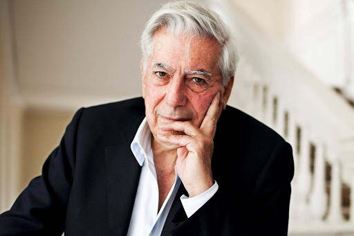
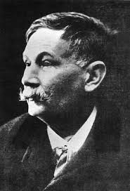
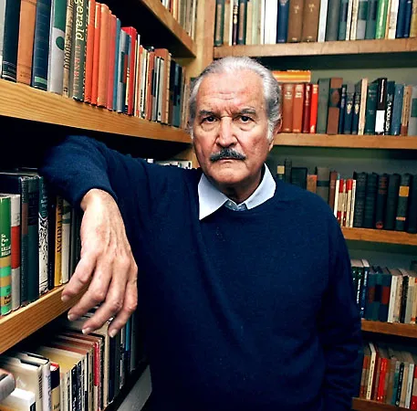
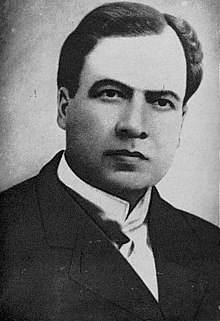
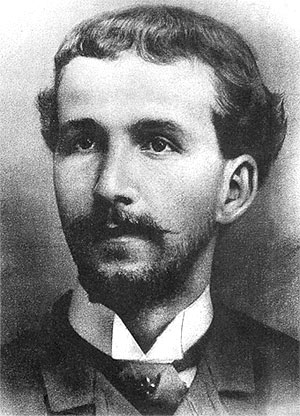

1. Lee con atencion el texto y contesta la pregunta siguiente:

    - Bañate en la sangre del dragon y seras invulnerable ...

> - Sigfrido, entra en la cueva de los Nibelungos… toma el yelmo que transforma a las personas y el anillo que da todo lo que deseas. Así lo hizo Sigfrido, entonces el pajarillo le dijo: 
> - **BAÑATE EN SANGRE DE DRAGON Y** serás invulnerable. Ninguna espada ni arma podrá penetrar en tu carne. Mientras Sigfrido obedecía sumergiéndose en la sangre que formaba un enorme charco en el suelo, una hoja de tilo se desprendió y fue a caer en su espalda; pero ni él ni el jilguero lo vieron; el pájaro entonces habló de Crimilda, la bella valkiria que dormía cercada por un círculo de fuego. 
> - **Sígueme y te conduciré hasta ella,** una vez allí, atraviesa sin miedo las llamas y encontrarás a la que ha de ser tu esposa.    

Este texto corresponde al genero: 

R: Epico 

> El género épico es una categoría literaria que narra las hazañas y aventuras de héroes, a menudo en un contexto histórico o mítico. Las obras épicas suelen presentar elementos como la exaltación de valores como el honor, la valentía y la lucha contra fuerzas adversas. Este género se caracteriza por su extensión, un estilo elevado y el uso de un lenguaje rico y descriptivo. Ejemplos clásicos incluyen "La Iliada" y "La Odisea" de Homero, así como "El Cantar de los Cantares" y "El Cid" en la literatura española.

---

2. A que genero pertenecen las obras literarias escritas a manera de dialogo? 

R:Dramatico      

> Las obras literarias escritas a manera de diálogo pertenecen al género dramático. Este género se caracteriza por la representación de acciones y conflictos a través de conversaciones entre personajes, en lugar de una narrativa convencional. Las obras dramáticas pueden incluir tragedias, comedias y otros subgéneros, y están diseñadas para ser representadas en un escenario.

---
3. Escritor peruano que alcanzo la fama en 1960 y en 2010 gano el premio nobel de literatura 

R: Mario Vargas Llosa  

> 
>
> Mario Vargas Llosa (nacido el 28 de marzo de 1936) es un escritor, político y ensayista peruano, considerado uno de los autores más influyentes de la literatura en español y una figura central en la narrativa contemporánea. Nació en Arequipa, Perú, y pasó gran parte de su vida en Lima.
>
> Vargas Llosa ha escrito numerosas novelas, ensayos y obras de teatro, siendo algunos de sus trabajos más destacados "La ciudad y los perros", "La casa verde", "Conversación en La Catedral" y "La fiesta del chivo". Su obra se caracteriza por una exploración profunda de temas sociales, políticos y culturales, así como un estilo narrativo innovador que combina realismo y elementos experimentales.
>
> En 2010, recibió el Premio Nobel de Literatura, en reconocimiento a su contribución a la literatura y su compromiso con la libertad de expresión. Vargas Llosa también ha estado involucrado en la política, siendo un crítico del autoritarismo y un defensor de la democracia y los derechos humanos. Se postuló a la presidencia del Perú en 1990, aunque no tuvo éxito en su candidatura.

---
4. El libro titulado "Azul" de Ruben Dario, publicado en 1888, pertenece al    

R:Modernismo 

> Esta obra es considerada una de las primeras manifestaciones del modernismo literario en lengua española, caracterizada por su innovación estética y la búsqueda de nuevas formas de expresión poética.

---
5. En la literatura realista, el novelista espanol mas importante del siglo XIX, entre sus obras se encuentran: Doña perfecta, Marianela, entre otras.  

R: Benito Perez Galdos 

> 
>
> Benito Pérez Galdós (1843-1920) fue un destacado novelista, dramaturgo y político español, considerado uno de los más importantes autores de la literatura realista del siglo XIX. Nació en Las Palmas de Gran Canaria y se trasladó a Madrid, donde desarrolló la mayor parte de su carrera literaria. 
>
> Galdós es conocido por su amplia producción literaria, que incluye más de 20 novelas, dramas y ensayos. Su obra más famosa es la serie de novelas "Episodios nacionales", que narra la historia de España desde la guerra de la independencia hasta la restauración borbónica. Otras obras destacadas incluyen "Doña Perfecta", "Marianela" y "Misericordia". 
>
> Su estilo se caracteriza por un profundo análisis social, psicológico y político, y es reconocido por su capacidad para retratar la vida cotidiana de la época. Galdós fue también un defensor de los derechos sociales y la justicia, lo que se refleja en sus escritos. En 2010, recibió el reconocimiento póstumo del Premio Nobel de Literatura.

---
6. Son algunas obras escritas por Carlos Fuentes. 

R: Cristobal Nonato, Las buenas conciencias, La region mas importante.  

> 
>
> Carlos Fuentes (1928-2012) fue un destacado novelista, ensayista y dramaturgo mexicano, considerado uno de los más importantes escritores de la literatura en español del siglo XX. Nacido en Ciudad de Panamá, pero criado en México, Fuentes tuvo una carrera literaria que abarcó más de seis décadas, en la que exploró temas como la identidad nacional, la historia y la cultura mexicana.
>
> Algunas de sus obras más conocidas incluyen "La muerte de Artemio Cruz", "Aura", "El día de los muertos", "Gringo viejo", "Cristóbal Nonato", "Las buenas conciencias" y "La región más transparente". Fuentes se caracterizó por su estilo narrativo innovador y su habilidad para entrelazar realismo y elementos fantásticos.
>
> A lo largo de su vida, Fuentes recibió numerosos premios y distinciones, incluido el Premio Miguel de Cervantes en 1977 y el Premio Alfonso Reyes en 1986. Además de su labor literaria, Fuentes fue un importante intelectual y un defensor de los derechos humanos, participando activamente en debates políticos y sociales en México y América Latina.

---

7. Movimiento poetico latinoamericano inspirado en el parnasianismo  y simbolismo.

R: Modernismo

El Modernismo. Este movimiento, que tuvo su auge a finales del siglo XIX y principios del XX, se caracteriza por la búsqueda de la belleza estética, el uso de metáforas elaboradas y la musicalidad en la poesía. Poetas destacados de este movimiento incluyen a Rubén Darío y José Asunción Silva.

---
8. Escritor colombian, ganador del premio nobel de literatura en 1982 tambien es autor de la novela cien años de soledad.  

R: Gabriel García Márquez 

>
>
> Gabriel García Márquez fue un escritor, periodista y novelista colombiano, nacido el 6 de marzo de 1927 en Aracataca y fallecido el 17 de abril de 2014 en Ciudad de México. Es ampliamente reconocido como uno de los más importantes autores del siglo XX y uno de los máximos exponentes del realismo mágico, un estilo literario que mezcla lo real con lo fantástico.
>
> Su obra más famosa es "Cien años de soledad", publicada en 1967, que narra la historia de la familia Buendía en el pueblo ficticio de Macondo. García Márquez recibió el Premio Nobel de Literatura en 1982, en reconocimiento a su contribución a la literatura, caracterizada por su prosa poética y su habilidad para contar historias complejas que reflejan la realidad social y política de América Latina.

---

9. Movimiento literario al cual pertenece Azul y Prosas profanas

R: Modernismo 

> **"Azul"** es una obra del poeta y escritor nicaragüense **Rubén Darío**, publicada en 1888. Este libro es considerado un hito en la literatura modernista y consiste en una colección de poemas y relatos que exploran temas como el amor, la naturaleza y la búsqueda de la belleza. La obra marca un cambio significativo en la poesía hispanoamericana, combinando influencias del simbolismo y el parnasianismo con un lenguaje innovador y musicalidad.
> 
> **"Prosas profanas"**, también de Rubén Darío, fue publicada en 1896 y es otra obra emblemática del modernismo. A diferencia de "Azul", esta colección se centra más en el ensayo y la prosa poética. Los textos abordan una variedad de temas, incluyendo el arte, la vida cotidiana y reflexiones sobre la existencia humana, manteniendo un estilo lírico y estéticamente elaborado. Esta obra también resalta la influencia del simbolismo y destaca la importancia del lenguaje poético.
>
> 
>
> **Rubén Darío** (1867-1916) fue un poeta, periodista y diplomático nicaragüense, conocido como uno de los máximos exponentes del modernismo en la literatura hispanoamericana. Nacido en Metapa (actualmente Ciudad Darío), su obra se caracteriza por una búsqueda de la belleza y la musicalidad en el lenguaje, así como por su exploración de temas como el amor, la muerte, la naturaleza y la identidad.
> 
> Su libro más famoso, **"Azul"** (1888), marcó un hito en la poesía modernista y estableció nuevas formas y estilos en la literatura. Otras obras importantes incluyen **"Prosas profanas"** (1896) y **"Cantos de vida y esperanza"** (1905). Además de su labor poética, Darío fue un crítico social y político, influyendo en el pensamiento literario y cultural de su tiempo. Su legado perdura como un referente fundamental en la literatura en lengua española.

---

10. Genero literario creado para ser presentado

R: Texto dramatico 

> Las obras literarias escritas a manera de diálogo pertenecen al género dramático. Este género se caracteriza por la representación de acciones y conflictos a través de conversaciones entre personajes, en lugar de una narrativa convencional. Las obras dramáticas pueden incluir tragedias, comedias y otros subgéneros, y están diseñadas para ser representadas en un escenario.

