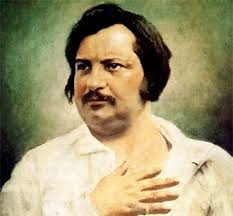
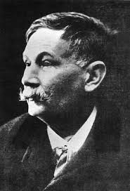
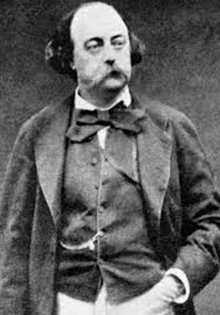
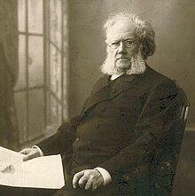

1. Corriente literaria que surge durante la segunda mitad del siglo XIX retratan el mundo que les rodea a manera de experimentadores, se interesan por el presente por los problemas sociales y se apoyan del metodo cientifico

R: Naturalizmo
 
> ### Características del Naturalismo:
> - **Contexto histórico**: Surge en la segunda mitad del siglo XIX como una respuesta al Romanticismo.
> - **Interés en el presente**: Los naturalistas se enfocan en retratar la realidad social y los problemas contemporáneos.
> - **Método científico**: Se apoyan en la observación y la experimentación, utilizando el enfoque científico para analizar la conducta humana y los factores sociales y ambientales que influyen en ella.
> - **Retrato de la sociedad**: Sus obras suelen mostrar la vida de las clases bajas y los aspectos más oscuros de la naturaleza humana.
> 
> ### Autores destacados:
> - **Émile Zola**: Considerado el principal exponente del naturalismo, escribió obras como "Germinal" y "Thérèse Raquin".
> - **Guy de Maupassant**: Su estilo refleja elementos naturalistas en cuentos como "Boule de Suif".

---
2. Los representantes de la literatura realista son:  

R: Balzac, Galsdos, Flaubert, Ibsen

> 
> ### 1. Honoré de Balzac (1799-1850)
> - **Nacimiento**: Nació el 20 de mayo de 1799 en Tours, Francia.
> - **Obra principal**: Es conocido por su monumental serie de novelas titulada *La Comédie Humaine*, que retrata la sociedad francesa de su tiempo.
> - **Estilo**: Balzac es considerado uno de los precursores del realismo literario. Su estilo se caracteriza por una prosa detallada y una profunda exploración de la psicología de sus personajes.
> - **Legado**: Influyó en numerosos escritores, incluidos Marcel Proust y Émile Zola. Su enfoque en la observación social y el detalle minucioso sentó las bases para la narrativa realista.
> 
> 
> ### 2. Benito Pérez Galdós (1843-1920)
> - **Nacimiento**: Nació el 10 de mayo de 1843 en Las Palmas de Gran Canaria, España.
> - **Obra principal**: Es uno de los más destacados novelistas del siglo XIX español, conocido por obras como *Fortunata y Jacinta*, *Marianela* y *Los episodios nacionales*.
> - **Estilo**: Su escritura combina el realismo y el naturalismo, abordando problemas sociales y políticos de la España de su época.
> - **Legado**: Galdós es considerado el "cervantino" de su tiempo, y su obra ha influido en muchos escritores posteriores, así como en el desarrollo del teatro español.
>
> 
>
> ### 3. Gustave Flaubert (1821-1880)
> - **Nacimiento**: Nació el 12 de diciembre de 1821 en Ruán, Francia.
> - **Obra principal**: Es famoso por su novela *Madame Bovary*, que es considerada una de las obras maestras del realismo.
> - **Estilo**: Flaubert es conocido por su búsqueda de la perfección en la forma literaria, así como por su enfoque crítico hacia la sociedad burguesa de su tiempo.
> - **Legado**: Su trabajo ha influido en numerosos autores del siglo XX y es considerado un precursor del modernismo literario.
> 
> 
>
> ### 4. Henrik Ibsen (1828-1906)
> - **Nacimiento**: Nació el 20 de marzo de 1828 en Skien, Noruega.
> - **Obra principal**: Es conocido por sus obras de teatro, como *Casa de muñecas* y *Hedda Gabler*, que abordan temas sociales y psicológicos.
> - **Estilo**: Ibsen es considerado el padre del teatro moderno y su estilo se caracteriza por un enfoque realista y crítico hacia las normas sociales.
> - **Legado**: Su trabajo ha tenido un impacto duradero en el teatro contemporáneo y ha influido en dramaturgos posteriores como Anton Chéjov y Eugene O'Neill.

---
3. Genero literario que esta escrito en dialogo tiene acotaciones y sugio en la antigua grecia:  

R: Dramatico

> ### Características del Teatro o genero Dramatico:
> - **Diálogo**: Está escrito principalmente en forma de diálogo entre personajes, lo que permite desarrollar la trama y los conflictos.
> - **Acotaciones**: Incluye acotaciones o instrucciones que indican cómo deben actuar los personajes y cómo se deben desarrollar las escenas.
> - **Origen**: Surgió en la Antigua Grecia, donde se presentaban obras en festivales en honor a Dionisio, el dios del vino y la fertilidad.
> - **Tipos**: Se divide en varios subgéneros, como la tragedia y la comedia, que abordan diferentes temas y estilos.
> 
> ### Autores destacados:
> - **Esquilo**: Considerado el padre de la tragedia.
> - **Sófocles**: Conocido por obras como *Edipo Rey*.
> - **Eurípides**: Famoso por su enfoque innovador en la tragedia.
> - **Aristófanes**: Reconocido por su contribución a la comedia griega.

---

4. Genero literario que narra hazañas heroicas tiene finalidad patriotica 

R: Epopeya

> Una **Epopeya** es un género literario que se caracteriza por ser un poema extenso que narra las hazañas y aventuras de héroes, dioses o personajes históricos. 
> 
> ### Características de la Epopeya:
> - **Temática heroica**: Se centra en grandes acontecimientos, como guerras, viajes o hazañas extraordinarias.
> - **Estilo elevado**: Utiliza un lenguaje poético y solemne, con un tono que resalta la grandeza de los personajes y los eventos narrados.
> - **Estructura narrativa**: Suele presentar un relato en verso, con episodios que incluyen la intervención de fuerzas sobrenaturales o divinas.
> - **Cultura y valores**: Refleja los valores, creencias y tradiciones de la sociedad en la que se originó.
> 
> ### Ejemplos de Epopeyas:
> - **La Ilíada** y **La Odisea** de Homero.
> - **La Eneida** de Virgilio.
> - **El Cantar de los Cantares** en la literatura española.

---

5. Genero literario que cuenta, narra y relata. Pertenece a este la novela, cuento, la leyenda y el mito. 

R: Epico

> ### Características del Épico:
> - **Temática**: Aborda temas de gran relevancia, como la guerra, la valentía, la mitología y los valores culturales.
> - **Héroes**: Los personajes son a menudo héroes que realizan actos extraordinarios o enfrentan adversidades significativas.
> - **Estilo narrativo**: Utiliza un lenguaje grandilocuente y formal, a menudo con descripciones vívidas y un tono exaltado.
> - **Elementos sobrenaturales**: Puede incluir la intervención de dioses o seres sobrenaturales que afectan el destino de los personajes.
> 

---

6. Corriente del arte que abarco la 2da mitad del siglo XIX surigio en francia y se opone al romanticismo 

R: Realismo

> **Realismo** es una corriente del arte y la literatura que abarcó la segunda mitad del siglo XIX, surgió en Francia y se opone al Romanticismo. Se caracteriza por su enfoque en la representación objetiva de la realidad y la vida cotidiana, alejándose de las idealizaciones y emociones extremas del Romanticismo.
> ### Características del Realismo:
> - **Representación objetiva**: Los autores buscan retratar la realidad de manera precisa y sin idealización.
> - **Enfoque en la vida cotidiana**: Se centran en las experiencias, problemas y conflictos de las personas comunes, en lugar de héroes o situaciones excepcionales.
> - **Detallismo**: Se presta atención a los detalles y matices de la vida, incluyendo aspectos sociales, económicos y psicológicos.
> - **Temática social**: Muchas obras realistas abordan temas como la clase social, la pobreza, el trabajo y la moralidad.
> 
> ### Autores destacados:
> - **Gustave Flaubert**: Conocido por su obra *Madame Bovary*.
> - **Émile Zola**: Considerado un referente del naturalismo, parte del realismo.
> - **Benito Pérez Galdós**: Autor español famoso por sus novelas que retratan la sociedad española.
> - **Anton Chéjov**: Dramaturgo ruso que exploró la vida cotidiana en sus obras.

---

7. Las caracteristicas del realismo son:  

R: Analiza y describe el comportamiento del hombre, deja la fantasia y hace una representacion fiel de la realidad

> ### Características del Realismo:
> - **Análisis del comportamiento humano**: Los autores del realismo analizan y describen el comportamiento y las motivaciones de los personajes, explorando su psicología y relaciones sociales.
> - **Abandono de la fantasía**: El realismo se aleja de elementos fantásticos o idealizados, enfocándose en situaciones y personajes verosímiles.
> - **Representación fiel de la realidad**: Busca una representación precisa y objetiva de la vida cotidiana, abordando temas relevantes y aspectos de la sociedad, la cultura y la economía de la época.

---

8. Que figura retorica se ve en la siguiente expresion? 

"La amapola es como la sangre de la tierra"

R: Simil 

> ### Características del Símil:
> - **Definición**: El símil es una comparación directa entre dos elementos, utilizando palabras como "como", "parece", "similar a", etc.
> - **Función**: En este caso, se compara la amapola con la sangre de la tierra para evocar una imagen visual y emocional que resalta la belleza y la vitalidad de la flor, así como su conexión con la naturaleza.

---

9. Que figura retorica predomina en la siguiente expresion? 

"Floralba, a las piedras les das alma"

R: Hiperbole

> ### Características de la Hipérbole:
> - **Definición**: La hipérbole es una figura retórica que consiste en exagerar una característica o cualidad para enfatizar una idea o emoción.
> - **Función**: En este caso, la frase sugiere de manera exagerada que las piedras, objetos inanimados, pueden recibir vida o alma, lo que resalta la importancia del impacto que Floralba tiene en el entorno o en la percepción de la realidad.

---

10. Que figura retorica predomina en:

"Se fue, se fue, cual pajaro escapando de la jaula, cuando yo ame"

R: Simil

> #### Tipos de Figuras Retóricas:
> 
> 1. **Metáfora**: Comparación implícita entre dos cosas diferentes sin usar "como".
> 2. **Símil**: Comparación explícita entre dos cosas usando "como", "parece", etc.
> 3. **Personificación**: Atribución de cualidades humanas a objetos inanimados o conceptos abstractos.
> 4. **Hipérbole**: Exageración de una idea o situación para enfatizar.
> 5. **Anáfora**: Repetición de una o varias palabras al inicio de frases o versos.
> 6. **Epíteto**: Adjetivo que resalta una cualidad inherente del sustantivo.
> 7. **Oxímoron**: Combinación de dos términos opuestos que generan un nuevo significado.
> 8. **Paradoja**: Unión de ideas contradictorias que revelan una verdad oculta.
> 9. **Aliteración**: Repetición de sonidos similares en palabras cercanas.
> 10. **Onomatopeya**: Palabra que imita o sugiere el sonido que describe.
> 11. **Metonimia**: Sustitución de un término por otro relacionado con él (por ejemplo, "la corona" para referirse a la monarquía).
> 12. **Sinestesia**: Mezcla de sensaciones de diferentes sentidos (por ejemplo, "un sonido dulce").
> 13. **Clímax**: Enumeración de ideas que van de menor a mayor importancia.
> 14. **Antítesis**: Contraposición de ideas o palabras opuestas en una misma frase.
> 15. **Paronomasia**: Juego de palabras que aprovecha la similitud fonética.

