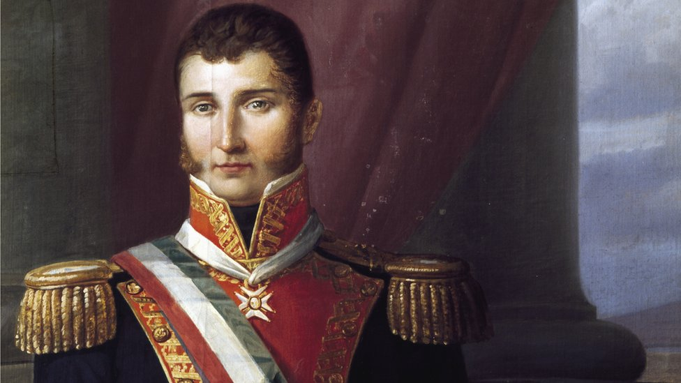
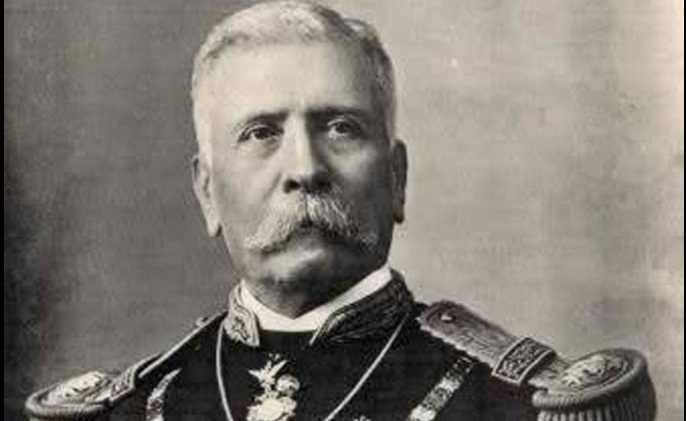
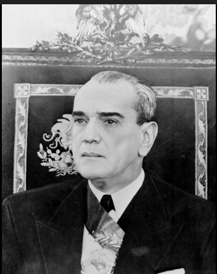
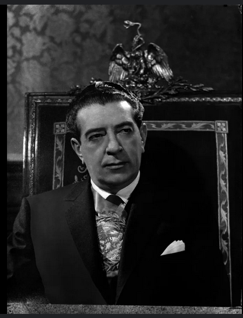
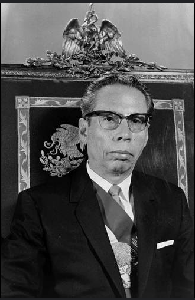
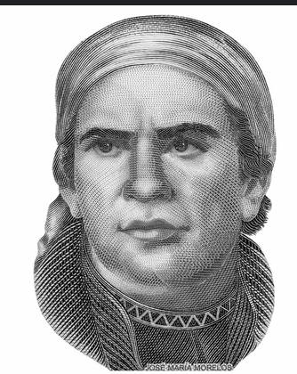
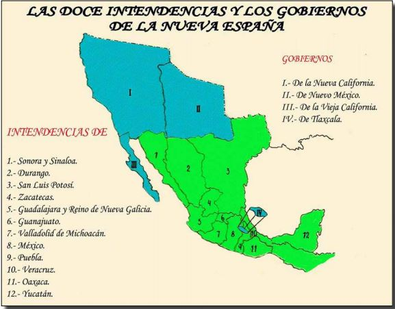

1. ¿Cual fue la primera forma de gobierno en el mexico independiente?

**R: Imperio**

> E: La primera forma de gobierno en México tras su independencia fue el **Imperio**, conocido como el **Primer Imperio Mexicano**.
> - **Período**: 1821 - 1823
> - **Gobernante**: Agustín de Iturbide fue proclamado como **Emperador Agustín I** en 1822.
> - **Características**: 
>   - Se estableció una monarquía constitucional, pero con poderes centralizados en el emperador.
>   - El Imperio fue corto, debido a la insatisfacción con la forma de gobierno y la creciente presión para adoptar una república.
> - **Fin**: En 1823, Iturbide abdicó y se proclamó la **República Federal**.

---
2. Porfirio Diaz llega la poder mediante el plan de Tuxtepec en el cual proponia:  

**R: No reeleccion**

> Porfirio Díaz llegó al poder mediante el **Plan de Tuxtepec** en 1876, en el cual proponía:
>
> - **Desconocimiento del gobierno de Sebastián Lerdo de Tejada**, a quien acusaba de intentar perpetuarse en el poder a través de la reelección.
> - **No reelección presidencial**, estableciendo que ningún presidente debería gobernar de manera consecutiva.
> - **Reforma política**: Díaz buscaba implementar un gobierno más liberal, acusando al régimen de Lerdo de ser centralista y autoritario.
>
> El Plan de Tuxtepec tuvo éxito tras la batalla de **Tecoac**, permitiendo a Díaz asumir la presidencia, marcando el inicio de su largo régimen.
>
> 
---
3. Le etapa en la que la economia mexica crecio un una tasa del 7% se le conoce con el nombre de ________

**R: Desarrollo estabilizador**

> El **Desarrollo Estabilizador** fue un periodo de crecimiento económico en México que abarcó de **1954 a 1970**. Durante este tiempo, el país experimentó un notable crecimiento económico sin altos niveles de inflación o devaluación de la moneda.
>
> ### Características principales:
> - **Crecimiento económico sostenido**: El PIB creció a un promedio del 6% anual.
> - **Baja inflación**: Controlada en niveles bajos para evitar desequilibrios.
> - **Estabilidad cambiaria**: El peso mexicano se mantuvo estable frente al dólar.
> - **Industrialización**: Impulso a la industria mediante políticas proteccionistas.
> - **Inversión en infraestructura**: Carreteras, electricidad, y sistemas hidráulicos fueron priorizados.
>
> ### Líderes:
> - **Adolfo Ruiz Cortines** (1952-1958): Inició las políticas de estabilización.
> 
> - **Adolfo López Mateos** (1958-1964): Consolidó el crecimiento industrial.
> 
> - **Gustavo Díaz Ordaz** (1964-1970): Culminó el periodo de estabilidad.
> 
>
> ### Fin del Desarrollo Estabilizador:
> El modelo enfrentó problemas hacia finales de los años 60, como la creciente deuda externa y desigualdad, lo que llevó a una crisis económica a principios de los 70.

---
4. Personaje que dio seguimiento al proyecto insurgentes despues de la muerte de Hidalgo

**R: Jose Maria Morelos y Pavon**

> E: El personaje que dio seguimiento al proyecto insurgente después de la muerte de **Miguel Hidalgo** fue **José María Morelos y Pavón**.
>
> 
>
> ### Contribuciones:
> - **Morelos** asumió el liderazgo del movimiento independentista tras la captura y ejecución de Hidalgo en 1811.
> - Organizó y lideró campañas militares con mayor disciplina y estrategia.
> - Convocó el **Congreso de Chilpancingo** en 1813, donde se proclamó la **Independencia de México** y se redactó la **Constitución de Apatzingán** en 1814.
>
> Morelos fue una figura clave en la segunda etapa de la lucha por la independencia de México.

---
5. Acontecimientos del gobierno de Lazaro Cardenas:

**R: EXPROPIACION PETROLERA, CONSTRUCCION DE PRESAS y CREACION DE LA CTM**

> E: Durante el gobierno de **Lázaro Cárdenas** (1934-1940) en México, se llevaron a cabo varios acontecimientos significativos que marcaron la historia del país. A continuación se destacan algunos de los más importantes:
>
> 
>
> ### Acontecimientos Principales:
> - **Nacionalización del Petróleo**: En 1938, Cárdenas expropió las compañías petroleras extranjeras y nacionalizó la industria petrolera, estableciendo **Pemex** (Petróleos Mexicanos). Este acto fue fundamental para el control de los recursos naturales del país.
> - **Desarrollo Infraestructural**: Se impulsaron proyectos de infraestructura, incluyendo la construcción de caminos, presas, y la expansión de la red eléctrica en el país.
> - **Apoyo a los Trabajadores**: Se fomentaron los derechos laborales y se promovió el fortalecimiento de los sindicatos. Se estableció la **Confederación de Trabajadores de México** (CTM).
> - **Reforma Agraria**: Se implementó una reforma agraria significativa mediante la **Ley de Reforma Agraria** de 1934. Esto incluyó la redistribución de tierras a campesinos y el fortalecimiento de los ejidos.
> - **Reformas Educativas**: Se promovió la educación socialista y se fortaleció la educación pública, con un enfoque en la educación rural y la creación de escuelas en áreas lejanas.
> 
> ### Impacto:
> - El gobierno de Cárdenas es recordado por su enfoque en la justicia social y en la mejora de las condiciones de vida de los mexicanos. Sus políticas sentaron las bases para el desarrollo económico y social de México en las décadas siguientes.

---
6. Acontecimientos mas representativos de Adolfo Lopez Mateo: 
> R: LIBROS DE TEXTO GRATUITO, MEXICO RECUPERA EL CHAMIZAL y ESTABLECIO DESAYUNO EN LAS ECUELAS GRATUITO

> E: Durante el gobierno de **Adolfo López Mateos** (1958-1964) en México:

> México recuperó el **Chamizal** el **29 de diciembre de 1966** mediante la firma de un tratado con los Estados Unidos. Este acuerdo resolvió un conflicto territorial que se había prolongado durante más de un siglo debido a cambios en el curso del río Bravo (Río Grande) que habían modificado la frontera entre ambos países.
>
> ### Contexto:
> - **Conflicto**: El conflicto se originó en el siglo XIX y se agravó por el desvío del curso del río, lo que llevó a disputas sobre la posesión de tierras.
> - **Tratado de 1963**: Se firmó un tratado entre México y Estados Unidos para resolver la disputa. El acuerdo establecía la devolución del terreno al territorio mexicano y la construcción de una canalización para evitar futuros conflictos.
> - **Recuperación Formal**: El 29 de diciembre de 1966, México recibió oficialmente el Chamizal, y el acuerdo fue ratificado por ambos países.

> Los **libros de texto gratuitos** y los **desayunos gratuitos** en México fueron propuestos y promovidos por el presidente **Adolfo López Mateos** durante su mandato (1958-1964).
> - **Libros de Texto Gratuitos**: Implementados en 1960, estos libros se distribuyeron a estudiantes de educación básica para garantizar que todos tuvieran acceso a materiales educativos de calidad sin costo para las familias.
> - **Desayunos Gratuitos**: Iniciado en 1961, este programa proporcionó desayunos a estudiantes de escuelas públicas para mejorar la nutrición y el rendimiento académico.
>
> Estas medidas formaron parte de un esfuerzo más amplio para mejorar la educación y la salud infantil en México durante su administración.

---
7. Forma de division Politica en la nueva España propuesta por las reformas borbonicas: 

**R: Intendencias**

> 
>
> E: Las **Reformas Borbónicas** en la Nueva España, implementadas durante el siglo XVIII, llevaron a una reorganización administrativa y política que buscaba aumentar el control de la Corona sobre sus colonias y mejorar la eficiencia del gobierno. La **forma de división política** propuesta por estas reformas incluyó:
>
> ### Divisiones Administrativas:
> - **Intendencias**: Se establecieron nuevas provincias administrativas llamadas intendencias para mejorar la administración económica y fiscal. Cada intendencia era dirigida por un intendente, quien supervisaba la recaudación de impuestos y la administración de justicia.
> 
> - **Virreinato**: La estructura del Virreinato de la Nueva España se mantuvo, con el Virrey como autoridad máxima en la colonia, pero se le dio más control a los intendentes en cuestiones locales.
> 
> ### Objetivos de las Reformas:
> - **Centralización del poder**: Aumentar el control directo de la Corona sobre las colonias.
> - **Eficiencia administrativa**: Mejorar la administración fiscal y económica.
> - **Reducción de la influencia de los criollos**: Reemplazar a los criollos en cargos importantes por peninsulares para asegurar lealtad a la Corona.

---
8. Cuantas intendencias habia en el virreynato y cual era su funcion

**R: Eran 12 y su funcion era incrementar el igreso de la corona**

> E: La nueva España al reinado de los borbones sufrió un cambio respecto a cómo el territorio novohispano era distribuido bajo el dominio de los Habsburgo, hacia 1786 Nueva España se divido en 12 intendencias y cuatro gobiernos que dependían del virrey, los cargos para regir y gobernar la nueva división territorial fueron ocupados en su mayoría por españoles peninsulares, dicha división se pensó para restar poder virreinal sobre los territorios.

> 

---
9. Las reformas borbonicas en la nueva españa hicieron posible el desarrollo y la comercializacion entre España y sus colonias la cual permitio.

**R: Aumentar la recaudacion de la corona y reducir el poder de los grupos locales**

> E: Las **Reformas Borbónicas** en la Nueva España facilitaron el desarrollo y la comercialización entre España y sus colonias, lo cual permitió:
> - **Incremento en los Ingresos de la Corona**: Las reformas incrementaron los ingresos fiscales para la Corona Española a través de una administración más efectiva y una mayor participación en el comercio.
> - **Apertura Comercial**: Se promovió la apertura de puertos adicionales en la Nueva España para el comercio directo con España y otras colonias, rompiendo el monopolio comercial que antes limitaba el intercambio a un solo puerto.
> - **Desarrollo Económico**: La implementación de nuevas políticas económicas fomentó el crecimiento de la producción y exportación de bienes, especialmente minerales y productos agrícolas.
> - **Mejora en Infraestructura**: Se realizaron inversiones en infraestructura, como carreteras y puertos, que facilitaron el transporte y la comunicación entre las regiones de la colonia y con la metrópoli.
> - **Modernización Administrativa**: La creación de intendencias y la reorganización administrativa mejoraron la eficiencia en la recaudación de impuestos y la administración de recursos.

---
10. Crecimiento economico logrado por el pais a fin de la segunda guerra mundial y principios de los 70s

**R: Milagro Mexicano**

> E: El **Milagro Mexicano** se refiere al periodo de rápido crecimiento económico en México que tuvo lugar desde finales de la Segunda Guerra Mundial hasta principios de la década de 1970. Durante este tiempo, México experimentó un notable desarrollo industrial y económico.
>
> ### Características Principales:
> - **Crecimiento Económico**: México tuvo un crecimiento del Producto Interno Bruto (PIB) de aproximadamente 6% anual.
> - **Industrialización**: Se promovió una intensa industrialización y urbanización del país, con un énfasis en la sustitución de importaciones.
> - **Estabilidad**: Hubo una notable estabilidad macroeconómica, con baja inflación y tipo de cambio relativamente estable.
> - **Inversión en Infraestructura**: Se realizaron grandes inversiones en infraestructura, incluyendo la construcción de carreteras, hospitales, y escuelas.
> - **Reformas Sociales**: Se llevaron a cabo reformas en áreas como educación, salud y vivienda para mejorar las condiciones de vida de la población.
>
> ### Líderes Clave:
> - **Manuel Ávila Camacho** (1940-1946): Continuó las políticas de estabilización y sentó las bases para el crecimiento.
> - **Miguel Alemán Valdés** (1946-1952): Impulsó la industrialización y el crecimiento económico.
> - **Adolfo Ruíz Cortines** (1952-1958): Estabilizó la economía y realizó reformas sociales.
> - **Adolfo López Mateos** (1958-1964): Continuó el desarrollo económico y la inversión en infraestructura.
> - **Gustavo Díaz Ordaz** (1964-1970): Mantuvo el crecimiento económico, aunque enfrentó desafíos políticos y sociales.

