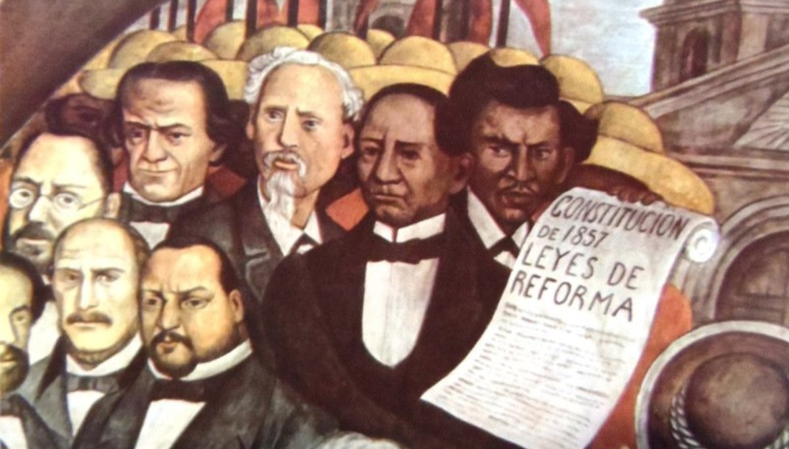
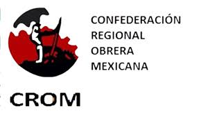
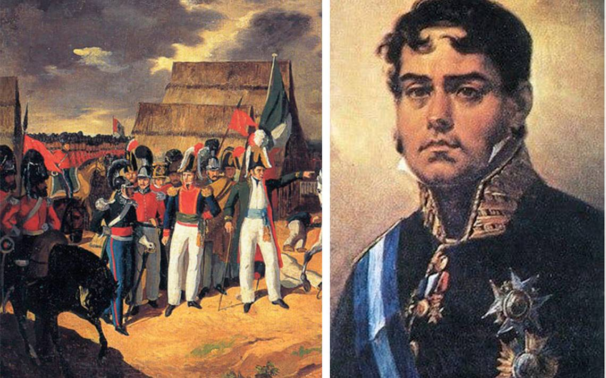
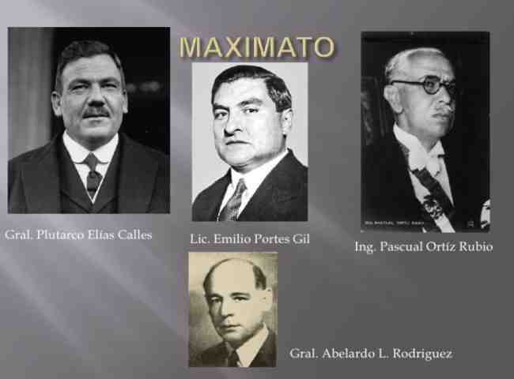

1. Con los gobiernos surgidos de la revolucion de Ayutla se establecieron principios.

R: Liberales en el gobierno 

> **Con los gobiernos surgidos de la Revolución de Ayutla se establecieron principios**:
>
> Los gobiernos surgidos de la **Revolución de Ayutla** (1854-1855) en México marcaron el inicio de una serie de reformas liberales que sentaron las bases para el establecimiento de un Estado moderno. Entre los principales principios establecidos se encuentran:
>
> - **Separación Iglesia-Estado**: Se impulsaron leyes para limitar el poder de la Iglesia en asuntos políticos y económicos.
> - **Supremacía del poder civil**: Se buscó fortalecer al gobierno civil por encima del poder militar.
> - **Promoción de derechos y libertades**: Los gobiernos liberales defendieron la libertad de expresión, la igualdad ante la ley y la propiedad privada.
>
> Estos principios fueron plasmados en la **Constitución de 1857**, que estableció un marco legal más liberal y democrático en el país.

--- 

2. El proyecto economico, politico y social del pais propuesto por los liberales quedo expresado en: 

R: La constitucion de 1857 

> El proyecto de los liberales quedó plasmado en la **Constitución de 1857** y en las **Leyes de Reforma**. Estas legislaciones reflejaron los principios de la **Revolución de Ayutla** y establecieron un marco de reformas para modernizar el país.
> 
> 
>
> - **Constitución de 1857**: Promovió la igualdad ante la ley, los derechos individuales y la separación de poderes.
> - **Leyes de Reforma**: Incluyeron disposiciones para limitar el poder de la Iglesia, promover la propiedad privada y secularizar los bienes eclesiásticos.
>
> En conjunto, estas reformas liberales buscaban consolidar un Estado laico, fortalecer el gobierno civil y promover el desarrollo económico mediante un marco de libertades y derechos.

--- 
3. ¿Cuales acciones resultan congruentes con el tema de la constitucion de 1917? 

        R:     
        I. Establece un gobierno representativo, republicano y federal
        IV. Establece las garantias individuales
        V. Promueve las garantias sociales 

> **Acciones congruentes con la Constitución de 1917**:
>
> La **Constitución de 1917**, creada después de la Revolución Mexicana, incorporó varios principios que buscaban responder a las demandas sociales, económicas y políticas del pueblo mexicano. Se considera una de las constituciones más avanzadas de su época por su enfoque en los derechos sociales y la estructura del Estado. Las acciones congruentes con esta constitución incluyen:
>
> - **I. Establece un gobierno representativo, republicano y federal**:
>   La Constitución de 1917 reafirma que México es una **república federal**, con tres poderes (Ejecutivo, Legislativo y Judicial), y un gobierno representativo donde la soberanía reside en el pueblo.
>
> - **IV. Establece las garantías individuales**:
>   La Constitución asegura el respeto a los **derechos humanos** de los ciudadanos, incluyendo la libertad de expresión, el derecho a la educación y la protección contra la opresión.
>
> - **V. Promueve las garantías sociales**:
>   Se reconocen derechos fundamentales para los trabajadores, como la jornada laboral de 8 horas, el salario mínimo, el derecho a huelga, y el derecho a la educación gratuita, buscando promover un equilibrio social y económico.
>
> En conjunto, estas acciones reflejan los ideales de justicia social y democracia que los revolucionarios buscaban implementar para mejorar las condiciones de vida y garantizar la equidad en el país.

--- 
4. ¿De que manera sivio la CROM a los gobiernos revolucionarios? 

R: Para manipular a los obreros

> **CROM (Confederación Regional Obrera Mexicana)**:
>
> La **CROM** es la **Confederación Regional Obrera Mexicana**, una organización sindical fundada en **1918** durante el gobierno de Venustiano Carranza. Su objetivo principal era defender los derechos de los trabajadores y promover mejoras laborales. 
>
> 
> - La CROM fue una de las primeras organizaciones sindicales en México que tuvo una influencia significativa en la política laboral y social del país.
> - Durante las décadas de 1920 y 1930, tuvo un fuerte vínculo con el gobierno, lo que le permitió consolidarse como un actor clave en la política nacional.
> - A lo largo de su historia, la CROM luchó por mejoras en las condiciones laborales, como el establecimiento de la jornada de 8 horas y la regulación del trabajo infantil.
>
> Sin embargo, su cercanía con el gobierno también generó críticas, ya que en ocasiones se consideraba que actuaba en beneficio de los intereses políticos más que en los de los trabajadores.
>
> Vicente Lombardo Toledano, un disidente de la CROM, organizó a una facción llamada "Purificada CROM" que dejó la Federación en 1932, dejando la CROM para representar solo pocos sindicatos en la industria textil. Al poco tiempo, la Purificada CROM se convirtió en la Confederación de Trabajadores de México (CTM) en 1936, aliándose con el presidente Lázaro Cárdenas y el gobernante Partido de la Revolución Mexicana. En los años siguientes, la CTM había eclipsado la CROM. 

--- 
5. Causas externas de la independencia de la Nueva España 

R: La independencia de las trece colinias inglesas de norteamerica y las ideas de la ilustracion 

> Las causas externas de la independencia de la Nueva España estuvieron influenciadas por eventos y cambios políticos que ocurrieron fuera del territorio novohispano y que motivaron a los criollos y otras clases sociales a buscar la independencia. Entre las principales se encuentran:
>
> - **Ilustración**:
>   Las ideas ilustradas, como la libertad, la igualdad y la soberanía del pueblo, influyeron en la mentalidad de los criollos y las élites educadas de la Nueva España.
>
> - **Independencia de Estados Unidos (1776)**:
>   El éxito de las Trece Colonias al independizarse de Gran Bretaña sirvió de inspiración para las colonias americanas, demostrando que era posible romper con la metrópoli.
>
> - **Revolución Francesa (1789)**:
>   La Revolución Francesa promovió los principios de libertad, igualdad y fraternidad, y puso fin a la monarquía absolutista, sirviendo como ejemplo para los movimientos independentistas en América.
>
> - **Invasión de Napoleón a España (1808)**:
>   La ocupación de España por Napoleón Bonaparte y la abdicación de Fernando VII generaron un vacío de poder que debilitó la autoridad española en sus colonias, creando un contexto propicio para los levantamientos independentistas.
>
> Estos factores externos se combinaron con las causas internas (desigualdad social, abusos de poder, y descontento criollo), desencadenando el proceso de independencia de la Nueva España.

--- 
6. Una de las causas internas de la independencia de la nueva españa fue que los:     

R: Criollos sufrian una gran relegacion y subestimacion 

> Una de las principales causas internas de la independencia de la Nueva España fue el **descontento de los criollos** (descendientes de españoles nacidos en América) debido a la falta de oportunidades y el trato desigual en comparación con los peninsulares (españoles nacidos en la península ibérica).
>
> - **Desigualdad social**: Los criollos eran excluidos de los cargos altos en la administración y el clero, a pesar de tener riqueza e influencia local.
> - **Descontento de las clases bajas**: Indígenas, mestizos y castas también sufrían explotación y discriminación, lo que generaba un profundo malestar social.
> - **Abusos económicos**: Las reformas borbónicas incrementaron los impuestos y limitaron el comercio local, afectando a muchos sectores económicos.
>
> Este descontento de los criollos, sumado a la desigualdad y la explotación de las clases bajas, contribuyó a un clima de resentimiento que fue clave para el inicio del movimiento independentista.

--- 
7. Despues de la independencia de la nueva españa _____ interto retomar el control del pais con la invacion de ____ 

R: España - barradas

> Después de la independencia de México en **1821**, España no reconoció la independencia de su excolonia y buscó recuperar el control sobre el territorio. En **1829**, se llevó a cabo un intento de reconquista conocido como la **"Invasión de Barradas"**, liderada por el general **Isidro Barradas**.
> 
>
> - **Contexto**: La joven nación mexicana enfrentaba dificultades políticas y económicas, lo que llevó a España a creer que podía restaurar su dominio. A esto se sumaba la presión de los grupos realistas que todavía simpatizaban con la corona española.
>
> - **La invasión**: En julio de 1829, Isidro Barradas desembarcó en la costa de Tamaulipas, al noreste de México, con un contingente de aproximadamente 3,000 soldados españoles. Sin embargo, fueron rápidamente enfrentados por las fuerzas mexicanas dirigidas por el general **Antonio López de Santa Anna** y el general **Manuel de Mier y Terán**.
>
> - **Resultado**: La invasión fracasó debido a la resistencia mexicana y a las enfermedades que afectaron a las tropas españolas. En septiembre de 1829, Barradas se rindió, y la victoria reafirmó la independencia de México.
>
> - **Impacto**: Esta derrota marcó el último intento serio de España por recuperar su antigua colonia y consolidó la soberanía de México como nación independiente.

--- 
8. Filosofia politica que sustento al gobierno de Porfirio Diaz: 

R: Positivismo 

> El **positivismo** fue una corriente filosófica y política que influyó profundamente en el gobierno de **Porfirio Díaz** (1876-1911) en México. Basada en las ideas de **Auguste Comte**, esta doctrina promueve el uso del método científico y la razón para organizar la sociedad y el Estado.
>
> Para Díaz, el positivismo se convirtió en la base ideológica para justificar su régimen autoritario y el proceso de modernización del país. A través de la frase "orden y progreso", se buscó:
>
> - **Estabilidad política**: El gobierno debía asegurar el orden y la paz social, a menudo a través de un control férreo y la represión de opositores.
> - **Desarrollo económico**: Implementar políticas que promovieran la inversión extranjera, el crecimiento de la infraestructura (ferrocarriles, comunicaciones) y la expansión industrial.
> - **Educación y progreso**: Se creía que el progreso del país dependía de una élite ilustrada capaz de gobernar con base en el conocimiento científico y racional, despreciando las tradiciones y creencias populares.
>
> Esta filosofía fue aplicada en gran medida por el grupo de **"Los Científicos"**, un grupo de asesores e intelectuales cercanos a Díaz que apoyaban estas ideas. Aunque el positivismo trajo crecimiento económico y modernización, también generó una profunda desigualdad y descontento social, lo que finalmente contribuyó a la caída del régimen porfirista y al estallido de la **Revolución Mexicana** en 1910.

--- 
9. Pais cuya cultura tuvo gran influencia en el Porfiriato 

R: Francia 

> Durante el Porfiriato, **Francia** fue el país que más influyó en la cultura, el arte y la arquitectura de México. Porfirio Díaz admiraba profundamente el estilo de vida francés y trató de imitarlo en su gobierno, lo que se reflejó en varias áreas:
>
> - **Moda y costumbres**: Las élites adoptaron las costumbres, modas y comportamientos de la alta sociedad francesa. Los eventos sociales, la vestimenta y el gusto por la gastronomía eran copias directas del estilo parisino.
> - **Arte y arquitectura**: La arquitectura de la Ciudad de México fue transformada para parecerse a París, con la construcción de edificios como el **Palacio de Bellas Artes** y el **Hemiciclo a Juárez**. Se promovieron el estilo **Beaux-Arts** y el **art nouveau**.
> - **Cultura e idioma**: El francés se convirtió en un idioma prestigioso entre las clases altas, y las ideas artísticas y filosóficas francesas eran estudiadas y promovidas en círculos intelectuales.
>
> Esta influencia francesa fue parte del esfuerzo de Díaz por proyectar a México como un país moderno y sofisticado, en línea con las grandes potencias europeas de la época.

--- 
10. Al periodo de 1928 a 1934, en el que Plutarco Elias Calles controló a la politica mexicana y manipulo a los presidentes en turno se le denomino. 

R: Maximato 

> A este periodo se le denomina el **"Maximato"**. Fue una etapa de la política mexicana en la cual Plutarco Elías Calles, conocido como el **"Jefe Máximo de la Revolución"**, ejerció un fuerte control político y manipulación sobre los presidentes en turno, sin ocupar formalmente la presidencia.
>
> - **Contexto**: El Maximato comenzó tras el asesinato de **Álvaro Obregón** en 1928, cuando Calles decidió no asumir la presidencia nuevamente, pero mantuvo su influencia sobre el gobierno.
> - **Presidentes títeres**: Durante este tiempo, los presidentes en funciones (Emilio Portes Gil, Pascual Ortiz Rubio y Abelardo L. Rodríguez) gobernaron bajo la influencia directa de Calles, quien tomaba las decisiones más importantes.
> 
> - **Fin del Maximato**: El Maximato terminó en 1934 con la llegada al poder de **Lázaro Cárdenas**, quien, al consolidarse en el poder, rompió con Calles y lo exilió en 1936.
>
> El Maximato fue una etapa de estabilidad relativa, pero también de control autoritario y falta de autonomía presidencial.
