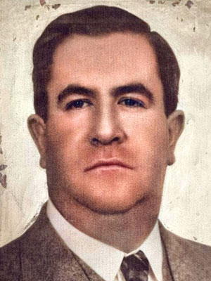
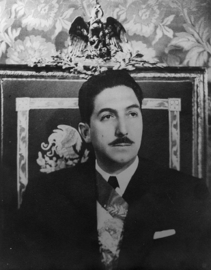
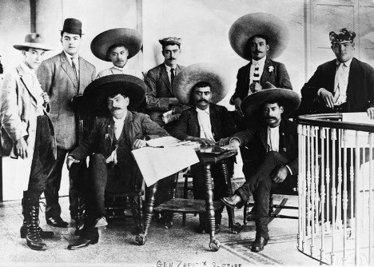
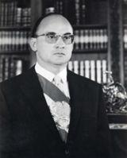
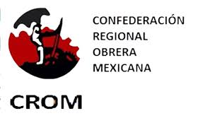
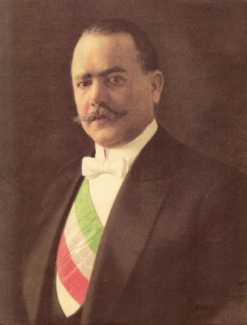
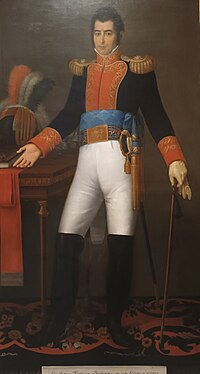

1. Realizacion del gobierno del gerenal Manuel Avila Camacho

R: Declara la guerra a las pontencias del eje, politica de unidad nacional y familia,  y el asesinato de Leon Trotsky

> #### Realización del gobierno de Manuel Ávila Camacho:
> - **Declara la guerra a las potencias del Eje**: Sí, durante la Segunda Guerra Mundial, Ávila Camacho declaró la guerra a las potencias del Eje (Alemania, Italia y Japón) en 1942.
> - **Política de unidad nacional y familiar**: Su gobierno promovió la política de unidad nacional, enfatizando valores familiares y la moral. Sin embargo, este aspecto podría ser más matizado en términos de su implementación.
> - **Asesinato de León Trotsky**: No se puede atribuir a su gobierno la responsabilidad directa del asesinato de Trotsky, que ocurrió en 1940 en México, ya que fue llevado a cabo por un agente estalinista. Sin embargo, la presencia de Trotsky en México y las tensiones políticas de la época son contextos relevantes.
>
> 
>
> **Manuel Ávila Camacho (1897-1970)** fue un político y militar mexicano que se desempeñó como presidente de México desde 1940 hasta 1946.
> 
> ### Biografía:
> - **Nacimiento**: Nació el 29 de abril de 1897 en la ciudad de Puebla, México.
> - **Carrera militar**: Participó en la Revolución Mexicana y ocupó diversos cargos en el ejército.
> - **Presidencia**: Asumió la presidencia tras ganar las elecciones de 1940, sucediendo a Lázaro Cárdenas. Su gobierno se centró en la estabilidad política y la unidad nacional.
> - **Segunda Guerra Mundial**: Durante su mandato, México declaró la guerra a las potencias del Eje en 1942 y participó en el esfuerzo bélico mediante la contribución de tropas y recursos.
> - **Política interna**: Implementó una política de unidad nacional que buscaba integrar a diferentes sectores de la sociedad y promover valores familiares.
> - **Fin de su mandato**: Ávila Camacho no buscó la reelección y fue sucedido por Manuel Pérez Treviño en 1946.
> - **Fallecimiento**: Murió el 13 de julio de 1970 en la Ciudad de México.
> 
---
2. Realizacion del gobierno del presidente Miguel Alemán Valdes

R: Inauguracion de C.U. y la industrializacion

> #### Realizaciones del gobierno de Miguel Alemán Valdés (1946-1952):
> - **Inauguración de la Ciudad Universitaria (C.U.)**: Se inauguró el 20 de marzo de 1952, sirviendo como sede principal de la Universidad Nacional Autónoma de México (UNAM) y simbolizando un impulso a la educación superior en el país.
> - **Industrialización**: Su gobierno impulsó la industrialización de México, promoviendo la modernización de la economía y el desarrollo de la infraestructura industrial. Se implementaron políticas para fomentar la inversión privada y extranjera, lo que contribuyó al crecimiento económico del país en ese período.
>
>
>
> **Miguel Alemán Valdés (1909-1983)** fue un político y abogado mexicano que se desempeñó como presidente de México desde 1946 hasta 1952.
> 
> ### Biografía:
> - **Nacimiento**: Nació el 29 de septiembre de 1909 en la Ciudad de Veracruz, México.
> - **Formación**: Estudió derecho en la Universidad Nacional Autónoma de México (UNAM) y se destacó como abogado y político.
> - **Carrera política**: Antes de su presidencia, ocupó varios cargos, incluyendo el de gobernador del Estado de Veracruz (1940-1944) y secretario de Gobernación (1944-1946).
> - **Presidencia**: Asumió la presidencia el 1 de diciembre de 1946, sucediendo a Manuel Ávila Camacho. Su administración se centró en la modernización y la industrialización del país.
> - **Logros**: 
>   - Inauguró la Ciudad Universitaria de la UNAM en 1952.
>   - Promovió un programa de industrialización que impulsó el crecimiento económico y el desarrollo de la clase media.
> - **Postpresidencia**: Tras dejar la presidencia, continuó participando en la vida política y empresarial de México. Fue nombrado embajador de México en los Estados Unidos en 1958.
> - **Fallecimiento**: Murió el 14 de mayo de 1983 en la Ciudad de México.

---
3. Objetivo del plan de Ayala  

R: Devolucion de tierras a sus antiguos dueños 

> 
> El **Plan de Ayala** fue un documento fundamental en la historia de la Revolución Mexicana, promulgado por Emiliano Zapata el 28 de noviembre de 1911. Este plan surge en un contexto de insatisfacción con las promesas no cumplidas del gobierno de Francisco I. Madero, quien había prometido reformas agrarias significativas pero no logró implementarlas de manera efectiva.
> 
> 
>
> ### Objetivos del Plan de Ayala:
> - **Devolución de tierras a sus antiguos dueños**: Uno de los principales objetivos del Plan de Ayala era la devolución de tierras a los campesinos y pueblos indígenas que habían sido despojados de sus terrenos durante el régimen porfirista y la Revolución. Zapata y sus seguidores consideraban que la tierra debía ser para quienes la trabajaban, y por ello, buscaban regresar las tierras a sus legítimos dueños.
> - **Reforma agraria**: El plan exigía una reforma agraria profunda que incluyera la expropiación de tierras de los grandes terratenientes y su redistribución entre los campesinos. Esto tenía como fin garantizar que los trabajadores agrarios pudieran tener acceso a la tierra y mejorar sus condiciones de vida.
> - **Establecimiento de un gobierno popular**: Además de las demandas agrarias, el Plan de Ayala abogaba por un cambio en la estructura política, buscando la instauración de un gobierno que representara verdaderamente los intereses del pueblo y que garantizara sus derechos.
> - **Eliminación del régimen de haciendas**: Zapata y sus seguidores denunciaron el sistema de haciendas que había perpetuado la explotación de los campesinos. El plan proponía la abolición de este sistema y la creación de formas de propiedad agraria más justas.
> 
> ### Importancia:
> El Plan de Ayala es considerado uno de los documentos más emblemáticos de la Revolución Mexicana y refleja las demandas de una gran parte de la población rural que había sido marginada. Su legado perdura en las luchas por la reforma agraria y los derechos agrarios en México.

---

4. Que grupos apoyaron a Porfirio Diaz en su 1ra Etapa: 

R: Los antiguos liberales y militares

> La primera etapa del gobierno de Porfirio Díaz se puede dividir en dos periodos: el primero de 1876 a 1880, y el segundo de 1884 a 1911. 
> - Díaz llegó al poder tras un golpe de estado contra el presidente Juan Nepomuceno Almonte en 1876, lo que marcó el inicio de su régimen.
> - En 1884, Díaz fue elegido presidente y comenzó un largo periodo de gobernabilidad que se extendió hasta 1911.
>
>Grupos que apoyaron a Porfirio Díaz en su primera etapa:
>
> - **Antiguos liberales**: Muchos liberales que habían luchado contra el Imperio de Maximiliano y en la Reforma apoyaron a Díaz, confiando en que su gobierno garantizaría la estabilidad política y el desarrollo económico del país. Estos liberales, que deseaban un gobierno que promoviera el progreso y la modernización, encontraron en Díaz un líder fuerte que podía ofrecerlo.
> - **Militares**: El apoyo de los militares fue crucial para Díaz, especialmente en su ascenso al poder. Durante su primera etapa, Díaz contaba con el respaldo de diversos grupos militares que habían sido parte de la Revolución de Ayutla y de la lucha contra el Imperio. Su experiencia y lealtad fueron fundamentales para consolidar el régimen porfirista.
> 
> - Durante su gobierno, Díaz promovió la modernización y la inversión extranjera, aunque su régimen también fue caracterizado por la represión política y la falta de libertades democráticas, lo que eventualmente conduciría a la Revolución Mexicana.

---
5. Cual fue la obra educativa sobresaliente del porfiriato? 

R: La universidad Nacional

La Universidad Nacional de México (UNM) fue una iniciativa del gobierno de Porfirio Díaz para modernizar al país, nacionalizar la ciencia, mexicanizar y democratizar el saber ante la evidente crisis.

---
6. Como se llama a la etapa economica que comprende desde el gobierno de la Madrid hasta Salinas de Gortari?

R: Neoliberalismo

> **Neoliberalismo**: Es una corriente económica y política que promueve la reducción del papel del Estado en la economía, favoreciendo la libre competencia y el mercado como regulador.
>
**Principales Características**:
>   - **Privatización**: Venta de empresas estatales al sector privado.
>   - **Desregulación**: Reducción de las regulaciones gubernamentales sobre la economía y los negocios.
>   - **Apertura Comercial**: Eliminación de aranceles y barreras comerciales para facilitar el comercio internacional.
>   - **Fomento a la Inversión Extranjera**: Atractivo para inversiones de empresas de otros países.
>   - **Reducción del Gasto Público**: Disminución en el gasto del gobierno en servicios sociales, salud y educación.
>
> ### Neoliberalismo en México:
> 
> - **Gobierno de Miguel de la Madrid (1982-1988)**: Comenzó un proceso de apertura económica y reformas estructurales. Su administración enfrentó una crisis económica severa, lo que llevó a la implementación de políticas de ajuste y reestructuración económica.
> - **Gobierno de Carlos Salinas de Gortari (1988-1994)**: Profundizó las reformas neoliberales, impulsando la liberalización de la economía, la privatización de empresas estatales, la apertura comercial y la firma del Tratado de Libre Comercio de América del Norte (TLCAN).
>
> ### Características del Neoliberalismo en México: 
>
> - **Privatización**: Se privatizaron numerosas empresas estatales, incluyendo Teléfonos de México (Telmex) y bancos.
> - **Liberalización económica**: Se redujeron las barreras arancelarias y se promovieron las inversiones extranjeras.
> - **Reformas laborales y sociales**: Se implementaron cambios en la legislación laboral, buscando flexibilizar el mercado laboral.
> - **Crecimiento económico**: Durante esta etapa, México experimentó un crecimiento económico sostenido, aunque también se acentuaron las desigualdades sociales y regionales.

---
7. Caracteristicas del desarrollo compartido 

R: El estado interviene en la economia

> - **Desarrollo Compartido**: Esta fue una estrategia económica implementada en México durante la presidencia de Luis Echeverría (1970-1976) y se caracterizó por la intervención activa del Estado en la economía para promover el crecimiento económico y la justicia social.
> 
> ### Características del Desarrollo Compartido:
> - **Intervención del Estado**: El Estado juega un papel fundamental en la regulación y promoción de la economía, buscando reducir desigualdades y mejorar la distribución del ingreso.
> - **Políticas Sociales**: Se implementaron políticas para mejorar el bienestar de los sectores más pobres, incluyendo educación, salud y vivienda.
> - **Industrialización**: Se promovió la industrialización a través de la inversión pública y el apoyo a las pequeñas y medianas empresas.
> - **Desarrollo Regional**: Se buscaron mecanismos para equilibrar el desarrollo económico entre las diferentes regiones del país, prestando atención a las zonas más desfavorecidas.
>
>
>
> **Luis Echeverría**:
> 
> - **Nacimiento**: Nació el 17 de enero de 1922 en la Ciudad de México.
> 
> - **Carrera Política**: Echeverría fue un político y abogado mexicano que se desempeñó como presidente de México desde 1970 hasta 1976.
> 
> - **Cargos Anteriores**: Antes de ser presidente, ocupó varios cargos importantes, incluyendo:
>   - **Secretario de Gobernación** (1964-1969): En este cargo, fue responsable de las relaciones políticas internas y de la seguridad nacional.
>   - **Vicepresidente** (1969): Se convirtió en el primer Vicepresidente en la historia moderna de México.
> 
> - **Presidencia**: Durante su mandato, implementó la política del **desarrollo compartido**, que buscaba promover la justicia social y reducir las desigualdades económicas. Sin embargo, su gobierno también fue criticado por su autoritarismo y por la represión de la oposición.
> 
> - **Eventos Significativos**:
>   - **Matanza de Tlatelolco**: Se le atribuye la represión violenta de los estudiantes que protestaban en 1968, lo que resultó en una masacre que dejó un número indeterminado de muertos.
>   - **Crisis Económica**: Su administración enfrentó problemas económicos, como la inflación y el aumento del desempleo, que llevaron a una crisis en la economía mexicana.
> 
> - **Vida Posterior**: Después de dejar la presidencia, Echeverría se retiró de la vida política activa, aunque mantuvo un perfil público y fue objeto de controversia y críticas por su legado.
> 
> - **Fallecimiento**: Luis Echeverría falleció el 8 de diciembre de 2022.

---
8. Con que plan, el general Porfirio Diaz desconoce la releccion de Lerdo de Tejada?

R: Tuxtepec

> El Plan de Tuxtepec fue promulgado el 10 de enero de 1876 por Porfirio Díaz en Tuxtepec, Oaxaca.
>   - Este plan surgió en respuesta a la reelección de **José María Lerdo de Tejada** como presidente de México, la cual Díaz consideraba ilegal y contraria a los principios de la democracia.
> 
> - **Objetivos del Plan**:
>   - Desconocer la reelección de Lerdo de Tejada.
>   - Promover el restablecimiento del orden constitucional.
>   - Llamar a la revocación de la reelección y a nuevas elecciones.
> 
> - **Consecuencias**:
>   - El Plan de Tuxtepec condujo a una serie de conflictos armados que finalmente resultaron en el derrocamiento de Lerdo de Tejada.
>   - Porfirio Díaz asumió la presidencia, lo que marcó el inicio de un largo periodo de gobierno que se conocería como el porfiriato.

---
9. Que sector apoyo al gobierno de Albaro Obregon?    

R: La confederacion regional obrera mexicana

> ### Aclaración:
> - **Álvaro Obregón** fue presidente de México de 1920 a 1924 y nuevamente de 1924 a 1928. Durante su gobierno, recibió el apoyo de diversos sectores sociales, incluyendo el movimiento obrero.
> - **Confederación Regional Obrera Mexicana (CROM)**: Esta organización se fundó en 1918 y buscaba representar los intereses de los trabajadores. Bajo el liderazgo de **Luis N. Morones**, la CROM se alineó con el gobierno de Obregón, lo que le permitió ganar poder y legitimidad.
>
> 
> 
> - **Relación entre la CROM y Obregón**: Aunque la CROM apoyó a Obregón, su relación fue compleja y a veces tensa, ya que los líderes obreros buscaban mejores condiciones laborales y derechos para los trabajadores, lo que no siempre era compatible con las políticas del gobierno.
> 
> ### Contexto:
> - Obregón impulsó diversas reformas sociales y laborales, pero también enfrentó críticas por su autoritarismo y la represión de movimientos sociales.
>
> 
>
> **Álvaro Obregón**:
> 
> - **Nacimiento**: Nació el 19 de febrero de 1880 en Sonora, México.
> 
> - **Carrera Militar**: Obregón fue un destacado general durante la Revolución Mexicana, participando en numerosas batallas y desempeñando un papel crucial en la lucha contra el régimen de Victoriano Huerta.
> 
> - **Presidencia**:
>   - Obregón se convirtió en presidente de México en dos ocasiones: de 1920 a 1924 y de 1924 a 1928.
>   - Su gobierno se caracterizó por la búsqueda de la estabilidad política y la implementación de reformas agrarias y educativas. 
> 
> - **Reformas**:
>   - Impulsó reformas agrarias que buscaban distribuir tierras entre campesinos y mejorar las condiciones de vida de los trabajadores.
>   - Promovió la educación laica y gratuita, fortaleciendo la infraestructura educativa del país.
> 
> - **Relación con el Movimiento Obrero**: Recibió el apoyo de sectores obreros, especialmente de la Confederación Regional Obrera Mexicana (CROM), aunque su relación con ellos era compleja.
> 
> - **Asesinato**: Obregón fue asesinado el 17 de julio de 1928 en un atentado en un restaurante de la Ciudad de México, lo que puso fin a su vida y su influencia en la política mexicana.
> 
> - **Legado**: Su presidencia dejó una marca importante en la historia de México, tanto por sus esfuerzos de modernización como por los desafíos que enfrentó en su gobierno.

---

10. Que presidente comienza a gobernar despues de la constitucion de 1824? 

R: Guadalupe Victoria   

> 
>
> **Guadalupe Victoria**:
> 
> - **Nacimiento**: Nació el 29 de septiembre de 1786 en Veracruz, México.
> 
> - **Carrera Militar**: Participó activamente en la Guerra de Independencia de México y se convirtió en un destacado líder militar. Su nombre real era **José María de Guadalupe Victoria y Anaya**.
> 
> - **Presidencia**:
>   - Asumió la presidencia de México el 10 de octubre de 1825 y ocupó el cargo hasta el 31 de marzo de 1829.
>   - Fue el segundo presidente de México después de la independencia y el primero en gobernar bajo la Constitución de 1824.
> 
> - **Logros**:
>   - Su gobierno se enfocó en estabilizar el país después de la guerra y promover el desarrollo económico y la educación.
>   - Implementó reformas que buscaban fortalecer el sistema federal y la administración pública.
> 
> - **Conflictos**: Su mandato estuvo marcado por la inestabilidad política y la oposición de diferentes facciones, lo que dificultó su gobierno.
> 
> - **Retiro**: Después de dejar la presidencia, Victoria se retiró de la vida política y se dedicó a la agricultura y a sus negocios privados.
> 
> - **Fallecimiento**: Guadalupe Victoria falleció el 21 de marzo de 1843 en la ciudad de Veracruz.

---
