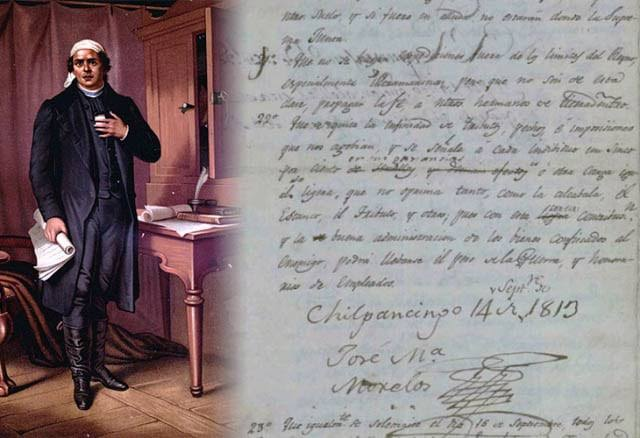
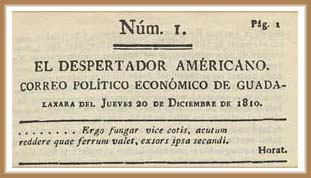
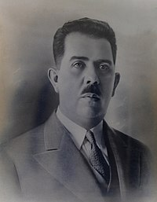

1. Cual era la finalidad de "Sentimientos de la nacion"

R: La division de poderes y el sentir de la sociedad

> 
>
> - **"Sentimientos de la Nación"**: Es un documento redactado por **José María Morelos y Pavón** en 1813, durante la Guerra de Independencia de México.
> - **Finalidad**:
>   - **División de Poderes**: Uno de los objetivos principales del documento era establecer la separación de poderes en el gobierno para evitar abusos y asegurar una administración más justa.
>   - **Reflejo de la Sociedad**: También buscaba plasmar las aspiraciones y necesidades del pueblo mexicano, reflejando el sentimiento de la sociedad en ese momento, así como la necesidad de justicia, igualdad y derechos.
> 
> - **Contenido**: El documento proponía diversas reformas sociales y políticas, incluyendo la abolición de la esclavitud y la promoción de derechos fundamentales.

--- 
2. Periodico insurgente que encabezo el cura "Jose Maria Morelos y Pavon"

R: El Despertar Americano

> 
>
> **El Despertar Americano**: Era un período de despertar cultural, social y político en América Latina y, en particular, en México, durante las primeras décadas del siglo XIX, después de las guerras de independencia.
> 
> - **Características**:
>   - **Movimientos Independentistas**: El Despertar Americano fue impulsado por las luchas por la independencia de las colonias latinoamericanas del dominio español, promoviendo la búsqueda de identidad nacional.
>   - **Pensamiento Ilustrado**: Influenciado por las ideas de la Ilustración, promovía la educación, la igualdad, los derechos humanos y la búsqueda de un gobierno representativo.
>   - **Identidad Cultural**: Se buscaba reafirmar la identidad cultural y social de los pueblos latinoamericanos, en contraste con el colonialismo y la herencia europea.
>   - **Literatura y Artes**: Este período también vio un florecimiento en la literatura, el arte y la educación, con la creación de obras que reflejaban la realidad y las aspiraciones de los pueblos.
> 
> - **Impacto**: El Despertar Americano sentó las bases para el desarrollo de movimientos nacionales y republicanos en América Latina, y fomentó un sentido de unidad y pertenencia en la región.

---
3. Con que plan se desconoce al imperio de Iturbe en 1823? 

R: Casa Mata 

> El Plan de Casa Mata fue promulgado el 1 de diciembre de 1822 por un grupo de opositores al imperio de **Agustín de Iturbide**, quien había declarado el Imperio Mexicano tras la independencia de México.
> 
> - **Objetivos del Plan**:
>   - Desconocer el imperio de Iturbide y promover el restablecimiento de un gobierno republicano.
>   - Convocar a la elección de un Congreso que se encargara de establecer un nuevo marco constitucional para el país.
> 
> - **Consecuencias**:
>   - El Plan de Casa Mata fue exitoso y contribuyó al derrocamiento de Iturbide, quien abdicó el 19 de marzo de 1823.
>   - Esto dio paso a la creación de la República Mexicana y al establecimiento de la primera constitución federal en 1824.

--
4. Ordena cronologicamente los acontesimientos de la revolucion mexicana: 

        I. Decena Tragica
        II. Sucesion Presidencial 1910
        III. Toma de ciudad Juarez
        IV. Constitucion de 1917
        V. Convenio de Aguas Calientes

R: II, III, I, V, IV

> **Orden Cronológico de la Revolución Mexicana**:
> 
> 1. **Sucesión Presidencial 1910**:
>    - **Contexto**: Este evento fue el detonante de la Revolución Mexicana. La sucesión presidencial se centró en la candidatura de Francisco I. Madero, quien se opuso a la reelección de Porfirio Díaz. Madero promovió un cambio político y social, lo que llevó a la formación de un movimiento revolucionario.
> 
> 2. **Toma de Ciudad Juárez**:
>    - **Contexto**: La Toma de Ciudad Juárez ocurrió del 8 al 10 de mayo de 1911. Fue una victoria significativa para las fuerzas revolucionarias lideradas por Francisco Villa y Madero, y marcó el inicio de la derrota del régimen de Porfirio Díaz.
> 
> 3. **Decena Trágica**:
>    - **Contexto**: Este fue un periodo de violencia en la Ciudad de México entre el 9 y el 19 de febrero de 1913, cuando un grupo de militares, con el apoyo de Victoriano Huerta, se rebeló contra el gobierno de Francisco I. Madero. Este evento culminó con el derrocamiento y asesinato de Madero, lo que generó un nuevo ciclo de lucha en la Revolución.
> 
> 4. **Convenio de Aguas Calientes**:
>    - **Contexto**: Firmado en octubre de 1914, este convenio fue un intento de unir a las diferentes facciones revolucionarias después de la caída de Huerta. Fue un acuerdo entre los líderes revolucionarios, incluyendo a Carranza, Villa y Zapata, para establecer un gobierno provisional y llevar a cabo reformas sociales.
> 
> 5. **Constitución de 1917**:
>    - **Contexto**: Promulgada el 5 de febrero de 1917, esta constitución es uno de los logros más importantes de la Revolución Mexicana. Introdujo reformas sociales y políticas, incluyendo la reforma agraria, derechos laborales y la nacionalización de recursos naturales, y sentó las bases para el México moderno.

---
5. Durante la etapa conocida como "Republica Restaurada", Benito Juarez Durante su Gobierno Creara: 

R: La ENP (Escuela Nacional Preparatoria)

> **República Restaurada**:
> 
> - **Contexto Histórico**: La República Restaurada se refiere al período de la historia de México que va de 1867 a 1876, tras la victoria de las fuerzas liberales sobre el Imperio de Maximiliano de Habsburgo. Este periodo marca la consolidación del gobierno republicano y la restauración del orden constitucional después de la intervención francesa y la caída del imperio.
> 
> - **Gobierno de Benito Juárez**: Benito Juárez, un líder destacado de la lucha liberal, asumió la presidencia en 1867 y se mantuvo en el poder durante gran parte de este período. Su gobierno se caracterizó por la implementación de reformas liberales y la promoción de un Estado laico.
> 
> - **Características**:
>   - **Reformas Liberales**: Juárez promovió diversas reformas que buscaban modernizar el país, reducir el poder de la Iglesia y garantizar derechos civiles y políticos.
>   - **Estabilidad Política**: A pesar de enfrentar varios desafíos, incluido el descontento social y la oposición conservadora, Juárez trabajó para establecer un gobierno estable y funcional.
>   - **Educación y Derechos Civiles**: Se implementaron políticas de educación laica y se promovieron derechos humanos y libertades civiles, como la libertad de expresión y de culto. *La Escuela Nacional Preparatoria fue un elemento fundamental de la Ley Orgánica de la Instrucción Pública del Distrito Federal, expedida por el presidente Benito Juárez el 2 de diciembre de 1867, quien nombró como primer director al doctor Gabino Barreda.*
> 
> - **Fin del Período**: La República Restaurada concluyó con la llegada de Porfirio Díaz al poder en 1876, después de un levantamiento armado conocido como la Revolución de Tuxtepec. Díaz iniciaría un largo periodo de gobierno conocido como el Porfiriato.
> 
> - **Legado**: La República Restaurada es considerada un período clave en la historia de México, ya que sentó las bases para la formación de un estado moderno y el desarrollo de instituciones democráticas, aunque también se enfrentó a desafíos y tensiones que culminarían en la Revolución Mexicana de 1910.

---
6. Con que tratado o convenio, se vende el territorio de la mesilla a Estados Unidos? 

R: Gadsden

> Tratado Gadsden: Este tratado fue el resultado de la necesidad de Estados Unidos de adquirir tierras para la construcción de una línea de ferrocarril que conectara el sur de Estados Unidos con la costa del Pacífico.
> 
>   - México vendió a Estados Unidos aproximadamente 29,670 kilómetros cuadrados de territorio, que actualmente forman parte del sur de Arizona y el suroeste de Nuevo México.
>   - A cambio, Estados Unidos pagó 10 millones de dólares.
> 
> - **Consecuencias**: 
>   - La venta del territorio de La Mesilla ayudó a completar la frontera entre México y Estados Unidos, pero también aumentó las tensiones entre ambos países y fue un factor en las relaciones posteriores.
>   - Este tratado es visto por muchos como una continuación de la expansión territorial de Estados Unidos a expensas de México, lo que contribuyó a la percepción de injusticia y despojo en la historia mexicana.

---
7. Principales postulados de la constitucion de apatzingan (1814)

R: Division de poderes, sufragio universal, sufragio popular y apoyo a la educacion.

> **Constitución de Apatzingán**: Fue promulgada el 22 de octubre de 1814 por el Congreso de Anáhuac, liderado por José María Morelos y Pavón, durante la Guerra de Independencia de México.
> 
> - **Principales Postulados**:
>   - **División de Poderes**: Este principio sí se incluyó, estableciendo los poderes ejecutivo, legislativo y judicial.
>   - **Sufragio**: Aunque se mencionó la idea de un sistema electoral, el concepto de "sufragio universal" y "sufragio popular" en el contexto actual no se aplicaba. La constitución proponía el sufragio para hombres mayores de 25 años que supieran leer y escribir y que no fueran delincuentes.
>   - **Educación**: Se promovió la educación como un derecho, pero el enfoque estaba más en la educación moral y cívica que en la educación técnica o universitaria.
> 
> - **Otros Postulados**: Incluía la abolición de la esclavitud, la defensa de los derechos humanos, la libertad de expresión y la propiedad.
> 
> - **Conclusión**: Si bien algunos postulados mencionados tienen fundamentos en la Constitución de Apatzingán, la descripción no es del todo precisa, especialmente en lo relacionado al sufragio universal y popular.

---
8. Cuales son las caracteristicas del gobierno de Maximiliano?

R: De tipo liberal y fue el segundo imperio 

> El gobierno de **Maximiliano de Habsburgo**, quien fue emperador de México de 1864 a 1867, se considera un **imperio** y no un gobierno completamente **liberal**. 
> - **Características del Gobierno**:
>   - **Imperio**: Fue el **Segundo Imperio Mexicano**, establecido con el apoyo de Francia.
>   - **Influencia Conservadora**: Aunque Maximiliano promovió algunas reformas liberales, su gobierno estuvo influenciado por los conservadores, y muchas de sus políticas fueron vistas como una restauración del orden conservador en contraste con las reformas liberales de Juárez.
>   - **Reformas**: Intentó implementar ciertas reformas como la promoción de la educación y el desarrollo de infraestructuras, pero su gobierno careció de un apoyo popular sólido y fue percibido como un régimen impuesto por potencias extranjeras.

---
9. A que siglas cambian respecto a PRM en la epoca de Avila Camacho?

R: PRI

>
>
> **Nombres del Partido Revolucionario Institucional (PRI)**:
> 
> 1. **Partido Nacional Revolucionario (PNR)**:
>    - **Período**: 1929-1938.
>    - **Contexto**: Fue fundado por Plutarco Elías Calles como parte de un esfuerzo por unificar a los diversos grupos revolucionarios tras la Revolución Mexicana.
> 
> 2. **Partido de la Revolución Mexicana (PRM)**:
>    - **Período**: 1938-1946.
>    - **Contexto**: Se estableció como una forma de integrar a diferentes sectores sociales (obreros, campesinos, y otros) en un solo partido, con el fin de mantener el legado de la Revolución.
> 
> 3. **Partido Revolucionario Institucional (PRI)**:
>    - **Período**: Desde 1946 hasta la actualidad.
>    - **Contexto**: Adoptó su nombre actual para reflejar su compromiso con la institucionalización del proceso político en México, manteniendo un enfoque en las reformas y el desarrollo nacional.

---
10. Porque se dice que Lazaro Cardenas es el creador del estado mexicano?

R: Por la creacion del partido de revolucion mexicana (PRM) vinculado con la politica, los militares y sector obrero 

> **Lázaro Cárdenas**:
> 
> - **Nacimiento**: Nació el 21 de mayo de 1895 en Jiquilpan, Michoacán, México.
> 
> - **Carrera Militar y Política**:
>   - Participó en la Revolución Mexicana y se unió a las fuerzas constitucionalistas. Su carrera militar le permitió ganar reconocimiento y ascendió en el ámbito político.
>   - Fue gobernador de Michoacán de 1928 a 1932, donde implementó reformas agrarias y educativas.

> - **Presidencia**:
>   - **Periodo**: Se desempeñó como presidente de México del 1 de diciembre de 1934 al 30 de noviembre de 1940.
>   - **Politica**:  El PRM fue fundado en 1938 durante el gobierno de Lázaro Cárdenas, en un momento en que se buscaba consolidar el proceso revolucionario y unificar a diversos sectores sociales en un solo partido político.
>   - **Reformas**: Durante su presidencia, impulsó reformas significativas, incluyendo la reforma agraria y la nacionalización de la industria petrolera en 1938, que fortaleció la soberanía económica de México.
>   - **Educación y Cultura**: Promovió la educación laica y la cultura mexicana, buscando elevar el nivel educativo de la población y fortalecer la identidad nacional.
>   - **Relaciones Laborales**: Apoyó a los sindicatos y promovió derechos laborales, mejorando las condiciones de vida de los trabajadores.

> - **Legado**:
>   - Es considerado uno de los presidentes más importantes de México, conocido por su compromiso con la justicia social y el desarrollo nacional.
>   - Su gobierno es visto como el establecimiento del Estado Mexicano moderno, con políticas que sentaron las bases para el México contemporáneo.
> 
> - **Fallecimiento**: Lázaro Cárdenas murió el 19 de octubre de 1970 en la Ciudad de México.

