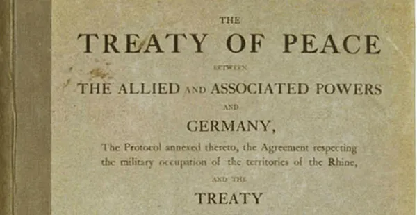
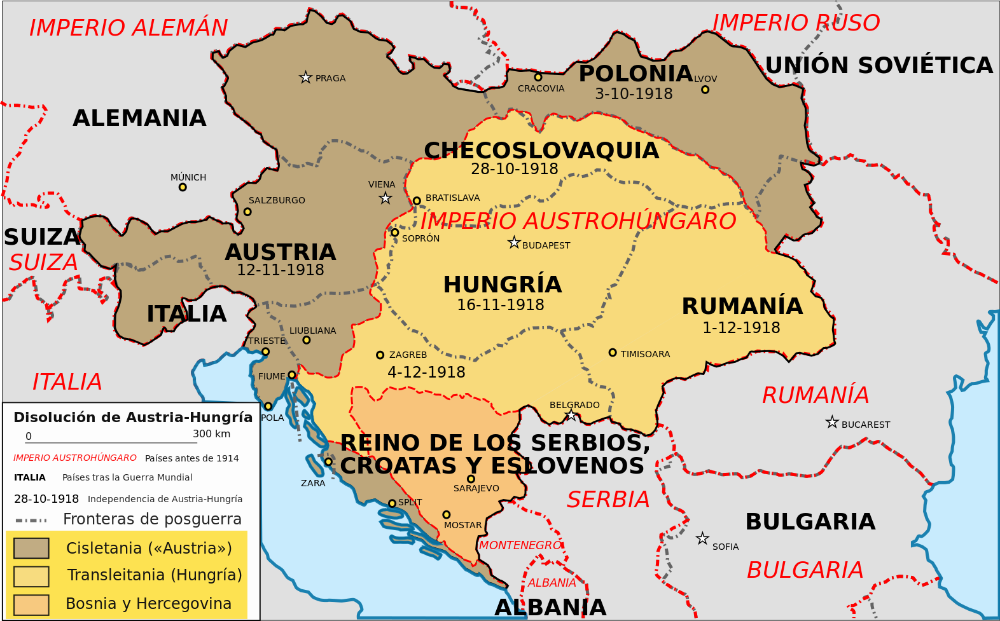
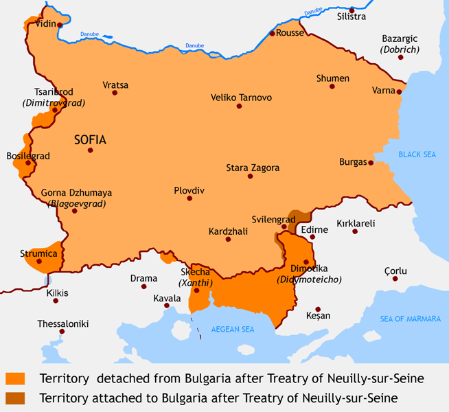
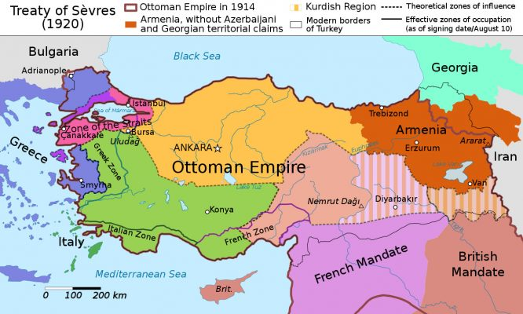
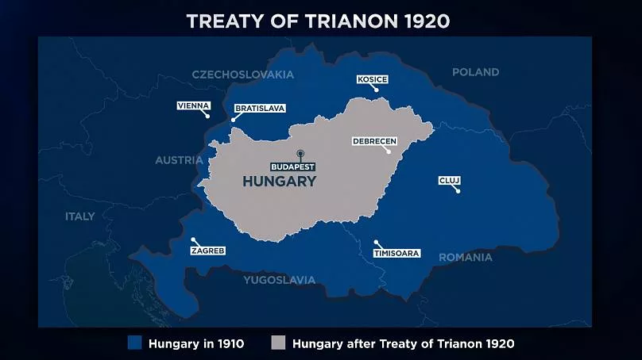
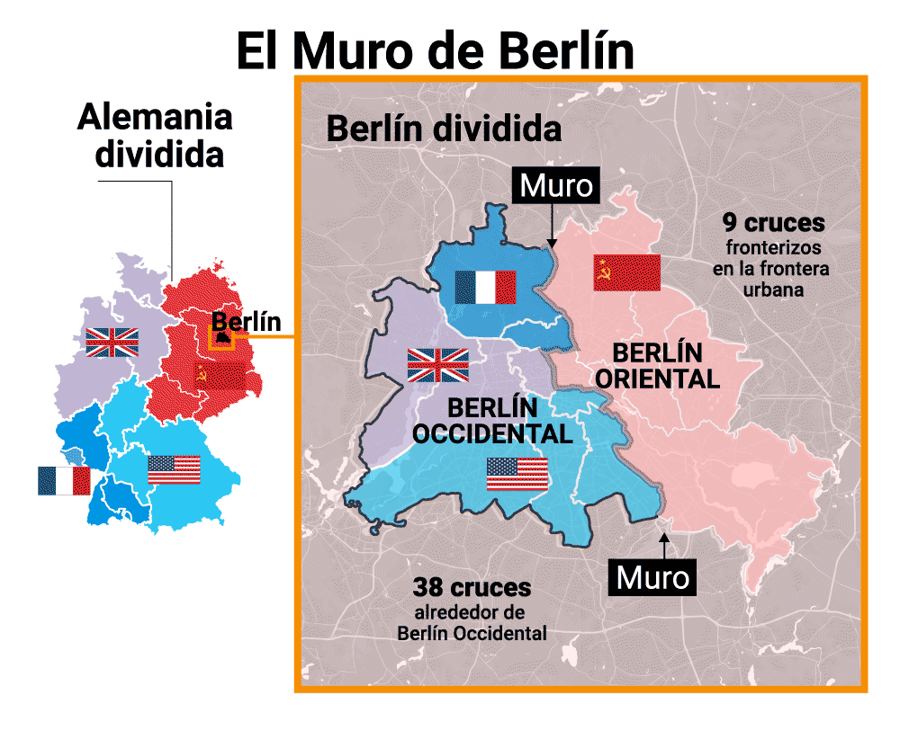

1. Durante la guerra fria el mundo se polarizo formando dos bloques. Cuales fueron sus principales logros:

R: 

Capitalistas
- La ayuda economia de los estados unidos de america a Europa   
- El establecimiento de la doctrina truman
- La creacion de la OTAN

Socialista
- La creacion del pacto de varsovia
- La creacion de un grupo de defensa contra el imperialismo de los estados unidos de america 

> - **Capitalistas (Bloque Occidental)**:
>   - **La ayuda económica de Estados Unidos a Europa**: Esto se refiere al **Plan Marshall**, un programa de ayuda económica que Estados Unidos implementó para reconstruir Europa tras la Segunda Guerra Mundial y frenar la expansión del comunismo.
>   - **Establecimiento de la Doctrina Truman**: La Doctrina Truman fue una política de contención del comunismo, en la que Estados Unidos se comprometió a apoyar a países que resistieran la influencia soviética.
>   - **Creación de la OTAN (Organización del Tratado del Atlántico Norte)**:  Fundada en 1949, la OTAN fue una alianza militar que buscaba proteger a Europa occidental de la influencia y agresión del bloque comunista.
> 
> - **Socialista (Bloque Oriental)**:
>   - **Creación del Pacto de Varsovia**: Fundado en 1955 como respuesta a la OTAN, el Pacto de Varsovia fue una alianza militar entre la Unión Soviética y los países del Este de Europa para contrarrestar el poder del bloque capitalista.
>   - **Grupo de defensa contra el imperialismo de Estados Unidos**: Aunque el término "grupo de defensa" no era formal, el Pacto de Varsovia y otros acuerdos entre países socialistas se basaban en la defensa mutua y la resistencia contra lo que consideraban "imperialismo capitalista".
> 

---
2. Elige la caracteristica que corresponde a cada uno de los siguientes compuestos: 

R:

    I. El tercer mundo:
        Deficiencia alimentaria, alto crecimiento demografico y dependencia economica.
    II. Globalizacion:
        Creacion de alianzas de libre comercio e intercambio cultural.
    III. Perestroika:
        Mejorar el nivel de vida de la poblacion, disminucion del estado en cuestion economica y promover la libre competencia de productos.

> - **I. El Tercer Mundo**:
>   - **Deficiencia alimentaria, alto crecimiento demográfico y dependencia económica**: El término "Tercer Mundo" se utilizaba para describir a los países en vías de desarrollo durante la Guerra Fría. Estas naciones se caracterizaban por bajos niveles de desarrollo económico, altos índices de pobreza y crecimiento demográfico acelerado, así como dependencia de las economías más desarrolladas.
> 
> - **II. Globalización**:
>   - **Creación de alianzas de libre comercio e intercambio cultural**: La globalización se refiere al proceso de integración económica, cultural y política a nivel mundial. Se caracteriza por la eliminación de barreras comerciales (como tratados de libre comercio) y una mayor interconexión entre culturas y sociedades.
> 
> - **III. Perestroika**:
>   - **Mejorar el nivel de vida de la población, disminución del estado en cuestión económica y promover la libre competencia de productos**: La Perestroika fue una serie de reformas económicas y políticas implementadas en la Unión Soviética por Mijaíl Gorbachov en la década de 1980, cuyo objetivo era modernizar la economía, reducir la intervención estatal y promover un mayor grado de competencia.

---
3. Relaciona cada uno de los siguientes movimientos del siglo XIX  con sus caracteristicas:

Movimientos:

    I. Ludismo.
    II. Cartismo.
    III. Cooperativismo.
    IV. Socialismo.
    V. socialismo científico.

 Características

    a. Destrucción incidental de máquinas, como respuesta a la
    pérdida de empleos.
    b. Tiene como base las sociedades mutualistas y las Trade
    Unions.
    c. Entre sus teóricos había burgueses que proponían una
    sociedad sin clases.
    d. Búsqueda de reforma política como el sufragio universal.
    e. Hace llamado a los obreros del mundo para eliminar a la
    propiedad privada.

R: I:a, II:d, III:b, IV:c, V:e

> ### Relación de movimientos y características:
> 
> - **I. Ludismo**:
>   - **a. Destrucción incidental de máquinas, como respuesta a la pérdida de empleos.**
>   - **Explicación**: El ludismo fue un movimiento de trabajadores ingleses que, durante las primeras décadas del siglo XIX, se manifestaban destruyendo maquinaria industrial que consideraban causante de su desempleo y deterioro de sus condiciones laborales.
> 
> - **II. Cartismo**:
>   - **d. Búsqueda de reforma política como el sufragio universal.**
>   - **Explicación**: El cartismo fue un movimiento político de trabajadores en Gran Bretaña durante la primera mitad del siglo XIX, que exigía reformas democráticas, como el sufragio universal masculino y la representación justa en el Parlamento.
> 
> - **III. Cooperativismo**:
>   - **b. Tiene como base las sociedades mutualistas y las Trade Unions.**
>   - **Explicación**: El cooperativismo promovía la asociación voluntaria de trabajadores para crear cooperativas de producción y consumo, buscando mejorar las condiciones laborales y asegurar el bienestar de sus miembros.
> 
> - **IV. Socialismo**:
>   - **c. Entre sus teóricos había burgueses que proponían una sociedad sin clases.**
>   - **Explicación**: El socialismo utópico (precursor del socialismo) fue propuesto por pensadores como Saint-Simon, Charles Fourier y Robert Owen, quienes eran en su mayoría burgueses que soñaban con la creación de comunidades ideales y una sociedad sin clases sociales.
> 
> - **V. Socialismo Científico**:
>   - **e. Hace llamado a los obreros del mundo para eliminar a la propiedad privada.**
>   - **Explicación**: El socialismo científico, desarrollado por Karl Marx y Friedrich Engels, planteaba la lucha de clases como motor de la historia y abogaba por la eliminación de la propiedad privada y la instauración del comunismo, donde los medios de producción fueran de propiedad común.

---
4. Caracteristica comunes a los regimenes totalitarios, Italia, Alemania y Japon.

R: Regimen de partido unico y militarista, sentimiento nacional y politica expancionista.

> - **Régimen de partido único y militarista**: 
>   - Tanto en Italia como en Alemania, el poder se concentró en un solo partido (el Partido Fascista en Italia y el Partido Nazi en Alemania). Japón, aunque mantuvo al emperador como figura central, también estaba dominado por una cúpula militarista que controlaba el gobierno.
> 
> - **Sentimiento nacional**: 
>   - Los tres países promovían un fuerte nacionalismo. En Italia, el fascismo se basaba en la idea de restaurar la gloria del Imperio Romano. En Alemania, el nazismo exaltaba la superioridad racial y el orgullo alemán. En Japón, el nacionalismo se enfocaba en la supremacía del emperador y la misión de expandir la influencia japonesa.
> 
> - **Política expansionista**: 
>   - Los tres regímenes impulsaron políticas expansionistas agresivas. Italia buscaba expandir su imperio en África, Alemania quería anexionarse territorios europeos para el Lebensraum (espacio vital), y Japón se expandió por Asia con invasiones a Manchuria y otras regiones.

---
5. Relaciona tratados con sus postulados: 

R:

    - Versalles: 
        Reduccion del ejercito aleman y eliminanacion de la fuerza aerea alemana

    - Saint German:
        Prohibicion de cualquier alianza con alemania

    - Neully
        Desarme y reduccion territorial de bulgaria

    - Sevres
        Desaparicion del imperio Otomano-Turco y firma del tratado de Lausana

    - Trianon
        Reduccion del territorio hungaro para beneficiar a rumania.

> - **Tratado de Versalles (1919)**:
>   - **Postulado**: Reducción del ejército alemán y eliminación de la fuerza aérea alemana.
>   - **Explicación**: Este tratado, firmado tras la Primera Guerra Mundial, impuso duras sanciones a Alemania. Su ejército se limitó a 100,000 soldados, se eliminó la fuerza aérea y se redujo drásticamente su capacidad militar. Además, Alemania tuvo que aceptar la responsabilidad por la guerra y pagar reparaciones.
>
> 
> 
> - **Tratado de Saint-Germain (1919)**:
>   - **Postulado**: Prohibición de cualquier alianza con Alemania.
>   - **Explicación**: Este tratado fue firmado con Austria tras la disolución del Imperio Austrohúngaro. Una de sus principales cláusulas era la prohibición de cualquier unión política entre Austria y Alemania, con el fin de evitar un resurgimiento del poder germánico en Europa Central.
> 
> 
> - **Tratado de Neuilly (1919)**:
>   - **Postulado**: Desarme y reducción territorial de Bulgaria.
>   - **Explicación**: Este tratado afectó a Bulgaria, que perdió territorio en favor de Grecia, Rumania y Yugoslavia. Además, se le impuso un límite al tamaño de su ejército y tuvo que pagar reparaciones de guerra.
>
> 
> 
> - **Tratado de Sèvres (1920)**:
>   - **Postulado**: Desaparición del Imperio Otomano-Turco y firma del Tratado de Lausana.
>   - **Explicación**: El Tratado de Sèvres desmembró el Imperio Otomano, cediendo la mayor parte de sus territorios a las potencias aliadas. Esto llevó a la creación de nuevas naciones en Medio Oriente y la reducción del territorio turco. Más tarde, el Tratado de Lausana (1923) definió las fronteras de la moderna Turquía.
>
> 
> 
> - **Tratado de Trianon (1920)**:
>   - **Postulado**: Reducción del territorio húngaro para beneficiar a Rumania.
>   - **Explicación**: El tratado se firmó con Hungría tras la disolución del Imperio Austrohúngaro. Hungría perdió más de dos tercios de su territorio y población, cediendo tierras a Rumania, Checoslovaquia y Yugoslavia. Este tratado generó resentimiento en Hungría, que se sintió injustamente castigada.
>
> 

---
6. Se caracterizo por la destruccion de las maquinas e incendiar fabricas, se caracterizo porque los obreros luchan por sus derechos.

R:Cartismo y Ludismo

> ### Cartismo:
> - **Definición**: Movimiento político de la clase obrera británica que se desarrolló durante la primera mitad del siglo XIX (1838-1858).
> - **Contexto**: Surge como una respuesta a las pésimas condiciones laborales y la falta de representación política de los trabajadores.
> - **Objetivo principal**: La elaboración de la *Carta del Pueblo* en 1838, que contenía seis demandas fundamentales para la reforma política:
>   1. Sufragio universal masculino (voto para todos los hombres adultos).
>   2. Elecciones parlamentarias anuales.
>   3. Sueldos para los miembros del Parlamento.
>   4. Eliminación del requisito de ser propietario de tierras para ser diputado.
>   5. Voto secreto.
>   6. Igualdad en la representación electoral.
> - **Impacto**: Aunque sus demandas no se cumplieron en su momento, el cartismo sentó las bases para futuras reformas democráticas en el Reino Unido.
>
> ### Ludismo:
> - **Definición**: Movimiento de trabajadores ingleses que se originó a principios del siglo XIX (1811-1816).
> - **Contexto**: Nació como una reacción contra las máquinas industriales que desplazaban a los artesanos y trabajadores manuales.
> - **Origen del nombre**: Proviene de Ned Ludd, un personaje posiblemente ficticio que supuestamente rompía telares en protesta contra la mecanización. Los seguidores de este movimiento se llamaban "luditas".
> - **Características**:
>   - Destrucción de maquinaria en fábricas textiles como forma de protesta.
>   - Resistencia a la automatización, que reducía la necesidad de trabajo humano.
> - **Impacto**: Aunque el movimiento fue reprimido por el gobierno, el ludismo mostró el descontento de los trabajadores con la Revolución Industrial y sentó las bases para la organización de los trabajadores en sindicatos.
> 

---
7. Las Guerras napoleonicas, el pensamiento ilustrado y las reformas borbonicas, que provocaro?

R: La independencia de hispanoamerica

> - **Guerras Napoleónicas**:
>   - Cuando Napoleón invadió España en 1808 y colocó a su hermano José Bonaparte en el trono, el poder español quedó debilitado y dividido. Esto generó un vacío de poder en las colonias americanas, incentivando movimientos independentistas.
> 
> - **Pensamiento Ilustrado**:
>   - Las ideas de la Ilustración (igualdad, libertad y soberanía popular) influyeron en las élites criollas y líderes revolucionarios de América. Inspirados por autores como Montesquieu, Rousseau y Voltaire, los movimientos independentistas buscaron romper con el absolutismo y crear nuevas naciones basadas en principios republicanos.
> 
> - **Reformas Borbónicas**:
>   - Las Reformas Borbónicas del siglo XVIII implementadas por la monarquía española intentaron modernizar y centralizar el control en las colonias, lo que provocó un gran descontento. Las reformas aumentaron los impuestos y limitaron la autonomía local, afectando a criollos y mestizos, quienes veían sus intereses amenazados.

---
8.  En que ano cae el muro de Berlin? 

R: 1989

> - **Fecha exacta**: 9 de noviembre de 1989.
> - **Causas de la caída**:
>   - La apertura política y económica iniciada por Mijaíl Gorbachov en la Unión Soviética (Perestroika y Glasnost).
>   - Protestas masivas a favor de la libertad y la reunificación en Alemania Oriental.
>   - Presión internacional y el colapso de otros regímenes comunistas en Europa del Este.
> - **Consecuencias**:
>   - Marcó el fin de la Guerra Fría.
>   - Aceleró la reunificación de Alemania (concretada en 1990).
>   - Simbolizó el derrumbe del sistema comunista en Europa.

---
9. Porque hubo tanta aceptacion al nacionalismo en alemania? 

R: Por el revanchismo contra los paises vencedores

> - **Revanchismo en Alemania**:
>   - El nacionalismo alemán creció en gran medida debido al **resentimiento** y la **humillación** que sentían tras las duras condiciones impuestas por el Tratado de Versalles (1919). Este tratado, firmado al finalizar la Primera Guerra Mundial, forzó a Alemania a:
>     - Aceptar la responsabilidad total por la guerra.
>     - Pagar enormes indemnizaciones a los países vencedores.
>     - Reducir drásticamente su ejército y perder territorios significativos.
> 
> - **Crisis económica y social**:
>   - La crisis económica que afectó a Alemania durante la década de 1920, incluida la hiperinflación, exacerbó el descontento. Esto hizo que el mensaje nacionalista, que prometía restaurar la grandeza y la fuerza de Alemania, fuera más atractivo.
> 
> - **Ascenso del Nazismo**:
>   - Adolf Hitler y el Partido Nazi capitalizaron este **revanchismo**, presentándose como la solución a los agravios impuestos por los países vencedores de la Primera Guerra Mundial y prometiendo revertir los términos de Versalles.
> 

---
10. Para estudiar el pasado, El historiados utiliza. 

R: Fuentes directas e indirectas 
   
> - **Fuentes Directas**:
>   - También conocidas como **primarias**.
>   - **Definición**: Documentos, objetos o testimonios creados en el mismo período que se está estudiando.
>   - **Ejemplos**:
>     - Cartas, diarios personales, documentos oficiales (tratados, leyes).
>     - Crónicas, manuscritos, mapas originales.
>     - Restos arqueológicos, objetos cotidianos, monumentos.
>     - Testimonios orales de personas que vivieron el evento.
> 
> - **Fuentes Indirectas**:
>   - También conocidas como **secundarias**.
>   - **Definición**: Textos o trabajos que analizan, interpretan o describen eventos basados en fuentes directas.
>   - **Ejemplos**:
>     - Libros de historia, artículos académicos, ensayos.
>     - Análisis, informes y reseñas sobre hechos históricos.
>     - Biografías escritas por personas que no presenciaron el evento.
> 
> 
> 