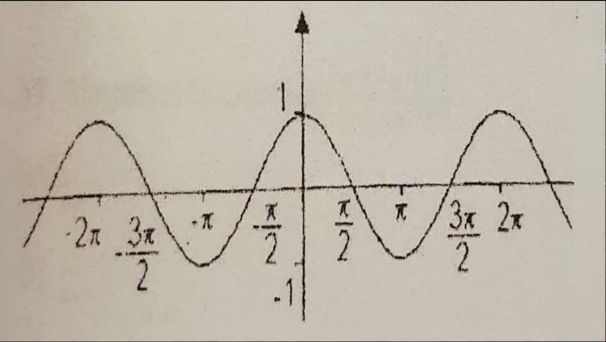
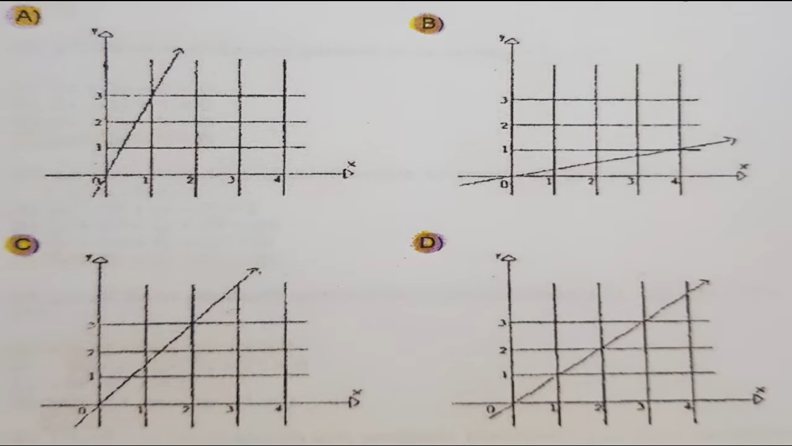

1. El valor numerico de la expresion:

7(x^2-2x+5)/3 cuando X = -2

    7[(-2)^2 - 2(-2) + 5]/3
    7[4 + 4 + 5]/3
    7[13]/3
    91/3

R:91/3

---

2. Rogelio recibe un salario semanal de 800 pesos mas el 5 porciento de comisiones sobre sus ventas, en una semana en la cual sus ventas ascendieron a 10,000 pesos ¿ Cuanto recibira Rogelio en total esa semana? 

10000\100 = 100 = 1%
500 = 5%
800 (sueldo) + 500 (comisiones) = 1300

R: 1300 pesos 

---
3. Juan tiene el doble de la edad de Maria, la suma de las edades de Juan y Maria es de 108 años. La ecuacion que representa algebraicamente lo anterior es: 

R: 2x+x = 108

>        J = 2M
>        J + M = 108
>  
>        (2M) + M = 108
>  
>        3M = 108
>        M = 108/3 = 36
>        J = 2(36) = 72

---
4. La solucion de la desigualdad  6x-1 > 7x-2 es: 

R: x < 1 

>         6x-1 > 7x-2
>         6x-7x > 1-2
>         -1x > -1
>         x < 1

---
5. La solucion del sistema:

| 3x + 2y = 22
| 4x - 3y = 1

R: x = 4 , y=5 

>         3x + 2y = 22
>         4x - 3y = 1
> 
>         4x = 1 + 3y
>         x = 1/4 + 3y/4
> 
> 
>         3(1/4 + 3y/4) + 2y = 22
>         3/4 + 9y/4 + 2y = 22
>         3 + 9y + 8y = 88
>         17y = 88 -3
>         y = 85/17 = 5
> 
>         x = 1/4 + 3(5)/4
>         x = (1+15)/4 = 4     

---

6. El dominio de la funcion:

$F(x) = \frac{1}{\sqrt{x-4}}$

R: $(4, \infty)$

> Analizanod la fraccion en primera instancia el valor que tenga la raiz cuadrada no puede ser cero por lo que podemos establecer que 
>
> $\sqrt{x-4}  \neq 0 $
>
> La raíz cuadrada solo está definida para valores positivos o mayores que cero en su interior. Esto significa que por lo tanto: 
>
> $x - 4 \neq 0 \rightarrow x \neq 4 \rightarrow x > 4$
>
> El dominio de la función 
$F(x) = \frac{1}{\sqrt{x-4}} $ 
es el intervalo $(4, \infty)$, lo cual significa que incluye todos los números mayores a 4, pero **no incluye** el 4 mismo.

---
7. A que funcion corresponde la siguente grafica:

R: f(x) = cos(x)

> **Análisis de la gráfica de $ f(x) = \cos(x) $**:
>
> La gráfica de la función $ f(x) = \cos(x) $ muestra que:
>
> 1. **En $ x = 0 $**:
>    - $ f(0) = \cos(0) = 1 $
>    - Por lo tanto, el punto es $ (0, 1) $.
>
> 2. **En $ x = \frac{\pi}{2} $**:
>    - $ f\left(\frac{\pi}{2}\right) = \cos\left(\frac{\pi}{2}\right) = 0 $
>    - Por lo tanto, el punto es $ \left(\frac{\pi}{2}, 0\right) $.
>
> 3. **Comportamiento general**:
>    - La función $ f(x) = \cos(x) $ oscila entre 1 y -1.
>    - La gráfica alcanza su máximo en $ (0, 1) $ y cruza el eje $ y $ en $ \left(\frac{\pi}{2}, 0\right) $.
>
> **Conclusión**: La gráfica tiene el valor **1** en el eje $ y $ en $ x = 0 $ y **0** en el eje $ y $ en $ x = \frac{\pi}{2} $ debido a las propiedades del coseno.

---
8. ¿Cual de las siguientes graficas corresponde a la funcion y = 3x? 

R: A  

---
9. ¿Cual es el dominio de la funcion $f(x) = e^{-3x}$?

R: $ (-\infty, \infty) $.

> **Dominio de la función $ f(x) = e^{-3x} $**:
>
> La función $ f(x) = e^{-3x} $ es una función exponencial. El dominio de las funciones exponenciales es el conjunto de todos los números reales, ya que se puede evaluar para cualquier valor de $ x $.
>
> **Por lo tanto, el dominio de $ f(x) = e^{-3x} $ es**:
> 
> $ (-\infty, \infty) $.

---
10. Cual es la distancia del origen al punto A (1,2) 

R: sqrt(5)

> La distancia desde el origen $(0, 0)$ a un punto $A(x, y)$ se calcula usando la fórmula de la distancia euclidiana:
>
> $
> d = \sqrt{(x_2 - x_1)^2 + (y_2 - y_1)^2}
> $
>
> Donde $(x_1, y_1)$ es el origen $(0, 0)$ y $(x_2, y_2)$ es el punto $A(1, 2)$.
>
> Sustituyendo los valores:
> 
> $
> d = \sqrt{(1 - 0)^2 + (2 - 0)^2} = \sqrt{1^2 + 2^2} = \sqrt{1 + 4} = \sqrt{5}
> $
>
> **Por lo tanto, la distancia del origen al punto $ A(1, 2) $ es**:
> 
> $ \sqrt{5} $.
