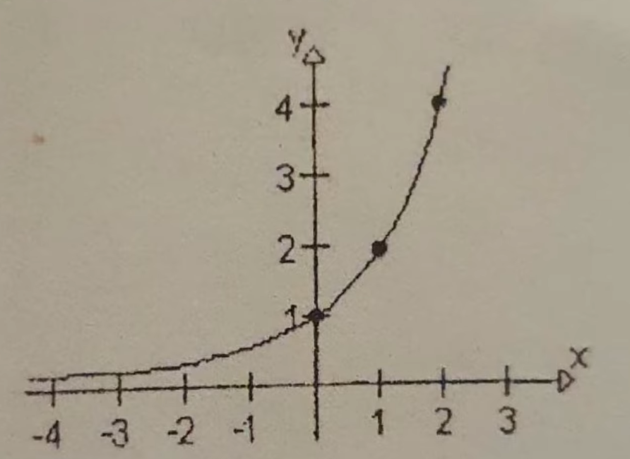
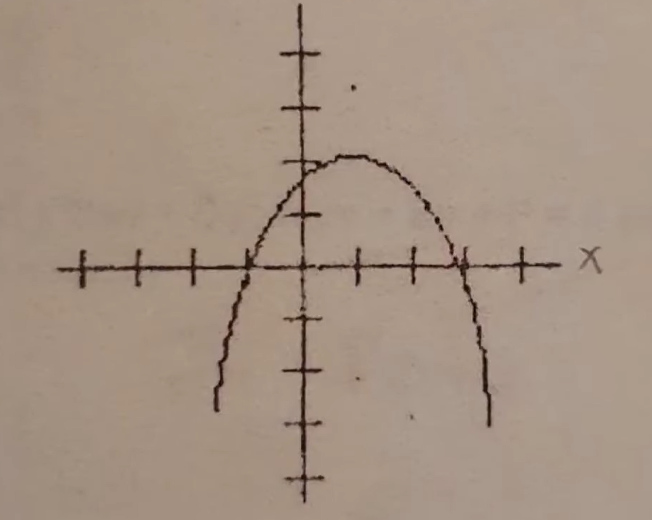
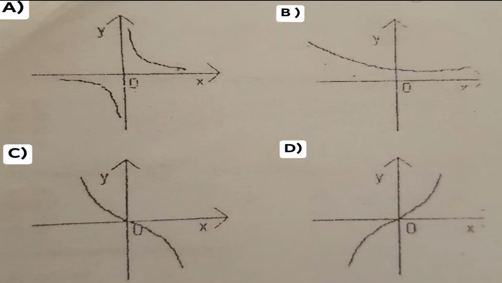

1.  El rango o imagen de la funcion es:

 

R: (0,infinito) 

---

2. EN la siguiente grafica, Cuales son los ceros de la ecuacion de segundo grado? 

 

R:  X = -1, X = 3

---
3. Cual de las siguientes graficas representa una funcion creciene?

 

R: D 

---
4. Cual es la pendiente de la recta que se muestra en la figura?

 

R:-3/2 

---
5. El valor numerico de F(x) = 5x^2 - x + 6/3, Cuando X = -1

R:  -4

---
6. La expresion 4A^2 - 9B^2 se factoriza como: 

R:  (2A-3B)(2A+3B)

---
7. La factorizacion de 4x^2 - 1 es:     

R: (2x-1)(2x+1)

---
8. El resultado de 2(18x^2)^1/2 

R: 6x(2x)^1/2

---
9. El resultdo de (x^16 * y^32)^1/4 es:  

R: x^4 * y^8

---
10. Al resolver la ecuacion 5(4x-1)-2(5x-5) = 20 (x+1) se obtiene: 

R: -3/2 

