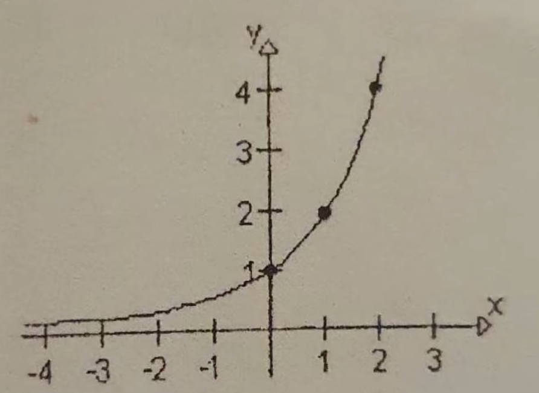
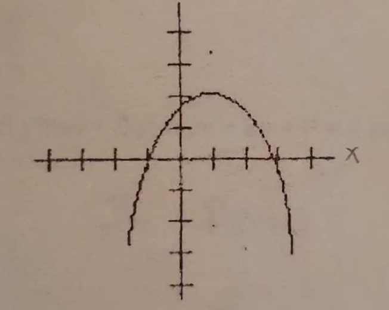
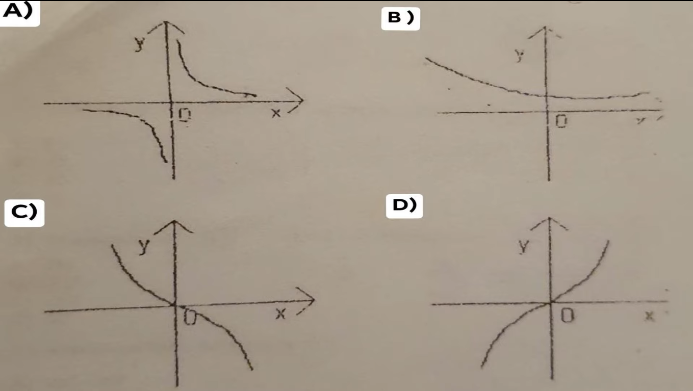
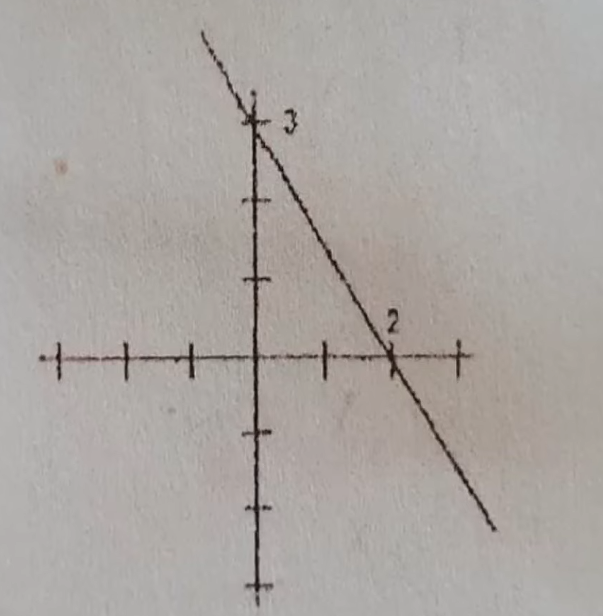

1.  El rango o imagen de la funcion es:

 

R: (0,infinito) 

---

2. EN la siguiente grafica, Cuales son los ceros de la ecuacion de segundo grado? 

 

R:  X = -1, X = 3

---
3. Cual de las siguientes graficas representa una funcion creciene?

 

R: D 

---
4. Cual es la pendiente de la recta que se muestra en la figura?

 

R:-3/2 

> La pendiente $ m $ de la recta que pasa por dos puntos $(x_1, y_1)$ y $(x_2, y_2)$ se calcula con la fórmula:
> 
> $$
> m = \frac{y_2 - y_1}{x_2 - x_1}
> $$
> 
> Para los puntos dados:
> - Punto 1: $(x_1, y_1) = (0, 3)$
> - Punto 2: $(x_2, y_2) = (2, 0)$
> 
> Sustituyendo los valores en la fórmula:
> 
> $$
> m = \frac{0 - 3}{2 - 0} = \frac{-3}{2}
> $$
> 
> Por lo tanto, la pendiente de la recta que pasa por los puntos $(0, 3)$ y $(2, 0)$ es:
> 
> $$
> m = -\frac{3}{2}
> $$

---
5. El valor numerico de F(x) = 5x^2 - x + 6/3, Cuando X = -1

R:  -4

(Revisar)

---
6. La expresion 4A^2 - 9B^2 se factoriza como: 

R:  (2A-3B)(2A+3B)

> La expresión $ 4A^2 - 9B^2 $ es una diferencia de cuadrados, que se puede factorizar utilizando la identidad:
> 
> $$
> a^2 - b^2 = (a - b)(a + b)
> $$
> 
> En este caso, podemos identificar:
> - $ a^2 = 4A^2 $  → $ a = 2A $
> - $ b^2 = 9B^2 $  → $ b = 3B $
> 
> Aplicando la identidad de la diferencia de cuadrados:
> 
> $$
> 4A^2 - 9B^2 = (2A)^2 - (3B)^2 = (2A - 3B)(2A + 3B)
> $$
> 
> Por lo tanto, la expresión $ 4A^2 - 9B^2 $ se factoriza como:
> 
> $$
> (2A - 3B)(2A + 3B)
> $$

---
7. La factorizacion de 4x^2 - 1 es:     

R: (2x-1)(2x+1)

> La expresión $ 4x^2 - 1 $ es una diferencia de cuadrados, que se puede factorizar utilizando la identidad:
> 
> $$
> a^2 - b^2 = (a - b)(a + b)
> $$
> 
> En este caso, podemos identificar:
> - $ a^2 = 4x^2 $  → $ a = 2x $
> - $ b^2 = 1 $      → $ b = 1 $
> 
> Aplicando la identidad de la diferencia de cuadrados:
> 
> $$
> 4x^2 - 1 = (2x)^2 - 1^2 = (2x - 1)(2x + 1)
> $$
> 
> Por lo tanto, la factorización de $ 4x^2 - 1 $ es:
> 
> $$
> (2x - 1)(2x + 1)
> $$

---
8. El resultado de 2(18x^2)^1/2 

R: 6x(2x)^1/2

> Para calcular el resultado de $2(18x^2)^{\frac{1}{2}}$, seguimos los pasos de simplificación:
> 
> 1. Primero, aplicamos la raíz cuadrada:
> 
> $$
> (18x^2)^{\frac{1}{2}} = \sqrt{18x^2}
> $$
> 
> 2. Descomponemos $\sqrt{18}$:
> 
> $$
> \sqrt{18} = \sqrt{9 \cdot 2} = \sqrt{9} \cdot \sqrt{2} = 3\sqrt{2}
> $$
> 
> 3. También tenemos:
> 
> $$
> \sqrt{x^2} = x
> $$
> 
> 4. Así que, combinando todo, obtenemos:
> 
> $$
> \sqrt{18x^2} = 3\sqrt{2} \cdot x
> $$
> 
> 5. Ahora, multiplicamos por 2:
> 
> $$
> 2(18x^2)^{\frac{1}{2}} = 2(3\sqrt{2} \cdot x) = 6\sqrt{2} \cdot x
> $$
> 
> Por lo tanto, el resultado de $2(18x^2)^{\frac{1}{2}}$ es:
> 
> $$
> 6\sqrt{2} \cdot x
> $$

---
9. El resultdo de (x^16 * y^32)^1/4 es:  

R: x^4 * y^8

> Para calcular el resultado de $(x^{16} \cdot y^{32})^{\frac{1}{4}}$, aplicamos la propiedad de las potencias:
> 
> $$
> (a^m \cdot b^n)^p = a^{m \cdot p} \cdot b^{n \cdot p}
> $$
> 
> Aplicando esto, tenemos:
> 
> $$
> (x^{16} \cdot y^{32})^{\frac{1}{4}} = x^{16 \cdot \frac{1}{4}} \cdot y^{32 \cdot \frac{1}{4}}
> $$
> 
> Calculando las potencias:
> 
> $$
> x^{16 \cdot \frac{1}{4}} = x^4
> $$
> 
> $$
> y^{32 \cdot \frac{1}{4}} = y^8
> $$
> 
> Combinando ambos resultados, obtenemos:
> 
> $$
> (x^{16} \cdot y^{32})^{\frac{1}{4}} = x^4 \cdot y^8
> $$
> 
> Por lo tanto, el resultado de $(x^{16} \cdot y^{32})^{\frac{1}{4}}$ es:
> 
> $$
> x^4 \cdot y^8
> $$

---
10. Al resolver la ecuacion 5(4x-1)-2(5x-5) = 20 (x+1) se obtiene: 

R: -3/2 

> Para resolver la ecuación $5(4x - 1) - 2(5x - 5) = 20(x + 1)$, seguimos estos pasos:
> 
> 1. **Distribuimos** los términos en ambos lados de la ecuación:
> 
> $$
> 20x - 5 - 10x + 10 = 20x + 20
> $$
> 
> 2. **Simplificamos** los términos en el lado izquierdo:
> 
> $$
> 20x - 10x + 10 - 5 = 20x + 20
> $$
> 
> Esto se reduce a:
> 
> $$
> 10x + 5 = 20x + 20
> $$
> 
> 3. **Reorganizamos** la ecuación para aislar $x$:
> 
> Restamos $10x$ de ambos lados:
> 
> $$
> 5 = 20x - 10x + 20
> $$
> 
> Lo que se convierte en:
> 
> $$
> 5 = 10x + 20
> $$
> 
> 4. **Restamos 20** de ambos lados:
> 
> $$
> 5 - 20 = 10x
> $$
> 
> $$
> -15 = 10x
> $$
> 
> 5. **Dividimos** ambos lados entre 10:
> 
> $$
> x = -\frac{15}{10} = -\frac{3}{2}
> $$
> 
> Por lo tanto, al resolver la ecuación $5(4x - 1) - 2(5x - 5) = 20(x + 1)$ se obtiene:
> 
> $$
> x = -\frac{3}{2}
> $$

