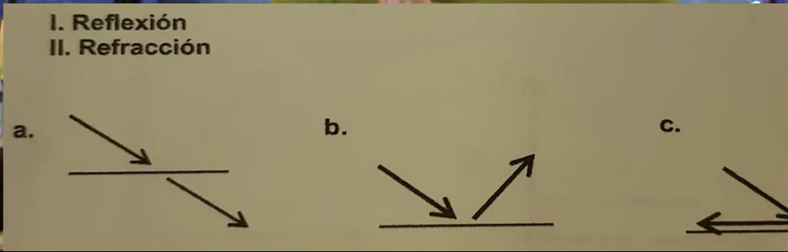

1. Si un peaton recorre 40m en 80 repentinamente se detiene durante 10s y posteriormente avanza 20m en 10s ¿Cual es la rapidez media? 

R: 0.6 m/s 

--- 
2. ¿Cual de los siguientes materiales sirve para medir la antiguedad de los fósiles? 

R: Carbono 14 

---
3. ¿Cual es el peso en Newtons de un cuerpo con una masa de 10kg? 

R: 98
---

4. Un gato hidraulico se utiliza para cambiar la llanta de un coche. Si se le aplica una fueza de 80 Newtons en un area de 5 cm^2 sobre el émbolo del piston y el auto se recarga en un area de 25 cm^2. ¿Que fuerza se genera?

R: 400 N        

---

5. En un cuerpo con MRU ¿Cómo aumentas su velocidad? 

R: Disminuyendo su cantidad de inercia

---

6. Una persona que pesa 500N salta sobre un resorte de 25 cm y se comprime 10 cm, si una persona de 900 N salta sobre el mismo resote, sabiendo que su coeficiente es de 50 N/cm ¿Cuanto se comprime el resorte? 

R: 18 cm 

---

7.  Relaciona los diagramas considerando la trayectoria de un haz de luz que corresponde a los fenomenos de reflexion y refracción respectivamente. 

R: I-b y II-a

---

8. Desde cierta altura se deja caer una piedra en un estanque ¿Cómo son las ondas que se forman en el agua? 

R: Las ondas son transversales, pues se desplazan de forma perpendicular con respecto a la dirección del movimiento. 

---

9. Si la aceleración de la gravedad en la CMDX es de aproximadamente 9.78 m/s^2,  se puede decir que la: 

R: La velocidad de los objetos aumenta 9.78 m/s cada segundo de caida.  

---
10. La potencia que produce un horno de microondas es de 1200 W, si la diferencia de potencial es de 120 V, ¿Cuanta corriente circula? 

R: 10 A 

