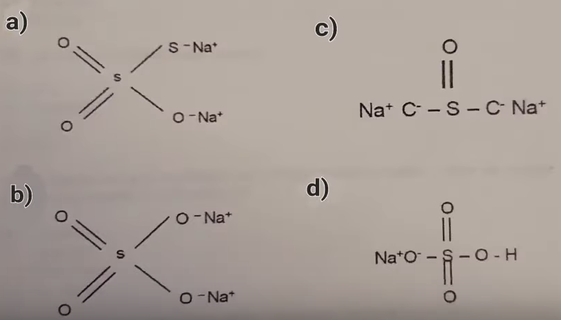

1. La siguiente tabla describe cuatro atomos diferentes con el numero de protones, electrones y neutrones que contienen cada uno: 

En relacion a ello es cierto que: 

R:  La masa atomica del C es 22  

---

2. De acuerdo con la regla del octeto de Lewis ..
Cual es la estructura correcta del tiosulfato de sodio?

R: a 

---

3. Que condiciones deben presentar los metales para cumplir la regla del octeto?

R: Tendran tendencia a perder electrones para asemejarse a los gases nobles que los precede 

---

4. Enlace que involucra la comparacion de electrones en los que los nucles (+) cargados de 2 o mas atomos atraen simultaneamente a los electrones (-) cargados que estan siendo compartidos 

R: Covalente   

---

5. En la siguiente estructura se muestra la representacion de la union entre 2 aminoacidos, Que tipo de enlace se lleva a cabo entre ellos? 

R: peptidico 

---

6. Tienes 1.8 gramos de glucosa en 100 mililitros de agua. La solucion resultante tiene una concentracion molar de (M.M o P.M de la glucosa 180 g/m) 

R: 0.10 M  

---

7. Las aminas se comportan como base de lewis debido a que  

R: Donan pares de electrones    

---
8. Si al medir el ph de una sustancia se obtiene un valor de 2, la sustancia es:  

R:  Acida 

---
9. Cual es la base mas fuerte: NH3,NAHCO3, H2O, KOH

R: KOH   

---
10. Cuando es una solucion se le coloca papel tornasol y este se vuelve azul, indica que la solucion es: 

R:  Una base  

