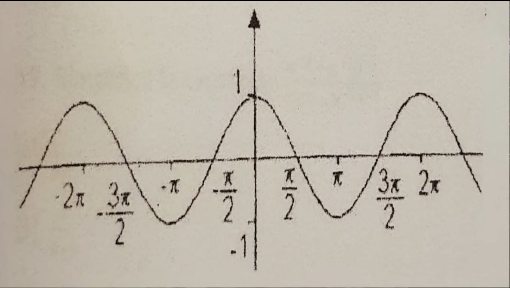

1. El valor numerico de la expresion:

7(x^2-2x+5)/3 cuando X = -2

R:91/2 

---

2. Rogelio recibe un salario semanal de 800 pesos mas el 5 porciento de comisiones sobre sus ventas, en una semana en la cual sus ventas ascendieron a 10,000 pesos ¿ Cuanto recibira Rogelio en total esa semana? 

R: 1300 pesos 

---
3. Juan tiene el doble de la edad de Maria, la suma de las edades de Juan y Maria es de 108 años. La ecuacion que representa algebraicamente lo anterior es: 

R: 2x+x = 108

---
4. La solucion de la desigualdad  6x-1 > 7x-2 es: 

R: x < 1 

---
5. La solucion del sistema:

| 3x + y = 22

| 4x + 3y = 1

R: x = 4 , y=5 

---

6. El dominio de la funcion:

F(x) = 1/sqrt(x-4)

R: (4,infinito)

---
7. A que funcion corresponde la siguente grafica:

R: f(x) = cos(x)

---
8. ¿Cual de las siguientes graficas corresponde a la funcion y = 3x? 

R: A  

---
9. ¿Cual es el dominio de la funcion f(x) = e^(-3x)?

R: (-infinito, infinito) 

---
10. Cual es la distancia del origen al punto A (1,2) 

R: sqrt(5)
