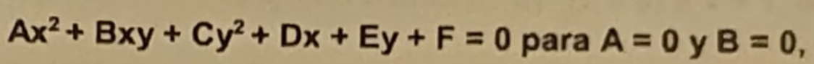

1. Cual es la distancia entre los puntos A(-3,5) y B(-2,-1)

R: Raiz de 37

---

2. Encuentra el punto que divide el segmento A(1,-2), B(0,3) en la razon de 3 a 1 

R: (1/4,7/4)

---
3. La pendiente de la recta que pasa por los puntos (-4,6) y (6,-8) 

R: -7/5

---
4. Simplifica la expresion: 
 

R:1/b+1

---

5. Cual es la expresion general de la recta y = 2/3x - 1

R:2x-3y-3 = 0

---

6. La ecuacion de la circunferencia de centro (2,3) y radio 5 es: 

R: (x-2)^2 + (y-3)^2 = 25

---

7. Cual es la ecuacion general de la circunferencia (x-2)^2 + (y-1)^2

R: x^2 + y^2 + 4x - 2y - 4 = 0

---
8. Escribe la ecuacion de una parabola horizontal que tiene un vertice en punto (2,3) y su p=3

R: (y-3)^2 = 12(x-2)

---
09. La ecuacion:

 

Que representa la ecuacion anterior: 

R: Una parabola

---

10. Al dividir ((x^2 + 4)/8) entre ((x^2-16)/4) resulta:     

R: (x^2+4)/2(x^2-16)

